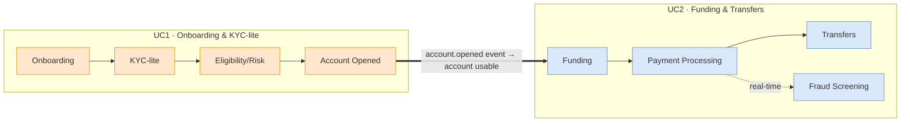

# Digital Banking Platform — Onboarding + Funding/Transfers

A hackathon build of **two connected banking platforms** on a shared, event-driven
microservices backbone:

1. **Use Case 1 — Digital Customer Onboarding & KYC-lite Account Opening**
2. **Use Case 2 — Funding & Transfers Platform with Real-Time Fraud Screening**

The two use cases are **not independent products** — a customer onboarded in UC1
receives an account that they then fund and transfer from in UC2. They share the
same auth, gateway, event bus, notification, audit and observability layers.

---

## Tech Stack (canonical for the whole team)

| Layer            | Choice                                                              |
|------------------|--------------------------------------------------------------------|
| Frontend         | React 18 + Vite + TypeScript, React Router, React Query, Redux Toolkit, Tailwind, Axios (JWT interceptor) |
| Backend          | Python 3.12, Django 5 + Django REST Framework (DRF), one Django project per microservice |
| Auth             | JWT access + refresh via `djangorestframework-simplejwt`, **RS256** (services verify with shared public key), rotation + blacklist |
| API contracts    | OpenAPI 3 via `drf-spectacular` (every service publishes `/api/schema`) |
| Async / eventing | **Apache Kafka** (event backbone) + **Celery** (background jobs) with Redis broker |
| Datastore        | **PostgreSQL** (database-per-service), **Redis** (cache / rate-limit / idempotency / fraud feature store) |
| Object storage   | MinIO (S3-compatible) for KYC documents |
| Realtime         | Django Channels (WebSocket) for ops dashboard + live notifications |
| Gateway          | Nginx (edge) + lightweight gateway rules; per-service DRF throttling |
| Packaging        | Docker + docker-compose (local), Kubernetes + Helm (prod-ready) |
| IaC / CI-CD      | Terraform, GitHub Actions |
| Observability    | OpenTelemetry, Prometheus + Grafana, Loki logs, Sentry errors |

Full rationale: [`docs/03-tech-stack.md`](docs/03-tech-stack.md).

---

## Repository / documentation map

```
project2/
├── README.md                       ← you are here (overview + index)
├── docs/
│   ├── 00-project-plan.md          ← FULL delivery plan: team split, milestones, timeline, DoD
│   ├── 01-hld.md                   ← High-Level Design (both use cases, Mermaid)
│   ├── 02-lld.md                   ← Low-Level Design: DB schemas, class/module, sequences
│   ├── 03-tech-stack.md            ← Stack, service catalogue, ports, repo layout
│   └── 04-api-contracts.md         ← Shared REST contracts + Kafka event envelopes (the "seams")
├── diagrams/
│   ├── usecase1-onboarding.drawio          ← draw.io: HLD + LLD-flow + ER pages
│   └── usecase2-funding-transfers.drawio   ← draw.io: HLD + LLD-flow + ER pages
└── team/
    ├── member1-auth-onboarding.md              ← Member 1 ownership + flow diagrams
    ├── member2-kyc-eligibility-account.md      ← Member 2 ownership + flow diagrams
    ├── member3-funding-transfers-payments.md   ← Member 3 ownership + flow diagrams
    └── member4-fraud-notifications-audit-platform.md ← Member 4 ownership + flow diagrams
```

> Open the `.drawio` files at <https://app.diagrams.net> (File → Open) or with the
> **Draw.io Integration** VS Code extension. Each file has multiple named pages/tabs.

---

## The 4-way work split at a glance

Each member owns a **vertical slice** (frontend + backend services + DB) **plus one
shared cross-cutting concern**, so platform work is distributed evenly and nobody
is blocked waiting on a single "infra person".

| Member | Vertical slice (feature ownership)                        | Shared concern owned | Primary UC |
|--------|-----------------------------------------------------------|----------------------|------------|
| **M1** | Auth service + Onboarding capture/workflow                | **API Gateway** & routing | UC1 |
| **M2** | KYC-lite + Eligibility/Risk + Account opening             | **Notification service**  | UC1 |
| **M3** | Funding + Transfers + Payment/Ledger                      | **Kafka event bus** & schema registry | UC2 |
| **M4** | Fraud screening + Risk monitoring + Ops dashboard         | **Audit/Compliance + Observability + CI/CD** | UC2 |

Details and per-member flow diagrams are in [`team/`](team/). The integration
"contract" that lets all four work independently is [`docs/04-api-contracts.md`](docs/04-api-contracts.md).

---

## How the two use cases connect



Start reading at [`docs/00-project-plan.md`](docs/00-project-plan.md).
