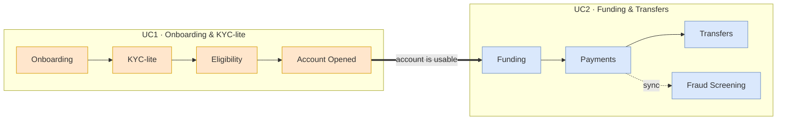

# Digital Banking Platform — Onboarding + Funding/Transfers

A 3-day hackathon build of **two connected banking use cases**:

1. **Use Case 1 — Digital Customer Onboarding & KYC-lite Account Opening**
2. **Use Case 2 — Funding & Transfers Platform with Real-Time Fraud Screening**

The two use cases are **not independent products** — a customer onboarded in UC1
receives an account that they then fund and transfer from in UC2.

## How we build it

**One Django project (a modular monolith): ~9 apps, one PostgreSQL database, ~10
tables, one React SPA.** Everything is synchronous (Python function calls between
apps) — no Kafka, no microservices, no gateway, no Redis/MinIO/K8s. This is the
smallest thing that demos both use cases end-to-end.

👉 **The plan: [`docs/plan.md`](docs/plan.md)** · **Diagram: [`diagrams/architecture.drawio`](diagrams/architecture.drawio)**

## Tech stack

| Layer | Choice |
|-------|--------|
| Frontend | React 18 + Vite + TypeScript, React Router, axios (JWT interceptor), Context (no Redux) |
| Backend | Python 3.12, **one** Django 5 + DRF project, one app per domain |
| Auth | `djangorestframework-simplejwt`, **HS256**, access + refresh |
| DB | **One** PostgreSQL (SQLite fine for local dev) |
| API docs | `drf-spectacular` → `/api/docs` Swagger |
| Async | none — synchronous; optional Django signals for audit/notifications |
| Run | `docker-compose` (web + db) or `python manage.py runserver` |

---

## Repository / documentation map

```
project2/
├── README.md                     ← you are here (overview + index)
├── docs/
│   └── plan.md                   ← THE plan: approach, architecture, member split, data model, timeline
├── diagrams/
│   └── architecture.drawio       ← draw.io: monolith architecture + data model (2 pages)
├── team/
│   ├── member1-platform-auth-onboarding.md   ← Member 1 ownership + flow diagrams
│   ├── member2-kyc-eligibility-account.md    ← Member 2 ownership + flow diagrams
│   ├── member3-payments.md                   ← Member 3 ownership + flow diagrams
│   └── member4-fraud-ops-audit-notifications.md ← Member 4 ownership + flow diagrams
└── full-vision/                  ← ARCHIVED heavier microservices design (reference only, NOT building)
    ├── docs/ (00–04) · diagrams/ (usecase1, usecase2) · team/ (microservices per-member)
```

> Open `.drawio` files at <https://app.diagrams.net> (File → Open) or with the
> **Draw.io Integration** VS Code extension. Each file has multiple named page tabs.

---

## The 4-member split (equal ownership)

Each member owns **1–3 Django apps + a React area**. Everyone works in the same
repo but in **different app folders**, so merge conflicts stay rare.

| Member | Django apps | React area | Owns for the team |
|--------|-------------|-----------|-------------------|
| **M1** | `accounts` (JWT), `onboarding` | Login/register, onboarding wizard, app shell | Project scaffold: `settings.py`, root `urls.py`, `docker-compose`, seed data |
| **M2** | `kyc`, `eligibility`, `banking` | KYC form, eligibility result, account dashboard | UC1 decision logic (rules) |
| **M3** | `payments` (funding + transfers + ledger) | Fund form, transfer form, history | Transaction integrity: idempotency, balance-in-a-DB-transaction |
| **M4** | `fraud`, `ops`, `audit`, `notifications` | Ops/fraud console, notifications | Fraud rules + the `audit()` helper everyone calls |

Per-member detail + flow diagrams: [`team/`](team/).

---

## How the two use cases connect



Start reading at [`docs/plan.md`](docs/plan.md).
