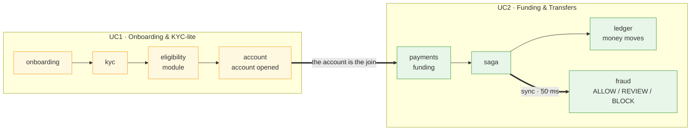

# IND Bank — Digital Banking Platform

A hackathon build of **two connected banking use cases**:

1. **Use Case 1 — Digital Customer Onboarding & KYC-lite Account Opening**
2. **Use Case 2 — Funding & Transfers Platform with Real-Time Fraud Screening**

The two use cases are **not independent products** — a customer onboarded in UC1
receives an account that they then fund and transfer from in UC2.

> 📖 **New here? Read [`docs/HANDBOOK.md`](docs/HANDBOOK.md)** — one document covering
> the architecture, every table, how money moves, how we verify it, and why each
> choice was made.

---

## Quick start

Python 3.12 and Node 20+. **No Docker, no Postgres, no Redis** — nothing to install
beyond those two runtimes.

```bash
# --- backend (terminal 1) ---
cd server
uv sync
uv run python scripts/setup.py                  # 10 DBs, migrations, seed rules + demo users
uv run python scripts/run_service.py --all      # all 10 services + their Q2 workers

# --- frontend (terminal 2) ---
cd client
npm install
npm run dev                                    # http://localhost:5173
```

Optional: `uv run python scripts/seed_demo_data.py` puts realistic traffic through the
system so the analyst and ops consoles have something to show.

### Demo logins

Password for all four: `demo-password-2026`

| Email | Role | What they see |
|---|---|---|
| `asha@indbank.test` | Customer | Accounts, send money, add money, payees, schedules |
| `analyst@indbank.test` | Fraud analyst | Case queue, case detail, rule performance |
| `ops@indbank.test` | Operations | Service health, failures, reports |
| `admin@indbank.test` | Administrator | Fraud rules, thresholds, limits, audit trail |

Staff accounts are **seeded, not registerable** — the public register endpoint always
creates a customer, so nobody can sign themselves up as an admin.

---

## How we build it

**Ten Django microservices, database-per-service, with Django Q2 as the message queue.**
A transactional outbox relays events over signed HTTP between services, so the whole
estate runs on **Python and the filesystem alone** — no Redis, no Kafka, no broker of any
kind, and no database server.

## Tech stack

| Layer | Choice |
|-------|--------|
| Frontend | React 19 + Vite (JavaScript/JSX), React Router, TanStack Query, `fetch` wrapper with coalesced JWT refresh |
| Backend | Python 3.12, **10** Django 5 + DRF services + a shared `platform_common` library |
| Auth | **RS256** JWT issued by `identity`, verified via cached JWKS; **HS256** HMAC tokens for service-to-service `/internal/*` calls |
| DB | **SQLite, one file per service** — cross-service joins are impossible, not just discouraged |
| Message queue | **Django Q2** (ORM broker, one queue per service) + transactional outbox → HTTP relay → inbox |
| Money | Integer minor units at 4dp, `ROUND_HALF_EVEN`; amounts cross the API as **strings**, never floats |
| Gateway | None — the Vite dev server proxies by path prefix to the ten ports |
| Run | `scripts/run_service.py` — one API process + one Q2 worker per service (no containers) |

> **Why SQLite and no broker?** Environment constraint: no database server and no Redis
> available. The design does not depend on it — each service uses the ORM against its own
> database, so moving to Postgres is a settings change per service, not a rewrite. The
> trade-offs are stated honestly in [the handbook](docs/HANDBOOK.md#12-defending-this-in-a-system-design-interview).

## Where it stands

| | |
|---|---|
| Backend tests | **374 passing** (`uv run python scripts/test_all.py`) |
| API contract gate | **47/47** over real HTTP (`scripts/verify_spa_api.py`) |
| Browser walkthrough | 18 screens × 4 roles, zero console/network errors |
| Tables | 46 across 10 databases |
| Event types | 37 |
| Fraud rules | 15 |

Known gaps — including **`audit` having no tests at all** — are listed without softening in
[`docs/HANDBOOK.md` §14](docs/HANDBOOK.md#14-what-is-not-done).

### Prior designs in this repo

| Design | Status | Why not |
|---|---|---|
| [`docs/HANDBOOK.md`](docs/HANDBOOK.md) + [`docs/microservices/`](docs/microservices/README.md) | **Current** | — |
| [`docs/plan.md`](docs/plan.md) | Superseded | Modular monolith — not microservices |
| `Xfull-vision/` (in git history only — `git show 1c37b59:Xfull-vision/docs/01-hld.md`) | Archived | Needs Kafka, Redis, MinIO, K8s — unavailable in this environment |

---

## Repository map

```
project2/
├── README.md                        ← you are here (overview + index)
├── docs/
│   ├── HANDBOOK.md                  ← ★ START HERE — the single complete document
│   ├── microservices/               ← the deep-dive design docs
│   │   ├── README.md                ← index + the 5 decisions worth knowing first
│   │   ├── 00-first-principles.md   ← invariants, boundary derivation, capacity math, 9 ADRs
│   │   ├── 01-hld.md                ← C4 views, topology, security, failure modes, deployment
│   │   ├── 02-lld.md                ← models, sequences, state machines, ledger, saga, fraud engine
│   │   ├── 03-events.md             ← envelope, event catalogue, Django Q2 mechanics
│   │   ├── 04-api-contracts.md      ← REST surface, errors, idempotency, authz matrix
│   │   └── 05-delivery-plan.md      ← build order, team split, demo script, traceability
│   └── plan.md                      ← SUPERSEDED modular-monolith plan
│
├── server/                          ← the backend
│   ├── libs/platform_common/        ← outbox/inbox, money, auth, CORS, settings, observability
│   ├── services/                    ← 10 Django projects, one per service
│   │   ├── identity/  onboarding/  kyc/       account/   payments/
│   │   └── ledger/    fraud/       notification/  audit/  ops/
│   ├── scripts/
│   │   ├── setup.py                 ← one-shot: create DBs, migrate, seed
│   │   ├── run_service.py           ← start services (API + Q2 worker each)
│   │   ├── manage_all.py            ← run one Django command across every service
│   │   ├── test_all.py              ← run all test suites
│   │   ├── verify_backbone.py       ← gate: events really cross a service boundary
│   │   ├── verify_spa_api.py        ← gate: 47 checks over real HTTP
│   │   └── seed_demo_data.py        ← realistic traffic for the demo
│   └── .data/                       ← the 10 SQLite files (gitignored — real password hashes)
│
├── client/                          ← the frontend (Vite + React SPA)
│   ├── README.md                    ← setup, proxy explanation, design rationale
│   ├── vite.config.js               ← the path-prefix → port routing table
│   └── src/
│       ├── routes/                  ← 22 screens across 4 role consoles
│       ├── components/              ← app shell + the boxy component kit
│       ├── lib/                     ← api client, money, auth, formatting
│       └── styles/                  ← design tokens + the component CSS
│
├── diagrams/architecture.drawio     ← monolith diagram (belongs to the superseded plan)
└── team/                            ← per-member docs for the superseded monolith plan

  (Xfull-vision/ — the archived Kafka/Redis/K8s design — is tracked in git but
   not checked out on disk; recover with `git checkout 1c37b59 -- Xfull-vision`)
```

---

## The 4-member split

Ownership is by **vertical slice** — service + its React area + its tests — so nobody
blocks on anyone for a full feature. Detail in
[`docs/microservices/05-delivery-plan.md`](docs/microservices/05-delivery-plan.md#2-team-split--four-people-ten-services).

| Member | Services | React area | Owns for the team |
|--------|----------|-----------|-------------------|
| **M1 · Platform & Identity** | `platform_common`, identity | App shell, auth, routing, API client | The event backbone, `ServiceClient`, CI |
| **M2 · Accounts & Onboarding** | account, onboarding, kyc | Onboarding wizard, accounts, beneficiaries | UC1 decision logic |
| **M3 · Money** | payments, ledger | Funding, transfers, schedules, activity | **Money correctness** — ledger invariants, idempotency, saga |
| **M4 · Fraud & Operations** | fraud, notification, audit, ops | Analyst console, ops console, admin | The rule engine + the audit chain |

---

## How the two use cases connect



A customer onboarded in UC1 receives the account they fund and transfer from in UC2 — the
two use cases are one product, not two demos.

## The one decision worth knowing before anything else

Every transfer is **reserved before it is taken, screened before it is sent, and unwound
completely if any step fails.** Money is held — not debited — while the fraud engine
decides. If screening is unreachable, the payment becomes a **review, never an automatic
approval**: an outage turns into analyst work, not into losses.

Everything else in the design follows from that.

👉 [`docs/HANDBOOK.md`](docs/HANDBOOK.md)
