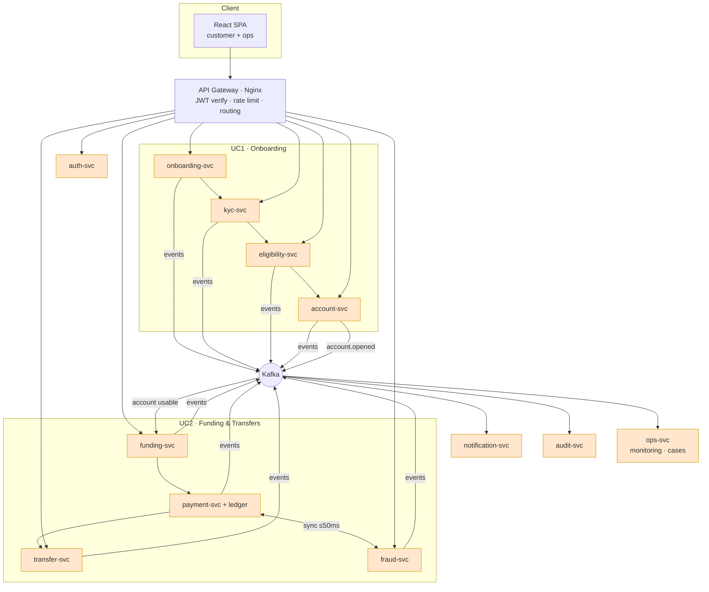

# 00 · Project Delivery Plan

**Project:** Digital Banking Platform — Onboarding (UC1) + Funding/Transfers (UC2)
**Team size:** 4 engineers, equal ownership
**Method:** API-first, contract-driven, event-driven microservices so all 4 build in parallel.

---

## 1. Goals & non-goals

### In scope (from the brief)
- **UC1:** capture customer info → KYC-lite verification → eligibility & risk → open account → instant account details → audit/compliance/workflow tracking.
- **UC2:** funding requests → domestic & international transfers → real-time payment processing → **fraud checks in milliseconds** → approve/reject → notify customer → risk/health monitoring with **reduced false positives** → operational visibility → complete audit trail.

### Non-goals (explicitly out, to protect the timeline)
- Real bank/rail integration (SWIFT, ACH, UPI, card networks) — **simulated** via adapter stubs.
- Real government KYC APIs — **mocked** verification provider with deterministic rules.
- Production regulatory certification — we build the **audit trail & controls**, not the legal sign-off.
- A trained ML fraud model — we ship a **rules + lightweight scoring** engine with a pluggable model interface (a stub model is fine for the demo).

---

## 2. Design principles that make parallel work possible

1. **Contract-first.** Every service's REST + event contract is frozen in [`04-api-contracts.md`](04-api-contracts.md) on Day 1. Teams code against the contract, not each other's implementations.
2. **Database-per-service.** No shared tables. Cross-service reads happen over the API or by consuming events. This removes the biggest source of merge/lock conflicts.
3. **Event-driven seams.** Services emit facts to Kafka (`account.opened`, `transaction.approved`, …). Consumers (notification, audit, fraud) never call back synchronously unless latency requires it.
4. **Mock-first integration.** Each service ships a mock/stub of its upstream dependencies (WireMock-style DRF stub views), so a member is never blocked by an unfinished neighbour.
5. **Everything behind the gateway.** One entry URL, JWT verified once at the edge, identity propagated downstream via signed headers + `trace_id`.

---

## 3. Service catalogue (who owns what)

| # | Service | Owner | UC | Dev port | Datastore |
|---|---------|-------|----|----------|-----------|
| 1 | `auth-svc` | **M1** | shared | 8001 | pg: `auth_db` |
| 2 | `onboarding-svc` | **M1** | UC1 | 8002 | pg: `onboarding_db` |
| 3 | `kyc-svc` | **M2** | UC1 | 8003 | pg: `kyc_db` + MinIO |
| 4 | `eligibility-svc` | **M2** | UC1 | 8004 | pg: `eligibility_db` |
| 5 | `account-svc` | **M2** | UC1 | 8005 | pg: `account_db` |
| 6 | `funding-svc` | **M3** | UC2 | 8006 | pg: `funding_db` |
| 7 | `transfer-svc` | **M3** | UC2 | 8007 | pg: `transfer_db` |
| 8 | `payment-svc` (+ ledger) | **M3** | UC2 | 8008 | pg: `payment_db` |
| 9 | `fraud-svc` | **M4** | UC2 | 8009 | pg: `fraud_db` + Redis feature store |
| 10 | `notification-svc` | **M2** | shared | 8010 | pg: `notify_db` |
| 11 | `audit-svc` | **M4** | shared | 8011 | pg: `audit_db` (append-only) |
| 12 | `ops-svc` (monitoring/case mgmt) | **M4** | UC2 | 8012 | reads fraud/audit |
| — | `api-gateway` (Nginx + rules) | **M1** | shared | 8080 | — |
| — | `web` (React app) | **all** (feature folders) | both | 5173 | — |

> Ownership is **equal**: each member owns 2–3 services + one shared platform concern + a React feature area. See the balance table in §5.

---

## 4. Architecture (one picture)

Deeper diagrams: **HLD** → [`01-hld.md`](01-hld.md), **LLD** → [`02-lld.md`](02-lld.md),
and the draw.io files in [`../diagrams/`](../diagrams/).

---

## 5. Equal-ownership breakdown

Each member owns a comparable amount of **backend services + one platform concern + a React feature area + DB schemas**. Complexity is balanced (M4's fraud engine is heavy, so M4's other services are lighter/read-only).

| Member | Backend services | Platform concern | React feature area | Approx. DB tables |
|--------|------------------|------------------|--------------------|-------------------|
| **M1** — Identity & Onboarding | auth-svc, onboarding-svc | **API Gateway + routing + JWT/RS256 keys** | Login/refresh, onboarding wizard | ~7 |
| **M2** — Verify & Account | kyc-svc, eligibility-svc, account-svc, notification-svc | **Notification (email/SMS/push, templates)** | KYC upload, eligibility result, account dashboard | ~9 |
| **M3** — Money Movement | funding-svc, transfer-svc, payment-svc/ledger | **Kafka bus + schema registry + idempotency lib** | Fund account, transfers (domestic/intl), txn history | ~9 |
| **M4** — Trust & Platform | fraud-svc, ops-svc, audit-svc | **Audit/Compliance + Observability + Docker/K8s/CI-CD** | Ops/fraud console, audit viewer, monitoring | ~8 |

**Why this is fair:** M2 owns more services but they are CRUD-shaped; M4 owns fewer services but the fraud engine + full platform/DevOps balances it; M1 owns the security-critical auth+gateway path; M3 owns the money-correctness (ledger, idempotency) path. Every member touches frontend, backend, DB, events, and one shared library.

Per-member detail + individual flow diagrams:
- [Member 1](../team/member1-auth-onboarding.md)
- [Member 2](../team/member2-kyc-eligibility-account.md)
- [Member 3](../team/member3-funding-transfers-payments.md)
- [Member 4](../team/member4-fraud-notifications-audit-platform.md)

---

## 7. Integration checkpoints (the "connect it well" part)

Independent work only pays off if the seams are tested. Four scheduled integration checkpoints:

| Checkpoint | When | What must pass |
|-----------|------|----------------|
| **IC-0 Contract sign-off** | Day 0 / Wk1 | All 4 agree on [`04-api-contracts.md`](04-api-contracts.md); OpenAPI stubs generated; event schemas registered. |
| **IC-1 Auth spine** | Day 1 / Wk1 | Every service accepts the gateway-issued JWT and rejects bad tokens. `trace_id` flows through. |
| **IC-2 UC1 e2e** | Day 3 / Wk2 | `POST /onboarding` … results in `account.opened` consumed by notification + audit. |
| **IC-3 UC2 e2e + fraud** | Day 4 / Wk3 | Transfer triggers sync fraud call; rejected txn is not posted to ledger; ops sees the case. |

Each checkpoint = a shared `docker-compose up` run + the e2e Postman/pytest collection green.

---

## 8. Ways of working

- **Branching:** trunk-based. Short-lived `feat/<svc>-<thing>` branches → PR → squash-merge to `main`. `main` always deployable.
- **Repo layout:** monorepo (one repo, folder per service) — see [`03-tech-stack.md`](03-tech-stack.md#repo-layout). Simplifies shared libs + one docker-compose.
- **Shared libraries** (`libs/`): `common-auth` (JWT verify middleware), `common-events` (Kafka producer/consumer + envelope), `common-idempotency`, `common-observability`. Owned by the platform-concern owner but PR-reviewed by all.
- **Code review:** every PR needs 1 review; PRs that change a **contract** need review from every affected owner.
- **Definition of Done (per service):** unit tests ≥70% on service layer · OpenAPI schema published · emits/consumes its documented events · health `/livez` `/readyz` · Dockerfile + compose entry · README with run instructions · structured logs with `trace_id`.
- **Ceremonies (hackathon):** 10-min standup morning + midday sync at each integration checkpoint. **(sprint):** daily standup, sprint planning, retro.

---

## 9. Testing strategy

| Level | Tooling | Owner |
|-------|---------|-------|
| Unit | pytest + pytest-django, factory_boy | each service owner |
| Contract | schemathesis against each `/api/schema`; Pact-style for events | each owner |
| Integration | docker-compose + pytest e2e collection | rotating |
| Fraud latency | Locust/k6 hitting transfer path, assert p99 < 50ms fraud decision | M4 |
| Security | JWT tamper tests, authz matrix, OWASP ZAP baseline | M1 + M4 |

---

## 10. Risks & mitigations

| Risk | Impact | Mitigation |
|------|--------|-----------|
| Fraud check adds latency to payments | UC2 fails "milliseconds" goal | In-process rules + Redis feature store; sync gRPC/HTTP with 50ms budget + timeout → **fail-open to async review** flagged as "unscreened". |
| Contract drift between members | Integration breaks late | Contracts frozen Day 0, changes require multi-owner PR, generated clients. |
| Double-spend / lost funding | Money correctness bug | Double-entry ledger + idempotency keys + DB transactions; funds move only on `payment.processed`. |
| One member blocked by another | Parallelism lost | Mock/stub every upstream; DB-per-service; event-driven seams. |
| High false-positive fraud rate | Poor UX, ops overload | Tunable thresholds + reason codes + ops feedback loop that adjusts rule weights. |
| Kafka/infra complexity in a hackathon | Time sink | Provide it all in one `docker-compose.yml` on Day 0 (M4). Redis Streams fallback documented if Kafka misbehaves. |

---

## 11. Demo script (what we show at the end)

1. **Onboard** a new customer in the React wizard → watch KYC + eligibility run → **instant account number** appears (UC1).
2. Show the **audit trail** entry and the **welcome notification** that fired.
3. **Fund** the new account → **transfer** domestically → approved, balance updates (UC2).
4. Attempt a **suspicious international transfer** → **fraud-svc rejects in <50ms** → customer notified, **case appears in ops dashboard**.
5. Ops analyst **reviews the case**, marks false-positive → rule weight adjusts.
6. Show **Grafana**: fraud decision latency p99, transaction health, false-positive rate.
