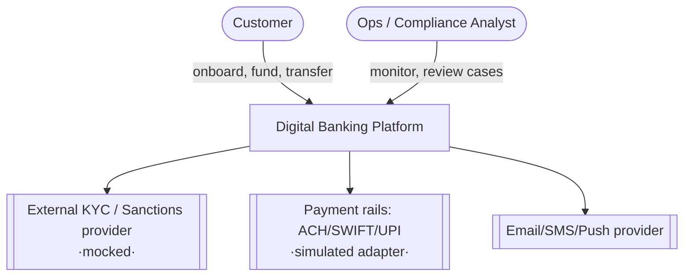
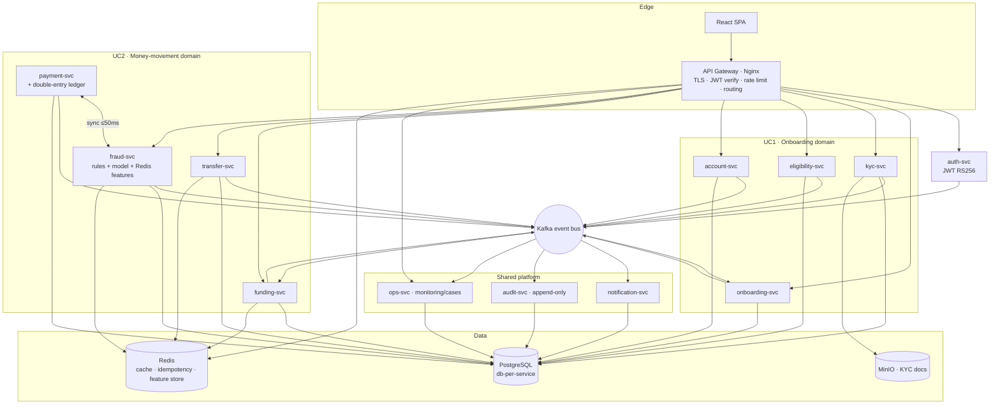
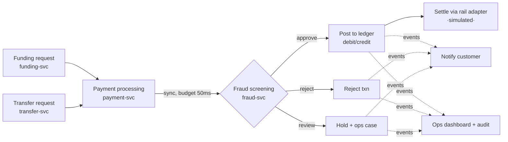
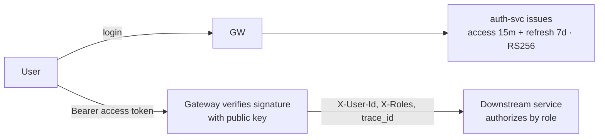
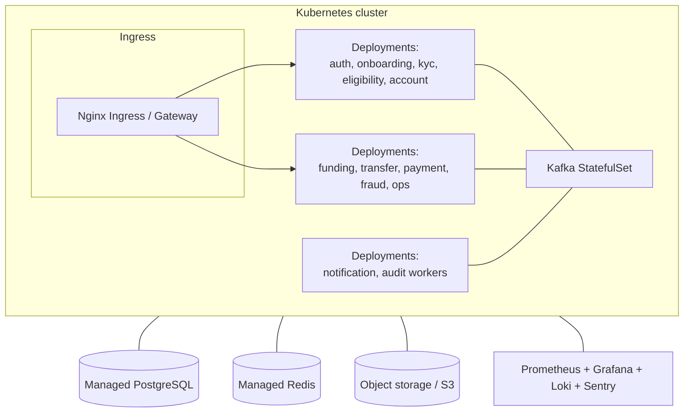

# 01 · High-Level Design (HLD)

Covers both use cases at the system level: context, containers, deployment, and
cross-cutting concerns. Low-level detail (schemas, sequences, classes) is in
[`02-lld.md`](02-lld.md). Editable diagrams: [`../diagrams/`](../diagrams/).

---

## 1. System context (C4 level 1)



**Actors & goals**
- **Customer** — onboard, get an account, fund it, send money, get notified.
- **Ops / Compliance analyst** — watch transaction health, work fraud cases, read audit trail, tune false positives.
- **External systems** — KYC/sanctions (mocked), payment rails (simulated), messaging provider.

---

## 2. Container view (C4 level 2)



Colour/ownership mapping is in [`00-project-plan.md`](00-project-plan.md#5-equal-ownership-breakdown).

---

## 3. UC1 — Onboarding & KYC-lite, high-level flow

```mermaid
flowchart LR
  A[Capture customer info<br/>onboarding-svc] --> B[KYC-lite verify<br/>kyc-svc]
  B --> C["Eligibility & risk<br/>eligibility-svc"]
  C -->|eligible| D[Open account<br/>account-svc]
  C -->|ineligible / high risk| R[Reject / manual review]
  D --> E[Instant account details<br/>acct no, IFSC/SWIFT, status]
  D -. account.opened .-> N[Notify customer]
  A & B & C & D -. events .-> AUD[Audit trail]
```

**Key HLD decisions (UC1)**
- Onboarding is a **workflow state machine** (`DRAFT → CAPTURED → KYC_PENDING → KYC_PASSED → ELIGIBLE → ACCOUNT_OPENED` / `…_FAILED / MANUAL_REVIEW`). onboarding-svc orchestrates; the other services are steps that report back via events.
- **KYC-lite** = identity match + document check + sanctions/PEP screen (mock), not full CDD. Heavy doc processing runs async (Celery) so the API stays responsive.
- **Instant account** = as soon as `eligibility.evaluated=PASS` is consumed, account-svc generates the account number synchronously and returns it.

---

## 4. UC2 — Funding & Transfers with real-time fraud, high-level flow



**Key HLD decisions (UC2)**
- **Fraud is on the synchronous critical path** for a strict latency budget (≤50 ms). It uses in-process rules + a Redis **feature store** (velocity, recent geo, device, amount z-score) so it never waits on a DB. If it can't answer in budget it **fails to async review** and marks the txn `UNSCREENED` rather than blocking money forever.
- **Money moves only after** a `payment.processed` (approved) event — funds are never posted on request, avoiding double-spend.
- **Double-entry ledger** in payment-svc guarantees balances reconcile; every posting is auditable.
- **Idempotency-Key** on funding/transfer POSTs makes retries safe.

---

## 5. Cross-cutting concerns

### 5.1 Security

- **AuthN:** JWT (SimpleJWT), RS256; refresh rotation + blacklist in Redis; short-lived access tokens.
- **AuthZ:** role-based (`customer`, `ops_analyst`, `compliance_officer`, `admin`) enforced by DRF permission classes from `common_auth`.
- **Edge:** gateway does TLS, rate limiting, JWT pre-check; services re-verify (defence in depth).
- **Data:** PII encrypted at rest (pgcrypto / field encryption for KYC), MinIO presigned URLs, secrets in Vault, no PII in logs (only `trace_id` + hashed refs).
- **Money integrity:** idempotency keys, DB transactions, double-entry ledger, append-only audit.

### 5.2 Scalability
- **Stateless services** → horizontal scale behind gateway; sessions live in JWT/Redis.
- **Kafka partitioning by `account_id`** preserves per-account ordering while scaling consumers.
- **CQRS-lite:** ops-svc/monitoring read from event-built projections, not the write DBs.
- **Async offload:** Celery for KYC docs, notifications, reconciliation.
- **Fraud fast path:** Redis feature store + in-process scoring; scale fraud-svc independently.

### 5.3 Reliability & observability
- Health probes `/livez` `/readyz`; gateway aggregate health.
- OpenTelemetry traces propagate `trace_id` end-to-end; Prometheus metrics (esp. `fraud_decision_seconds` p99, `txn_approved_total`, `false_positive_ratio`); Grafana dashboards; Loki logs; Sentry.
- Kafka gives **replay** for recovery and rebuilding audit/monitoring projections.
- Outbox pattern (transactional outbox table per service) so DB write + event publish don't diverge.

---

## 6. Deployment (prod-ready)


- **Local:** docker-compose (everything on one box).
- **Prod:** Kubernetes + Helm per service, managed Postgres/Redis/S3, Kafka as StatefulSet or managed (MSK/Confluent). Terraform provisions; GitHub Actions builds/pushes images and deploys.

---
