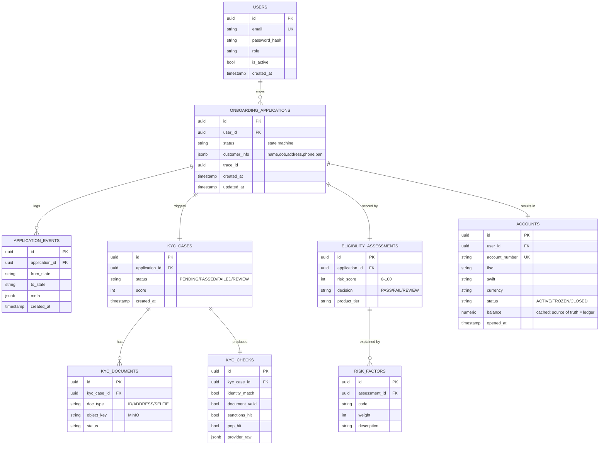
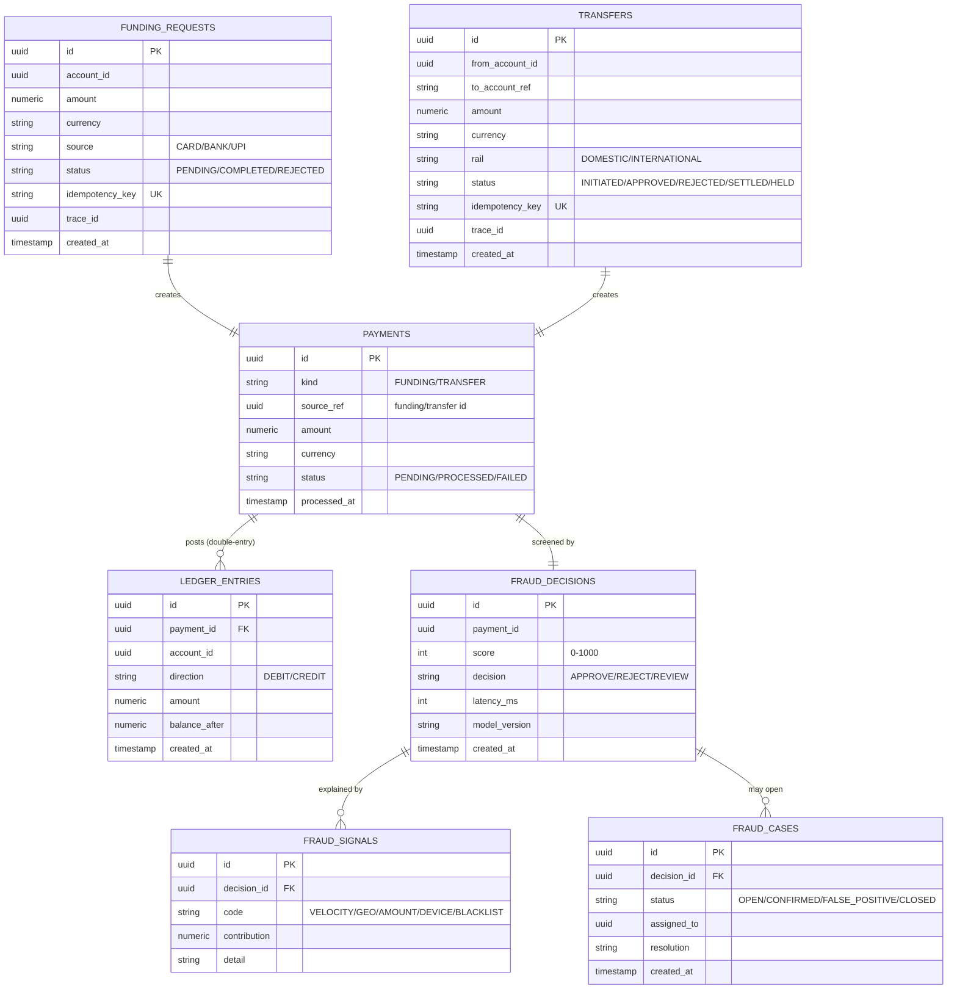
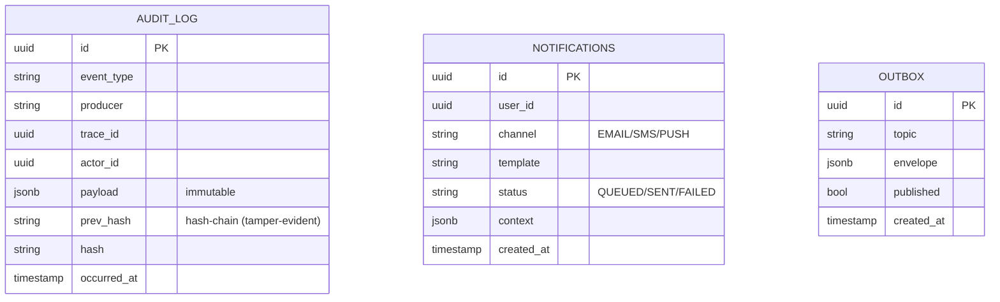
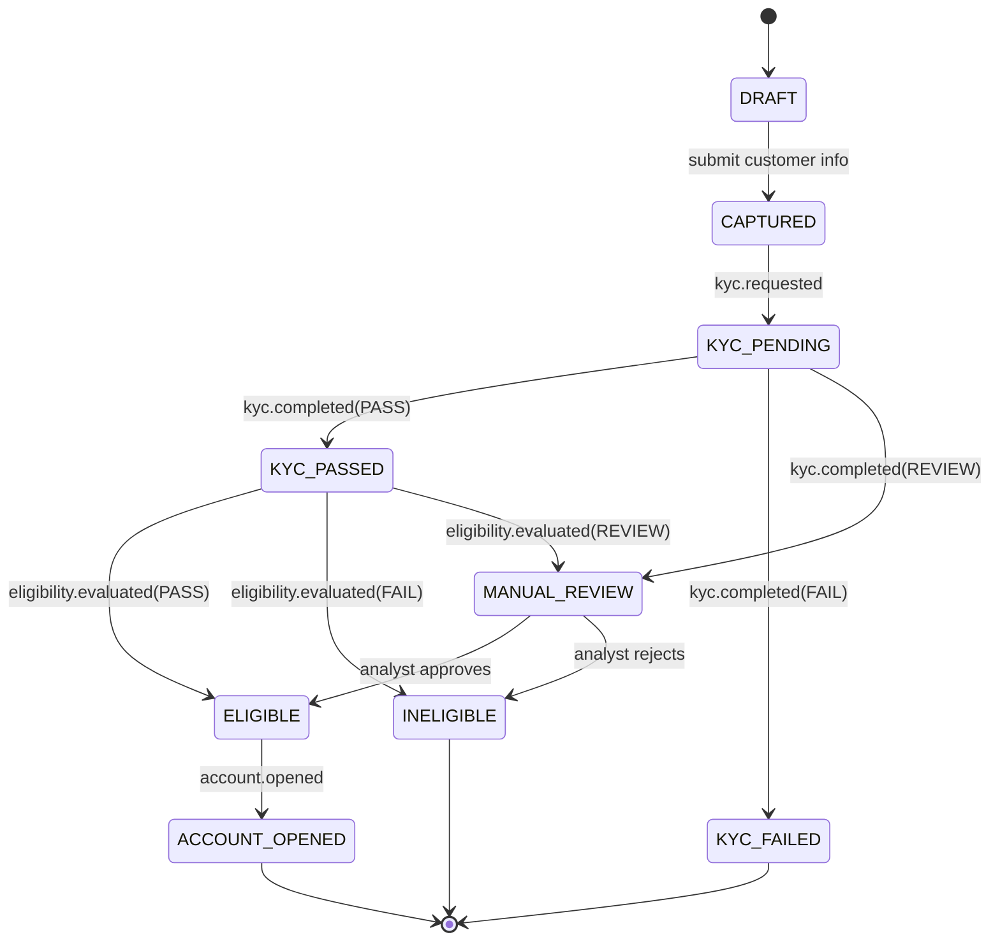
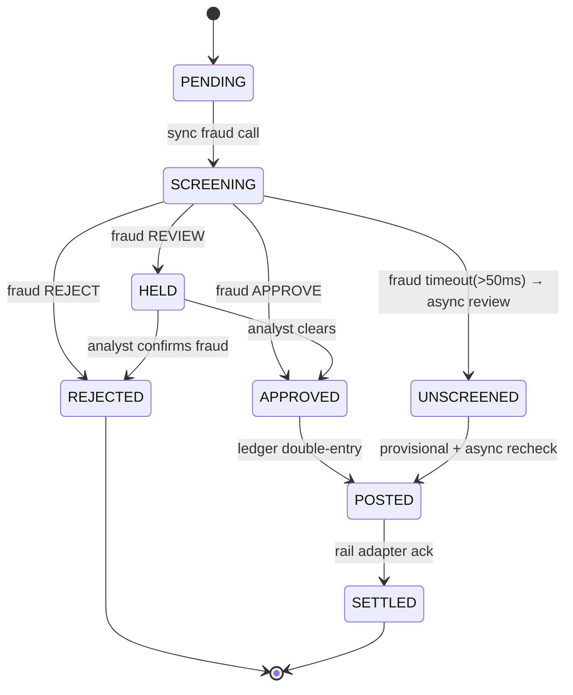
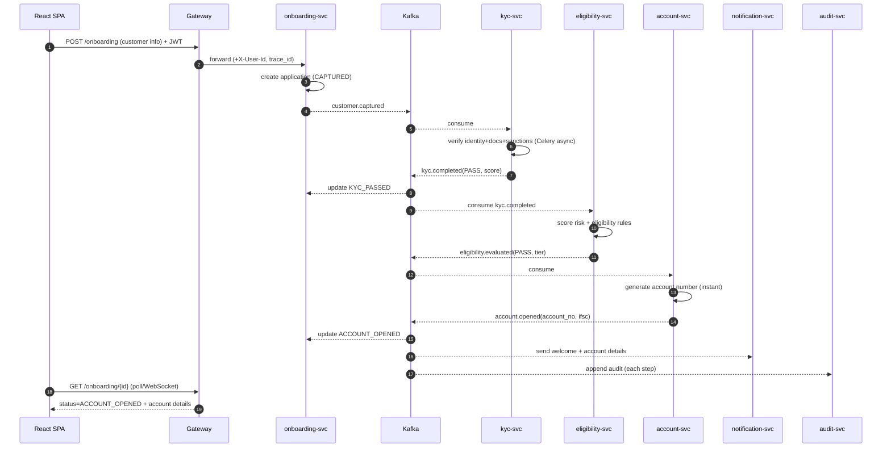
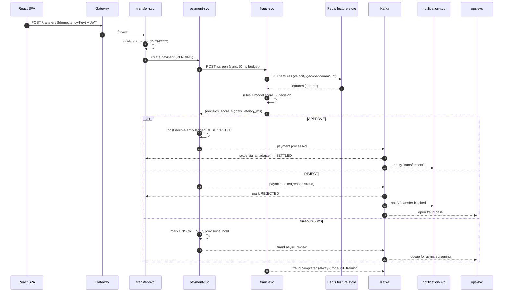
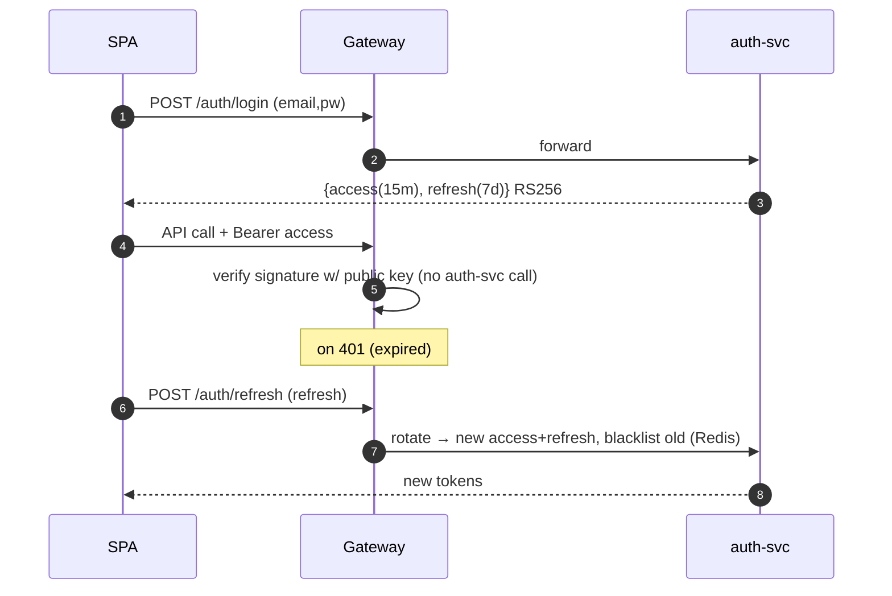
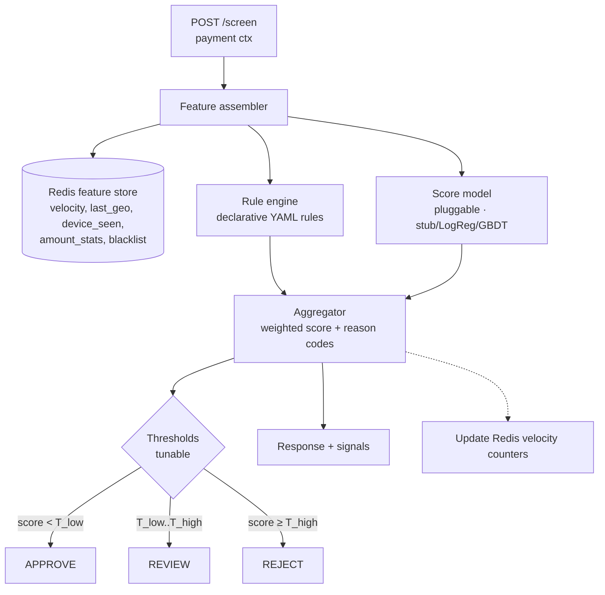
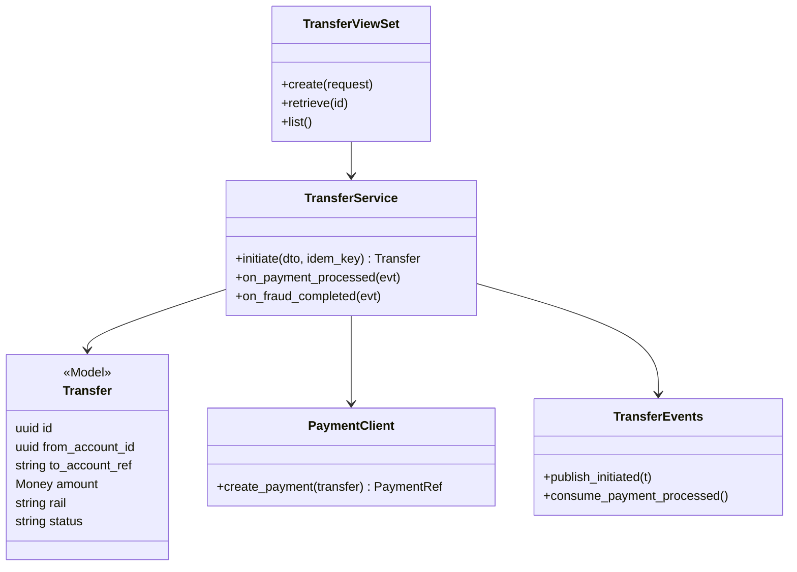

# 02 · Low-Level Design (LLD)

Per-service data models, state machines, sequences, and the internals of the
tricky bits (fraud scoring, ledger, idempotency). REST/event contracts are in
[`04-api-contracts.md`](04-api-contracts.md). Editable versions: the **"LLD"**
pages inside the two `.drawio` files.

---

## 1. Data models (ER per service — DB-per-service)

### 1.1 UC1 — Onboarding domain

### 1.2 UC2 — Money-movement domain

### 1.3 Shared platform tables

> **audit_log** is append-only and **hash-chained** (`hash = H(prev_hash + payload)`) → tamper-evident regulatory trail. Every service has an **outbox** table for the transactional-outbox pattern.

---

## 2. State machines

### 2.1 Onboarding application (onboarding-svc)

### 2.2 Transaction (funding/transfer via payment-svc)

---

## 3. Key sequences

### 3.1 UC1 — end-to-end onboarding

### 3.2 UC2 — transfer with real-time fraud (the latency-critical path)

### 3.3 Auth / token refresh

---

## 4. Fraud engine internals (fraud-svc)

- **Feature store keys** (Redis, TTL-based): `vel:{account}:1m`, `vel:{account}:1h`, `geo:{account}:last`, `dev:{account}:{device_hash}`, `amt:{account}:stats`, `bl:{account_ref}`.
- **Rules** are declarative + versioned (e.g. `amount > 3× rolling_avg AND rail=INTERNATIONAL AND new_beneficiary → +400`). Each firing emits a **reason code** → explainability + false-positive tuning.
- **Reducing false positives:** ops feedback (`FALSE_POSITIVE`) decrements the offending rule's weight via ops-svc → fraud-svc rule-weight store; thresholds are per-segment.
- **Latency budget:** everything in-process + Redis; hard 50 ms timeout in payment-svc; on timeout → `UNSCREENED` fail-open with async re-screen (never blocks money indefinitely, never posts silently either).

---

## 5. Ledger correctness (payment-svc)

- **Double-entry:** every posting writes ≥2 `ledger_entries` that sum to zero (DEBIT source, CREDIT destination / system account). Balance = sum of entries; `accounts.balance` is a cache reconciled from the ledger.
- **Atomicity:** posting runs inside a single DB transaction with `SELECT … FOR UPDATE` on the account row → no double-spend under concurrency.
- **Idempotency:** `Idempotency-Key` (Redis + unique DB index) means a retried funding/transfer returns the original result, never a second debit.
- **Outbox:** the `payment.processed` event is written to the `outbox` table in the same transaction, then published by a relay → DB and Kafka never diverge.

---

## 6. Module/class layout (representative — transfer-svc)

The same layering (`ViewSet → Service → Model/Client/Events`) is used by every service; see [`03-tech-stack.md`](03-tech-stack.md#3-repo-layout).

---

## 7. API surface (summary — full spec in `04-api-contracts.md`)

| Method & path | Service | Auth role |
|---------------|---------|-----------|
| `POST /auth/login`, `/auth/refresh`, `/auth/register` | auth | public |
| `POST /onboarding`, `GET /onboarding/{id}` | onboarding | customer |
| `POST /kyc/{app}/documents`, `GET /kyc/{app}` | kyc | customer |
| `GET /eligibility/{app}` | eligibility | customer/ops |
| `GET /accounts/{id}`, `GET /accounts/me` | account | customer |
| `POST /funding`, `GET /funding/{id}` | funding | customer |
| `POST /transfers`, `GET /transfers/{id}` | transfer | customer |
| `POST /fraud/screen` (internal), `GET /fraud/decisions/{id}` | fraud | internal/ops |
| `GET /ops/cases`, `PATCH /ops/cases/{id}` | ops | ops_analyst |
| `GET /audit?trace_id=` | audit | compliance |
| `GET /notifications/me` | notification | customer |
