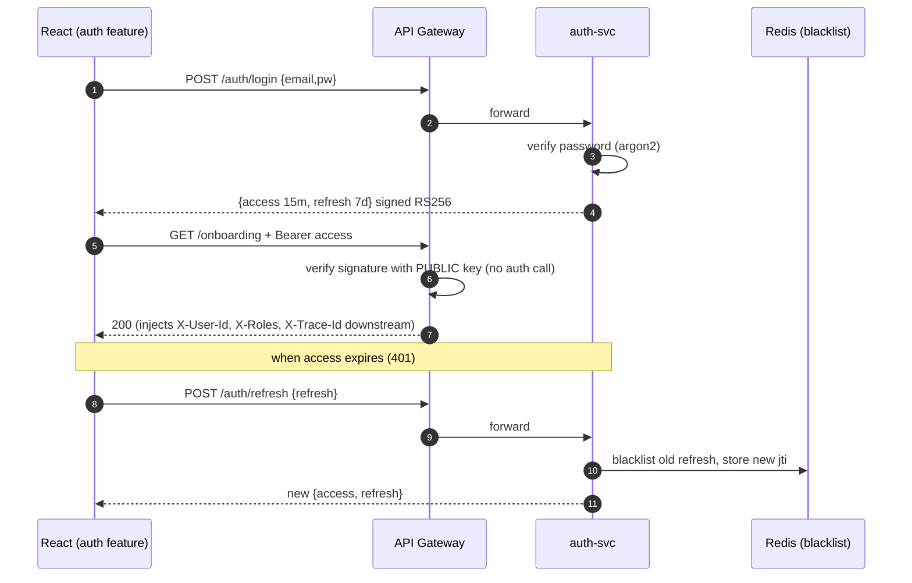
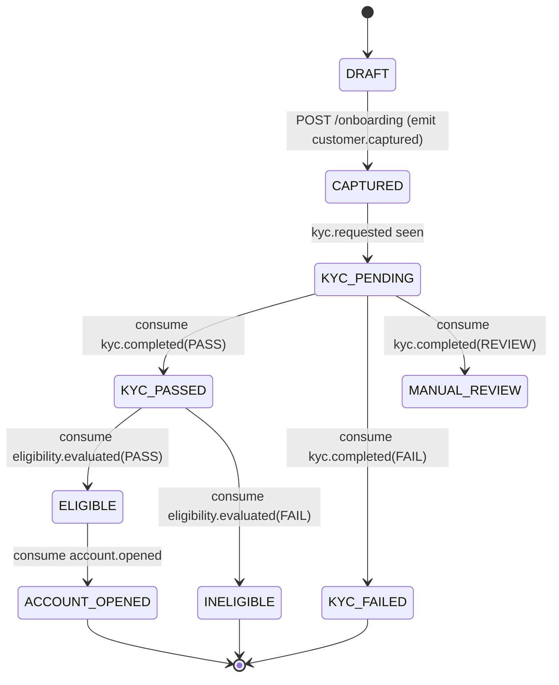
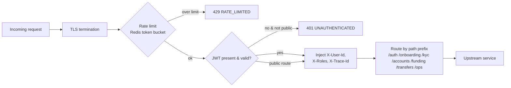
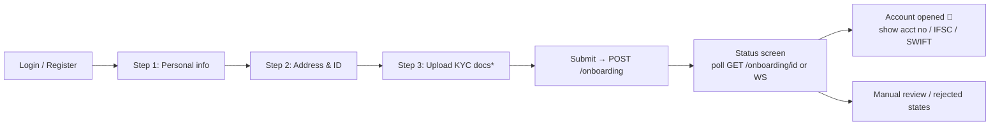

# Member 1 — Identity, Onboarding & API Gateway

> **Owns the secure front door + the UC1 workflow spine.** Everything enters through
> your gateway and authenticates against your auth-svc, so your work unblocks
> everyone else on Day 1. See the whole plan in [`../docs/00-project-plan.md`](../docs/00-project-plan.md).

## Ownership at a glance

| Type | You own |
|------|---------|
| **Backend services** | `auth-svc` (8001), `onboarding-svc` (8002) |
| **Shared platform concern** | `api-gateway` (Nginx) + routing/rate-limit + `libs/common_auth` (JWT RS256 verify + DRF permissions) + RS256 keypair management |
| **React feature areas** | `web/src/features/auth` (login, register, token-refresh interceptor), `web/src/features/onboarding` (multi-step wizard) |
| **DB (onboarding_db + auth_db)** | `users`, `refresh_tokens`, `onboarding_applications`, `application_events` |
| **Primary UC** | UC1 |

## Events you produce / consume

| Direction | Topic | Notes |
|-----------|-------|-------|
| produce | `user.registered` | on signup |
| produce | `customer.captured` | when onboarding info submitted → kicks off M2's kyc-svc |
| produce | `onboarding.completed` | terminal state reached |
| consume | `kyc.completed` | advance state machine |
| consume | `eligibility.evaluated` | advance state machine |
| consume | `account.opened` | mark `ACCOUNT_OPENED`, surface account details |

Contract details live in [`../docs/04-api-contracts.md`](../docs/04-api-contracts.md).

---

## Flow 1 — Auth (login + token refresh, RS256)

## Flow 2 — Onboarding workflow state machine (onboarding-svc)

## Flow 3 — Gateway request pipeline (what you build in Nginx + common_auth)

## Frontend — onboarding wizard (your React area)

\* the upload widget posts to M2's kyc-svc via presigned URL — you render it, M2 owns the endpoint.

---

## Your build checklist
- [ ] `auth-svc`: register/login/refresh/logout/me, argon2 hashing, SimpleJWT **RS256**, refresh rotation + Redis blacklist, `user.registered` event.
- [ ] Generate + document the RS256 keypair; publish the **public key** (JWKS endpoint) for all services + gateway.
- [ ] `libs/common_auth`: DRF authentication class that trusts gateway headers, `HasRole` permission classes, JWT verify middleware. **All members import this.**
- [ ] `api-gateway`: Nginx conf with `auth_request`, path routing to all 12 services, per-route rate limits, aggregate `/healthz`.
- [ ] `onboarding-svc`: application model + **state-machine service layer**, `POST /onboarding`, `GET /onboarding/{id}`, produce `customer.captured`, consume kyc/eligibility/account events, `application_events` audit rows.
- [ ] React `auth` feature: login/register forms, Axios interceptor (attach access, auto-refresh on 401), route guards by role.
- [ ] React `onboarding` feature: multi-step wizard + live status screen (poll or WebSocket).

## What others need from you (your public contract)
1. A working **login → JWT** so every other feature can be tested behind auth (deliver by **IC-1**).
2. `common_auth` importable package (deliver by **IC-0/IC-1**).
3. `customer.captured` event flowing so M2 can start KYC (deliver by **IC-2**).

## Definition of done
Unit tests ≥70% on auth + state-machine logic · OpenAPI schema published · gateway routes every service · JWT tamper/expiry tests pass · emits/consumes documented events · `/livez` `/readyz` · Dockerfile + compose entry.
