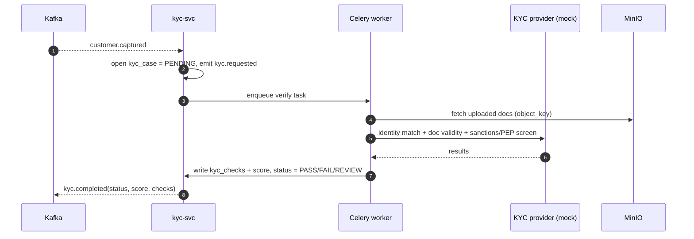
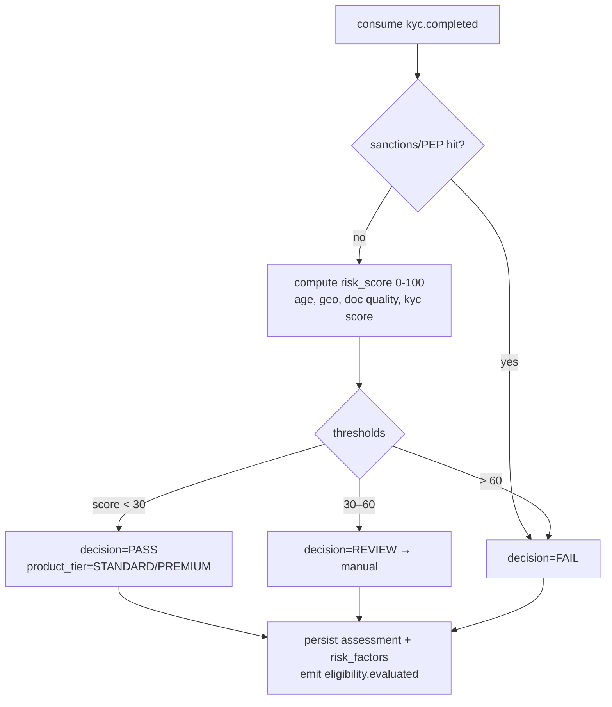
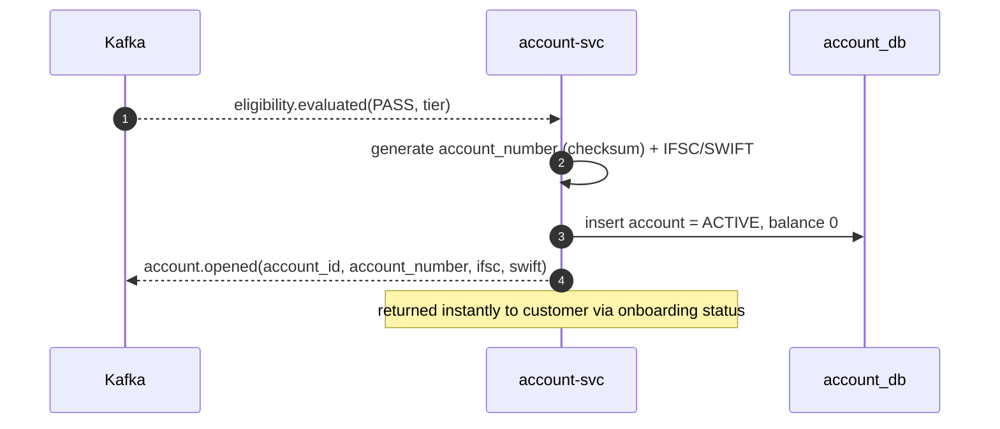
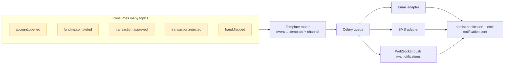
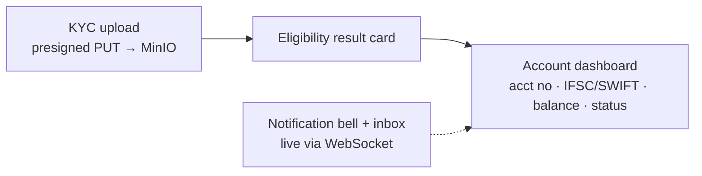

# Member 2 — Verification, Account Opening & Notifications

> **Owns the "does this customer qualify, and give them an account" core of UC1**,
> plus the shared **notification** channel every service uses to reach customers.
> Full plan: [`../docs/00-project-plan.md`](../docs/00-project-plan.md).

## Ownership at a glance

| Type | You own |
|------|---------|
| **Backend services** | `kyc-svc` (8003), `eligibility-svc` (8004), `account-svc` (8005), `notification-svc` (8010) |
| **Shared platform concern** | **Notification** (email/SMS/push, templating, WebSocket live push) — used by UC1 **and** UC2 |
| **React feature areas** | `web/src/features/kyc` (doc upload), `web/src/features/eligibility` (result), `web/src/features/account` (dashboard, balances, details), notification toasts/inbox |
| **DB** | `kyc_cases`, `kyc_documents`, `kyc_checks`, `eligibility_assessments`, `risk_factors`, `accounts`, `notifications`, MinIO objects |
| **Primary UC** | UC1 (+ notifications span both) |

> You own more services than others, but they are **CRUD-shaped** (create case, run rules, persist result) — deliberately balanced against M4's heavy fraud engine.

## Events you produce / consume

| Direction | Topic |
|-----------|-------|
| produce | `kyc.requested`, `kyc.completed`, `eligibility.evaluated`, `account.opened`, `notification.sent` |
| consume | `customer.captured` (→ start KYC), `kyc.completed` (→ eligibility), `eligibility.evaluated` (→ open account), and for notifications: `account.opened`, `funding.completed`, `transaction.approved`, `transaction.rejected`, `fraud.flagged` |

---

## Flow 1 — KYC-lite verification (kyc-svc, async via Celery)

## Flow 2 — Eligibility & risk scoring (eligibility-svc)

## Flow 3 — Instant account opening (account-svc)

## Flow 4 — Notification fan-out (notification-svc, shared)

## Frontend — your React areas

---

## Your build checklist
- [ ] `kyc-svc`: case model, presigned-upload contract, **Celery** verify task calling a **mock provider** (deterministic rules for demo), `kyc_checks`, emit `kyc.requested`/`kyc.completed`.
- [ ] MinIO bucket + presigned PUT/GET; React upload widget (rendered inside M1's wizard).
- [ ] `eligibility-svc`: declarative rule set + risk score, `risk_factors` explainability, emit `eligibility.evaluated`.
- [ ] `account-svc`: account-number generator (checksum), IFSC/SWIFT assignment, emit `account.opened`; `GET /accounts/me`, `GET /accounts/{id}`.
- [ ] `notification-svc`: template registry, channel adapters (email/SMS/push mock), **WebSocket** endpoint, consume the topic list above, emit `notification.sent`.
- [ ] React: eligibility result card, account dashboard, notification bell/inbox.

## What others need from you
1. `account.opened` event with a real account number → **M3's funding-svc** treats the account as usable (**IC-2**).
2. `notification-svc` consuming events → M3/M4 get customer notifications for free (**IC-3**).
3. Presigned-upload contract for M1's wizard (**IC-2**).

## Definition of done
Unit tests ≥70% on rule/scoring logic · OpenAPI published · async KYC path works under Celery · notification templates for every consumed event · emits/consumes documented events · `/livez` `/readyz` · Dockerfile + compose entry.
