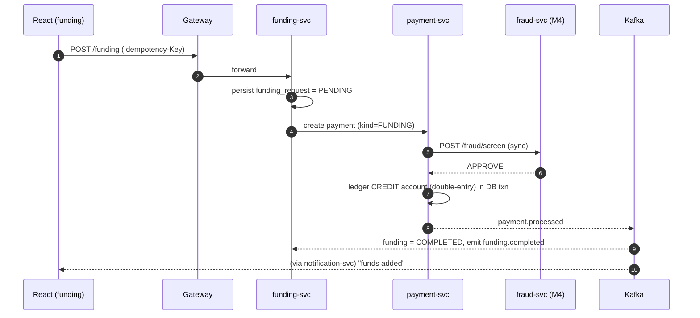
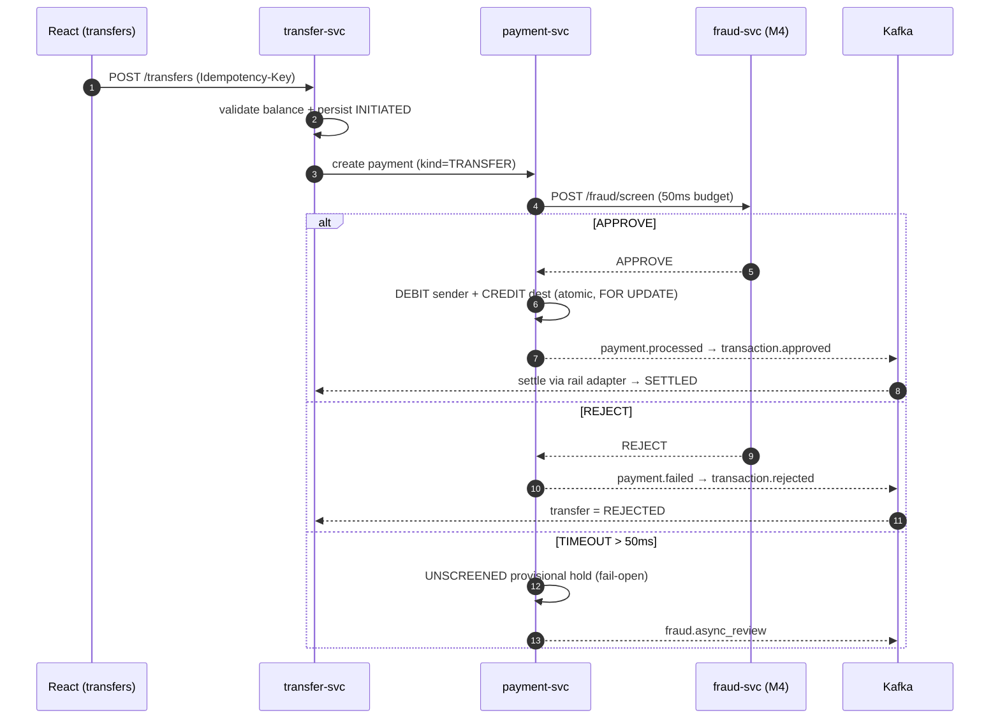
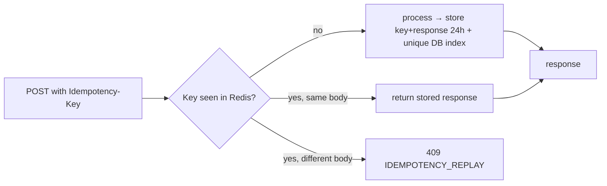
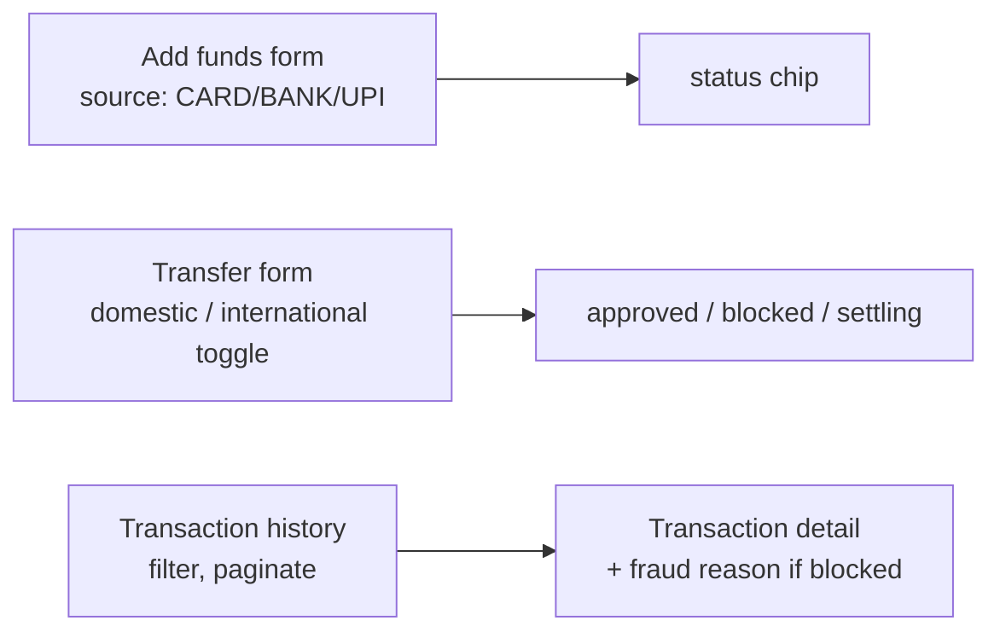

# Member 3 — Funding, Transfers & Payment/Ledger

> **Owns the money.** Every debit and credit flows through your services, so
> **correctness beats cleverness**: double-entry ledger, idempotency, DB transactions.
> You also own the **Kafka event backbone** that connects all four members.
> Full plan: [`../docs/00-project-plan.md`](../docs/00-project-plan.md).

## Ownership at a glance

| Type | You own |
|------|---------|
| **Backend services** | `funding-svc` (8006), `transfer-svc` (8007), `payment-svc` + ledger (8008) |
| **Shared platform concern** | **Kafka event bus** + `libs/common_events` (producer/consumer + envelope + outbox relay) + `libs/common_idempotency` (Idempotency-Key middleware) |
| **React feature areas** | `web/src/features/funding`, `web/src/features/transfers` (domestic/intl), `web/src/features/history` (transaction list) |
| **DB** | `funding_requests`, `transfers`, `payments`, `ledger_entries`, `outbox` |
| **Primary UC** | UC2 |

## Events you produce / consume

| Direction | Topic |
|-----------|-------|
| produce | `funding.requested`, `funding.completed`, `transfer.initiated`, `transfer.settled`, `payment.processed`, `payment.failed`, `transaction.approved`, `transaction.rejected` |
| consume | `account.opened` (know which accounts are fundable), `fraud.completed` (approve/reject decision from M4) |
| sync call | `POST /fraud/screen` on **M4's fraud-svc** during payment processing (50 ms budget) |

---

## Flow 1 — Funding an account (funding-svc → payment-svc)



## Flow 2 — Transfer with fraud gate (transfer-svc → payment-svc → fraud-svc)



## Flow 3 — Double-entry ledger posting (payment-svc, the correctness core)

```mermaid
flowchart TB
  IN[approved payment] --> TX[BEGIN DB transaction]
  TX --> LK[SELECT account FOR UPDATE<br/>lock row]
  LK --> CHK{sufficient balance?<br/>(transfers)}
  CHK -->|no| FAILr[rollback → payment.failed insufficient_funds]
  CHK -->|yes| E1[insert DEBIT entry]
  E1 --> E2[insert CREDIT entry]
  E2 --> BAL[update balance_after = sum of entries]
  BAL --> OB[insert payment.processed into OUTBOX<br/>same transaction]
  OB --> CM[COMMIT]
  CM --> REL[outbox relay publishes to Kafka]
```
Invariant: **every payment produces entries that sum to zero.** `accounts.balance` is a cache; the ledger is the source of truth.

## Flow 4 — Idempotency (common_idempotency, protects funding + transfers)



## Frontend — your React areas



---

## Your build checklist
- [ ] `libs/common_events`: Kafka producer/consumer wrappers, **event envelope**, `event_id` dedupe, **transactional outbox relay**, fixtures per topic. **Every member imports this.**
- [ ] `libs/common_idempotency`: Idempotency-Key DRF middleware backed by Redis + unique DB index.
- [ ] `payment-svc`: **double-entry ledger**, atomic posting with `SELECT … FOR UPDATE`, outbox, sync call to fraud-svc with 50 ms timeout + fail-open, emit `payment.processed`/`payment.failed`/`transaction.*`.
- [ ] `funding-svc`: `POST /funding`, consume `account.opened` + `payment.processed`, emit funding events.
- [ ] `transfer-svc`: `POST /transfers` (domestic + international rails), balance check, rail settlement adapter (simulated), emit transfer events.
- [ ] Provide `docker-compose` Kafka + topic bootstrap (with M4) and the shared **schema registry / fixtures**.
- [ ] React: funding form, transfer form (domestic/intl), transaction history + detail.

## What others need from you
1. `common_events` + the **frozen topic catalogue** so every service can publish/consume (**IC-0**).
2. The `POST /fraud/screen` **caller contract** agreed with M4 (**IC-0**), wired by **IC-3**.
3. `transaction.approved/rejected` events so M2 notifies and M4's ops-svc opens cases (**IC-3**).

## Definition of done
Unit tests ≥70% incl. **concurrency test** (no double-spend) and idempotency replay · ledger reconciliation check · OpenAPI published · emits/consumes documented events · `/livez` `/readyz` · Dockerfile + compose entry.
