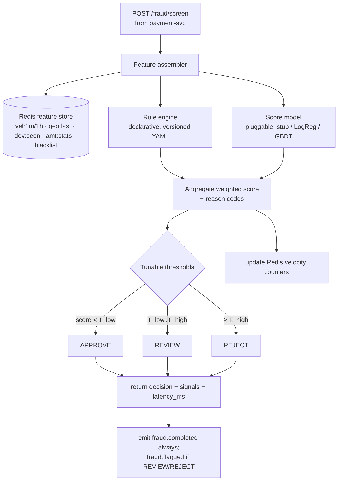
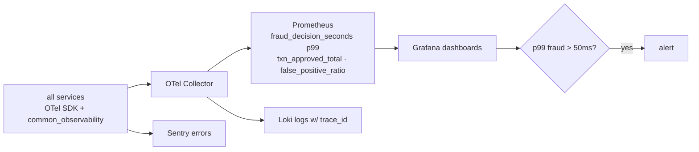
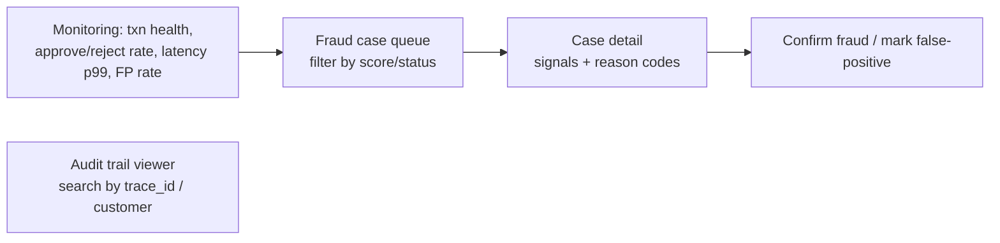

# Member 4 — Fraud Screening, Ops, Audit & Platform/DevOps

> **Owns trust + the platform.** Your fraud engine sits on the payment hot path
> (the "milliseconds" requirement), and you own the audit trail, ops visibility,
> and the Docker/K8s/CI-CD everyone runs on. Fewer CRUD services, deliberately —
> the fraud engine + platform is your weight. Full plan:
> [`../docs/00-project-plan.md`](../docs/00-project-plan.md).

## Ownership at a glance

| Type | You own |
|------|---------|
| **Backend services** | `fraud-svc` (8009), `ops-svc` (8012), `audit-svc` (8011) |
| **Shared platform concern** | **Audit/Compliance** + **Observability** (OTel, Prometheus, Grafana, Loki) + `libs/common_observability` + **docker-compose / K8s / GitHub Actions CI-CD** |
| **React feature areas** | `web/src/features/ops` (fraud console + case mgmt), `web/src/features/monitoring` (health dashboards), `web/src/features/audit` (trail viewer) |
| **DB** | `fraud_decisions`, `fraud_signals`, `fraud_cases`, `audit_log` (append-only, hash-chained), Redis feature store |
| **Primary UC** | UC2 (audit/observability span both) |

## Events you produce / consume

| Direction | Topic |
|-----------|-------|
| produce | `fraud.completed`, `fraud.flagged`, `case.updated` |
| consume (fraud) | `funding.requested`, `transfer.initiated` (also serves **sync** `POST /fraud/screen`) |
| consume (audit) | **all** topics (`*`) → append-only trail |
| consume (ops) | `fraud.flagged`, `transaction.rejected` → open/track cases |

---

## Flow 1 — Real-time fraud screening (fraud-svc, the ≤50 ms path)



## Flow 2 — Reducing false positives (the feedback loop with ops-svc)

```mermaid
sequenceDiagram
  autonumber
  participant FR as fraud-svc
  participant K as Kafka
  participant OPS as ops-svc
  participant A as Analyst (React)
  FR-->>K: fraud.flagged(payment, signals)
  K-->>OPS: open case = OPEN
  A->>OPS: review case, PATCH status = FALSE_POSITIVE
  OPS-->>K: case.updated(FALSE_POSITIVE, signals)
  K-->>FR: decrement weight of offending rule(s)
  Note over FR: thresholds are per-segment;<br/>FP rate tracked as a Prometheus metric
```

## Flow 3 — Tamper-evident audit trail (audit-svc)

```mermaid
flowchart LR
  ALL[consume ALL topics] --> HASH[compute hash = H(prev_hash + payload)]
  HASH --> APP[append immutable row<br/>event_type, producer, actor, trace_id, payload, hash, prev_hash]
  APP --> IDX[index by trace_id, actor_id, time]
  IDX --> Q[GET /audit?trace_id= → full chain for one flow]
  APP --> VER[chain verifier job<br/>detects any tampering]
```

## Flow 4 — Observability & the latency SLO



## Frontend — your React areas (Ops console)



---

## Your build checklist
- [ ] `fraud-svc`: **feature assembler** + Redis feature store, declarative **rule engine** with reason codes, pluggable **model interface** (ship a stub), `POST /fraud/screen` (sync, in-process, no blocking I/O beyond Redis), emit `fraud.completed`/`fraud.flagged`.
- [ ] Latency: load test (k6/Locust) proving **p99 < 50 ms**; expose `fraud_decision_seconds` metric.
- [ ] `ops-svc`: case model, `GET/PATCH /ops/cases`, `GET /ops/metrics`, false-positive feedback → `case.updated` → rule-weight tuning.
- [ ] `audit-svc`: consume `*`, **hash-chained append-only** log, `GET /audit`, chain verifier.
- [ ] `libs/common_observability`: OTel setup, `trace_id` middleware, structured log config. **Every member imports this.**
- [ ] **Platform (Day 0 deliverable):** `docker-compose.yml` bringing up gateway + all 12 services + Kafka + Postgres + Redis + MinIO + Prometheus + Grafana; GitHub Actions CI (lint → test → build → scan); K8s/Helm + Terraform skeleton.
- [ ] React: monitoring dashboards, fraud case console, audit viewer.

## What others need from you
1. **Day 0:** the one-command `docker-compose up` stack so everyone develops against the same infra (**IC-0**). This is the single most important unblock.
2. `common_observability` importable package (**IC-0/IC-1**).
3. `POST /fraud/screen` live for M3's payment-svc (**IC-3**), meeting the 50 ms budget.
4. Audit trail + ops dashboard for the demo (**IC-3 / Milestone M3**).

## Definition of done
Fraud p99 < 50 ms proven under load · unit tests ≥70% on rule engine · audit chain verifier passes · Grafana dashboards live · CI green on every PR · compose brings up the whole stack · emits/consumes documented events · `/livez` `/readyz`.
