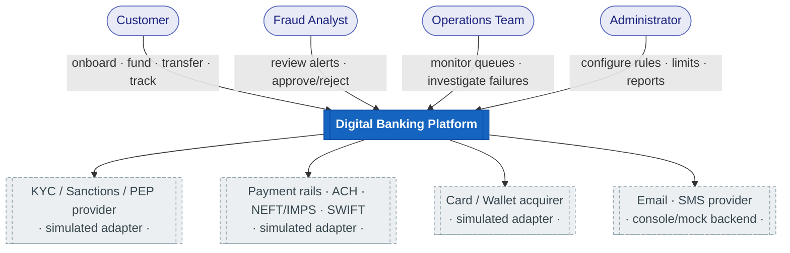
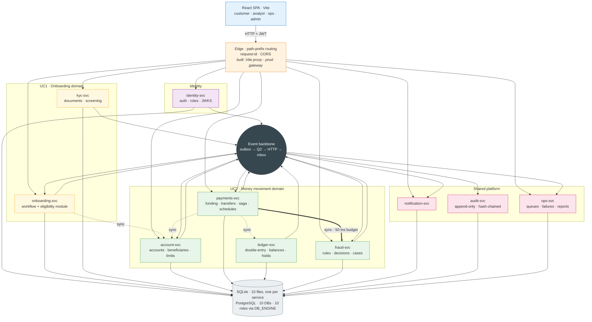
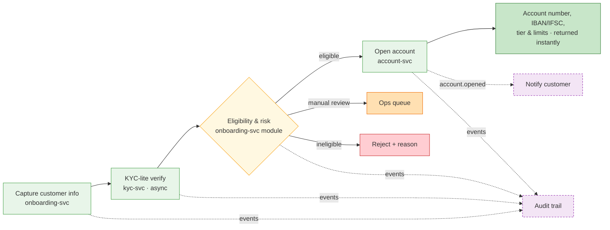
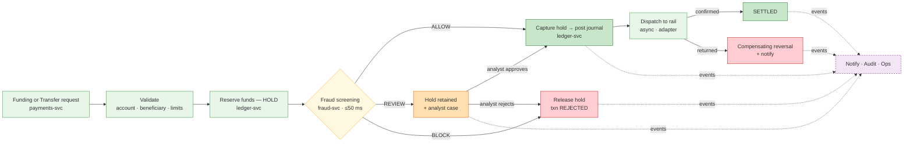
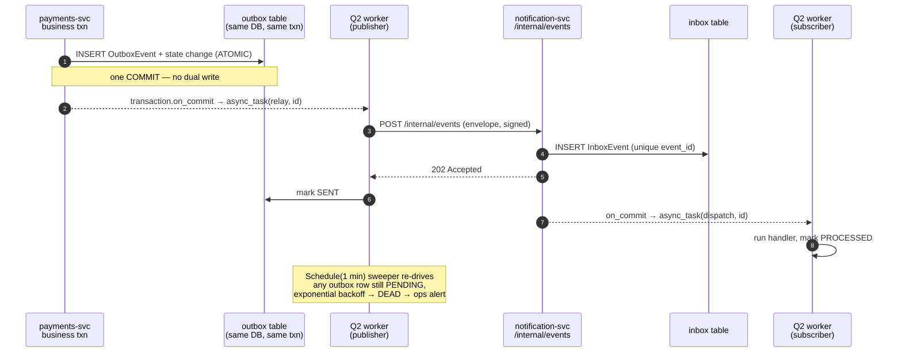
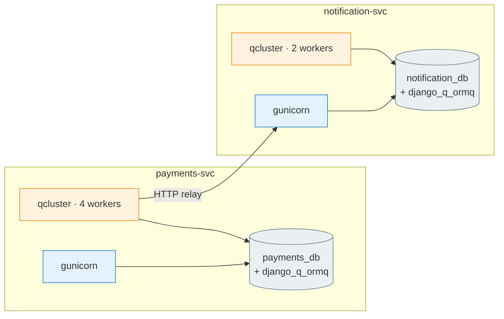
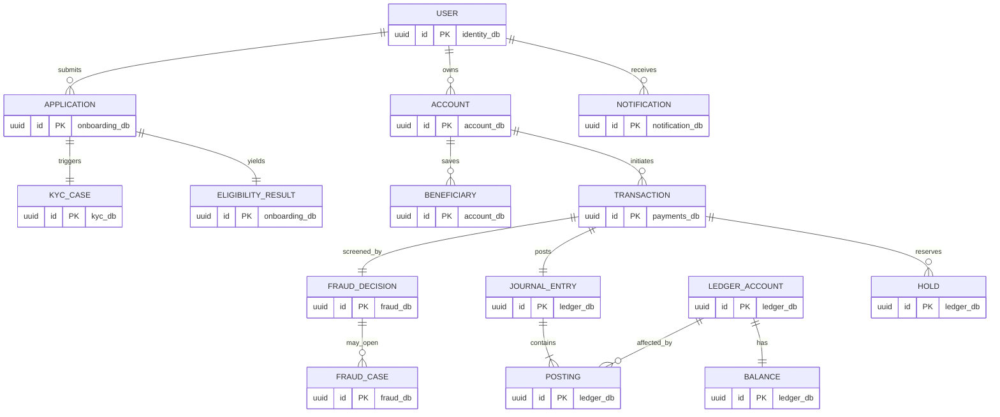
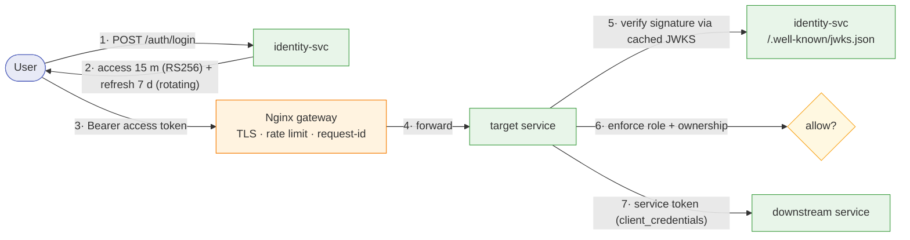
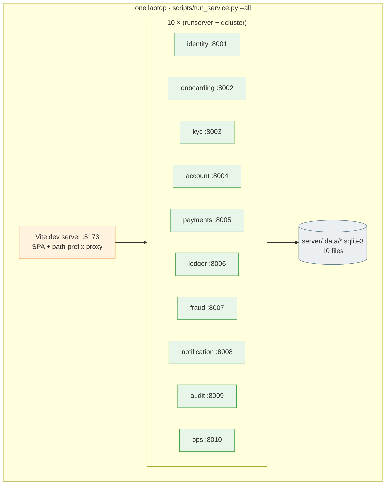

# 01 · High-Level Design (HLD)

> System-level design for the **Digital Banking Platform**: onboarding & KYC-lite
> account opening (UC1) and funding, transfers & real-time fraud screening (UC2).
> The reasoning behind every boundary is in [`00-first-principles.md`](00-first-principles.md);
> implementation detail is in [`02-lld.md`](02-lld.md).

**Stack:** React 19 + Vite (JavaScript/JSX) · Django 5.2 + DRF (Python 3.12) ·
**SQLite, one file per service** (PostgreSQL via `DB_ENGINE=postgres`) ·
**Django Q2** (ORM broker) · no gateway — the Vite dev server proxies by path prefix.
No Redis, no Kafka, no external broker — and no database server either.

> **Read this first.** This document is the *design*. Where the built system
> diverges from it, the divergence is called out inline in a `⚠ As built` note.
> The authoritative description of what actually exists is
> [`../HANDBOOK.md`](../HANDBOOK.md).

---

## 1. System context (C4 · Level 1)



**Every external dependency is behind an adapter interface** with a simulated
implementation. Nothing in the domain code knows whether a rail is real. This is
what makes the system demonstrable without a banking licence, and swappable
without a rewrite.

---

## 2. Container view (C4 · Level 2)



**Thick arrow = the only synchronous call with a hard latency budget.**
Dotted arrows are synchronous but generous. Everything through the backbone is
asynchronous and at-least-once.

### 2.1 Service register

| # | Service | Owns (authoritative data) | Public API | Q2 workload |
|---|---|---|---|---|
| 1 | **identity-svc** | users, credentials, roles, refresh tokens, signing keys, devices | `/api/auth/*` | token cleanup, login-anomaly events |
| 2 | **onboarding-svc** | applications, eligibility results | `/api/onboarding/*` | KYC callback handling, workflow timeouts |
| 3 | **kyc-svc** | KYC cases, documents, screening hits | `/api/kyc/*` | document processing, sanctions/PEP screen |
| 4 | **account-svc** | accounts, beneficiaries, limit policies, limit usage | `/api/accounts/*`, `/api/beneficiaries/*` | limit-window rollover, cooling-off expiry |
| 5 | **payments-svc** | funding requests, transfers, schedules, saga state, idempotency | `/api/funding/*`, `/api/transfers/*` | rail dispatch, scheduled/recurring runs, saga timeouts |
| 6 | **ledger-svc** | ledger accounts, journal entries, postings, balances, holds | *internal only* | hold expiry, end-of-day reconciliation |
| 7 | **fraud-svc** | rules, decisions, cases, feature read model, blacklists | `/api/fraud/*` | profile updates, rule-precision rollups |
| 8 | **notification-svc** | notifications, templates, preferences | `/api/notifications/*` | channel delivery + retry |
| 9 | **audit-svc** | append-only audit log | `/api/audit/*` (read) | chain verification, export jobs |
| 10 | **ops-svc** | health snapshots, failure cases, reports | `/api/ops/*` | health polling, report generation |

> `ledger-svc` has **no gateway route**. It is reachable only from inside the
> network by services holding a service token. Customers never address the
> ledger directly — this is a deliberate blast-radius decision (I1/ADR-002).

---

## 3. Use-case → service traceability

Every use case from the brief, mapped to where it lives. Nothing is unassigned.

### 3.1 Customer

| Use case | Service(s) | Entry point |
|---|---|---|
| Log in securely | identity-svc | `POST /api/auth/login` (+ optional TOTP) |
| View dashboard | account-svc (+ ledger for balance) | `GET /api/accounts` |
| Check account balance | account-svc → ledger-svc | `GET /api/accounts/{id}` (balance embedded) |
| Add money — select source (bank / debit card / wallet) | payments-svc + account-svc | `POST /api/funding` |
| Verify funding & receive confirmation | payments-svc → notification-svc | funding saga + `payment.settled` |
| Internal transfer (IND → IND) | payments-svc (`rail=INTERNAL`) | `POST /api/transfers` |
| Domestic transfer (IND → other bank) | payments-svc (`rail=DOMESTIC`) | `POST /api/transfers` |
| International transfer (IND → foreign bank) | payments-svc (`rail=INTERNATIONAL`) | `POST /api/transfers` |
| Scheduled transfer (future-dated) | payments-svc `TransferSchedule` | `POST /api/schedules` |
| Recurring transfer (automatic) | payments-svc `TransferSchedule` + Q2 sweeper | `POST /api/schedules` (`frequency`) |
| View transaction history | payments-svc read model | `GET /api/transactions?cursor=` |
| Track transfer status | payments-svc | `GET /api/transactions/{id}` |
| Cancel a transfer | payments-svc (compensating saga) | `POST /api/transactions/{id}/cancel` |
| Manage beneficiaries | account-svc | `/api/beneficiaries/*` |
| Onboard & open an account (UC1) | onboarding-svc → kyc-svc → account-svc | `POST /api/onboarding/applications` |

### 3.2 Fraud Analyst

| Use case | Service | Entry point |
|---|---|---|
| View fraud alerts | fraud-svc | `GET /api/fraud/cases?status=OPEN` |
| Review a suspicious transaction | fraud-svc (+ audit trail by correlation id) | `GET /api/fraud/cases/{id}` |
| Manually approve a transaction | fraud-svc → `fraud.case_approved` → payments resumes at CAPTURE | `POST /api/fraud/cases/{id}/approve` |
| Manually reject a transaction | fraud-svc → `fraud.case_rejected` → payments compensates | `POST /api/fraud/cases/{id}/reject` |
| Mark a false positive (tuning loop) | fraud-svc — folded into approve/reject, which update `RuleStat` | `POST /api/fraud/cases/{id}/approve` |

### 3.3 Operations

| Use case | Service | Entry point |
|---|---|---|
| Monitor transfer queues | ops-svc (polls every service's `/internal/metrics`) | `GET /api/ops/queues` |
| Monitor & investigate failed transfers | ops-svc + payments-svc read model | `GET /api/ops/failures` |
| Resolve a failed transfer with a recorded note | ops-svc | `POST /api/ops/failures/{id}/resolve` |
| Re-drive a dead outbox event | ⚠ **not built** — dead rows surface as failure cases, replay is manual | — |

### 3.4 Administrator

| Use case | Service | Entry point |
|---|---|---|
| Configure fraud engine rules | fraud-svc (versioned, shadow-mode capable) | `/api/fraud/rules/*` |
| Manage transaction & account limits | account-svc | `/api/limit-policies` |
| Generate system reports | ops-svc (async Q2 job → downloadable artefact) | `POST /api/ops/reports` |

---

## 4. UC1 — Onboarding & KYC-lite, high level



**Key decisions**

- Onboarding is an explicit **state machine** owned by onboarding-svc, persisted
  in a column, never inferred from the presence of related rows.
- **KYC is asynchronous** (documents, OCR, sanctions screening take seconds).
  The API returns immediately with `KYC_PENDING`; the SPA polls. onboarding-svc
  resumes on the `kyc.completed` event.
- **"Instant account details"** means: the moment eligibility passes,
  account-svc generates the account number **synchronously** and onboarding
  returns it in the same response. No queue on that step.
- A KYC case that never completes is swept by a Q2 timeout task into
  `MANUAL_REVIEW` rather than sitting forever.

---

## 5. UC2 — Funding & transfers with real-time fraud, high level



**Key decisions**

- **Reserve before screen.** The hold is placed *before* fraud runs, so a
  concurrent transfer can never spend the same funds while screening is in
  flight (I4). Cost: blocked transactions churn a hold that gets released.
  Benefit: the "insufficient funds discovered after approval" race cannot exist.
- **Money moves only on capture**, and capture happens only after an `ALLOW`
  decision or an analyst approval (I2).
- **Rail dispatch is asynchronous** because settlement is asynchronous in
  reality. An internal (ING→ING) transfer has no rail and settles at capture —
  which is why internal transfers are genuinely instant and international ones
  legitimately are not.
- **A return from the rail is a compensating journal entry**, never an edit or
  deletion of the original (I5, I8).

---

## 6. The event backbone

### 6.1 Mechanism

Derived in [`00-first-principles.md` §6](00-first-principles.md#6-deriving-the-event-backbone-from-django-q2); specified in [`03-events.md`](03-events.md).



### 6.2 Guarantees

| Property | How it holds |
|---|---|
| **No lost events** | Outbox row is committed atomically with the state change; sweeper guarantees eventual send |
| **No phantom events** | Nothing is published unless the business transaction committed |
| **At-least-once delivery** | Relay retries with exponential backoff until `SENT` or `DEAD` |
| **Effect-once processing** | `unique(event_id)` on the inbox; duplicate POST returns 200 without reprocessing |
| **Publisher never blocked** | Subscriber returns 202 before doing any work |
| **Out-of-order tolerance** | Handlers apply state-machine guards on `(aggregate_id, sequence)` |
| **Poison-message containment** | After `max_attempts`, the row goes `DEAD` and surfaces in ops-svc for replay |

### 6.3 Django Q2 topology

Each service runs **two process types**: `gunicorn` (API) and `qcluster`
(workers). Each has its own `Q_CLUSTER` config and its own queue tables inside
its own database.



**Queues are private.** No service can enqueue into another's queue — it has no
credentials for that database. The HTTP relay is the only crossing point, and it
is authenticated, signed and audited.

---

## 7. Data architecture

### 7.1 Database-per-service

Default is **SQLite, one file per service** — isolation taken literally, with no
shared server process to reach across:

```
server/.data/
├── identity.sqlite3      ├── payments.sqlite3     ├── notification.sqlite3
├── onboarding.sqlite3    ├── ledger.sqlite3       ├── audit.sqlite3
├── kyc.sqlite3           ├── fraud.sqlite3        └── ops.sqlite3
└── account.sqlite3
```

`DB_ENGINE=postgres` switches the estate to PostgreSQL with no code change, and
adds the role-enforced guarantees SQLite cannot provide:

```
postgres:5432
├── identity_db      owner: identity_role
├── onboarding_db    owner: onboarding_role
├── kyc_db           owner: kyc_role          (PII — field-level encryption)
├── account_db       owner: account_role
├── payments_db      owner: payments_role
├── ledger_db        owner: ledger_role       (REVOKE DELETE on postings)
├── fraud_db         owner: fraud_role
├── notification_db  owner: notification_role
├── audit_db         owner: audit_role        (REVOKE UPDATE, DELETE on audit_log)
└── ops_db           owner: ops_role
```

Each role has `CONNECT` on exactly one database. **A cross-service join is not
discouraged, it is impossible** — which is the whole point (ADR-006). Splitting
into separate instances later is a connection-string change.

### 7.2 Who owns what



> **The relationships above are conceptual, not foreign keys.** Lines crossing a
> database boundary are represented by a **UUID reference plus an event**, never
> by a FK constraint. `TRANSACTION.account_id` is a UUID that account-svc
> happens to know about — Postgres does not enforce it, the saga does.

### 7.3 Read models (and why they aren't duplication)

| Service | Read model | Fed by | Why local |
|---|---|---|---|
| fraud-svc | `AccountProfile`, `ScreenedTxn`, `KnownBeneficiary` | own screening writes, `beneficiary.added` | 50 ms budget forbids a network hop |
| account-svc | `cached_balance`, `LimitUsage` | `ledger.posted` | Dashboard lists must not fan out to the ledger per row |
| ops-svc | `HealthSnapshot`, `FailureCase` | polling + `payment.failed` | Ops must stay observable when a service is down |
| payments-svc | transfer history projection | own writes | Same service, no duplication |

Each is **derived, disposable and rebuildable** from events or a backfill —
never a second source of truth. The authoritative balance is always
`ledger_db.balance`.

---

## 8. Security architecture



| Layer | Control |
|---|---|
| **Transport** | TLS at the gateway; service-to-service on a private network. Mesh/mTLS deliberately deferred (ADR-009 in `00`). |
| **AuthN (user)** | JWT **RS256**. identity-svc holds the private key; every service verifies with the public key from a cached JWKS. No shared secret to leak. Access 15 min, refresh 7 days with **rotation + reuse detection** (a replayed refresh token revokes the whole family). |
| **AuthN (service)** | OAuth2 `client_credentials` → short-lived service JWT with a `scope` claim. `ledger-svc` accepts `scope=ledger:write` from `payments-svc` only. |
| **AuthZ** | Roles `CUSTOMER · FRAUD_ANALYST · OPS · ADMIN` in the token; DRF permission classes from `platform_common`. **Ownership is checked separately from role** — a `CUSTOMER` may hold a valid token and still not own account X. |
| **Gateway** | Rate limits per IP and per subject; strict CORS to the SPA origin; injects `X-Request-Id`; strips client-supplied internal headers. |
| **Internal endpoints** | `/internal/*` is never routed by the gateway. Reachable only in-network, and each request carries an **HMAC signature over the body** with a per-pair key, so a compromised in-network process can't forge events. |
| **PII** | KYC data lives only in `kyc_db`. Documents are stored as a **client-computed SHA-256 digest only** — the file itself never leaves the browser. `national_id_hash` is indexed so duplicate detection survives `purged_at`. Logs carry `correlation_id` only — **never** PAN, national ID, or full account numbers (masked to last 4). ⚠ **As built: field-level encryption (Fernet) is designed but not implemented** — raw `national_id` sits in plaintext in `kyc_identity`. |
| **Money integrity** | Idempotency keys at three independent layers (API, ledger entry, event inbox); row locks in deterministic order; double-entry. ⚠ `DELETE`/`UPDATE` revocation on postings is a **Postgres-only** control — SQLite has no roles, so under the default engine this is enforced by convention and code review, not by the database. |
| **Audit integrity** | Hash-chained rows (`hash = SHA256(prev_hash ‖ canonical(row))`); a Q2 job verifies the chain and raises an ops alert on a break. `audit_role` has `INSERT`/`SELECT` only (Postgres). **Limit worth stating:** this detects an edited row, but anyone with write access can recompute the chain forward and it will verify. Real tamper-*proofing* needs the head hash anchored outside the database. |
| **Admin-configurable rules** | Fraud rules are a **declarative JSON DSL evaluated by a whitelisted interpreter — never `eval`/`exec`**. Rules are versioned, validated on write, and can run in shadow mode. See [`02-lld.md` §8](02-lld.md). |
| **Secrets** | Env vars via `django-environ` locally; secret manager in production. Nothing in the repo. |

---

## 9. Failure modes — what happens when X is down

The most useful table in this document. Every row is a design decision, not a hope.

| Failure | Immediate behaviour | Customer sees | Recovery |
|---|---|---|---|
| **fraud-svc down / slow** | Transaction parked `UNDER_REVIEW` with hold intact (**never auto-allowed** — ADR-005) | "Under review, we'll confirm shortly" | Analyst queue drains the backlog once the service returns |
| **ledger-svc down** | Transfer fails **before** any hold; nothing to compensate | Clear failure, retry later | Idempotency key makes the retry safe |
| **ledger-svc down mid-saga** (hold placed, capture failed) | Saga marked `COMPENSATION_PENDING`; Q2 sweeper retries the release | Pending, then reverted | Hold auto-expires as a second safety net |
| **account-svc down** | Transfer rejected at validation | Clear failure | — |
| **notification-svc down** | Nothing on the money path is affected (I6); outbox accumulates | Payment succeeds; notification arrives late | Relay backoff drains the queue |
| **audit-svc down** | Outbox accumulates in every publisher | Nothing | Events replay on recovery; no audit is lost, only delayed |
| **A Q2 worker dies mid-task** | Task lease expires (`retry`); another worker re-runs it | Nothing | Handler idempotency makes the re-run safe |
| **Publisher dies between commit and `on_commit`** | The `async_task` never fires | Slight delay | The 1-min sweeper picks up the `PENDING` outbox row |
| **Subscriber returns 5xx repeatedly** | Backoff → `DEAD` after `max_attempts` | Nothing | ops-svc DLQ view → manual replay |
| **Rail returns/rejects a settled transfer** | Compensating reversal journal entry + `payment.returned` | Funds returned, notified with reason | Never an edit — always a new entry (I5/I8) |
| **Postgres instance down** | Whole estate degrades | Outage | Single availability domain today; managed Postgres + replica is the production answer |

> ⚠ **As built: there is no circuit breaker.** `do_screen` catches
> `ServiceUnavailable` and halts the saga to `UNDER_REVIEW` directly. The
> *outcome* above is exactly right — fail closed, hold retained — but every
> request keeps calling a dead service instead of failing fast. Adding a breaker
> in `platform_common/http` changes latency under outage, not correctness.
| **Duplicate client submit** (double-click) | Idempotency key returns the *stored original response* | One transfer | I3 |

---

## 10. Scalability

| Dimension | Approach |
|---|---|
| **Stateless API tier** | JWT, no server sessions → scale gunicorn replicas horizontally behind the gateway |
| **Independent scaling** | fraud-svc and payments-svc scale with TPS; kyc-svc and onboarding-svc with signups; audit-svc with total event volume. Ten separate scaling knobs is the point of the decomposition |
| **Worker tier** | `qcluster` replicas scale independently of the API tier. The ORM broker claims tasks by **compare-and-swap on a `lock` timestamp** (`UPDATE … WHERE id=? AND lock=?`; rowcount 0 means another worker won), so adding workers is safe — verified at 12 concurrent workers, 300 tasks, zero double-execution |
| **Hot-row contention** | Per-account row locks; different accounts never contend. Locks are always acquired in ascending UUID order → no deadlocks |
| **Fraud read path** | Own denormalised model + in-process TTL cache; rules held in memory and refreshed on `fraud.rule_updated` |
| **Read/write split** | Ops dashboards, reports and audit queries can be pointed at a Postgres read replica without code change |
| **Bulk/reporting load** | Never on the transactional path — always an async Q2 job producing an artefact |

**Bottleneck order** (measured expectation, to be confirmed under load test):
ledger row locks → fraud feature queries → outbox relay fan-out. All three are
addressable without re-architecting.

---

## 11. Observability

| Concern | Mechanism |
|---|---|
| **Correlation** | `X-Request-Id` at the gateway → `correlation_id` in every log line, every event envelope and every audit row. One id reconstructs a whole transfer across ten services. |
| **Structured logging** | JSON to stdout via `python-json-logger`; service name, correlation id, actor, latency. No PII. |
| **Health** | `/healthz` (liveness) and `/readyz` (DB + queue reachable) per service |
| **Metrics** | `/internal/metrics` per service: queue depth (`OrmQ` count), failed tasks in 24 h, oldest pending outbox age, outbox dead count, fraud decision p50/p95/p99 |
| **Queue monitoring (ops use case)** | ops-svc polls every service's `/internal/metrics` on a 15 s Q2 schedule and stores `HealthSnapshot` rows; the ops dashboard reads snapshots, so it stays useful *while* a service is down |
| **Django Q2 native tooling** | `qinfo`, `qmonitor`, `qmemory` management commands; Q2's Django admin shows successful/failed/scheduled/queued tasks per service |
| **Audit trail** | audit-svc query API by `correlation_id`, actor, subject or time range; CSV export as an async job |
| **Alerting hooks** | `outbox.dead`, `audit.chain_broken`, `ledger.invariant_breached`, queue-depth thresholds → ops dashboard (and a webhook adapter for a real alerting stack later) |

---

## 12. Deployment

### 12.1 Local / demo — no containers at all

The original design called for docker-compose with ~21 containers (10 × web +
10 × worker + Postgres) behind an nginx gateway. **That was dropped.** The
environment has no Docker and no database server, and 3–4 GB of RAM for a demo
is a poor trade. What replaced it:



Each service is still **two processes** (`runserver` + `qcluster`), because the
API and worker tiers scale on different signals and separating them here keeps
that honest. `run_service.py --core` starts only the UC2 demo path.

**What this costs us:** no container parity with production, and the deployment
story below is unproven rather than merely unautomated.

### 12.2 Production path

- **12-factor throughout**: all config from env, stateless web tier, logs to stdout.
- Kubernetes: one `Deployment` per service web tier + one per worker tier
  (they scale on different signals), `Service`, `HorizontalPodAutoscaler`,
  Ingress → gateway. Manifests are mechanical once compose works.
- Managed PostgreSQL with PITR; separate instances per service when scale demands.
- Object storage (S3) replaces the local `FileField` for KYC documents — one
  Django storage-backend setting.
- CI: per-service test + build + push; contract tests gate the merge.

---

## 13. Non-functional budget

| NFR | Target | How it's met | Proven? |
|---|---|---|---|
| Transfer API latency | p99 < 400 ms | 4 sync hops, budgeted in `00` §5 | ❌ **no load test exists** |
| Fraud decision | **p99 < 50 ms** | own read model + in-memory rules | ⚠ `FraudDecision.latency_ms` is recorded on every row, but only under demo data volume — no benchmark |
| Throughput | 250 TPS sustained | stateless tier + per-account locking | ❌ **not measured** |
| Event delivery | p95 < 2 s end to end | `on_commit` fast path | ⚠ measurable from `occurred_at` → `processed_at`; not asserted |
| Availability of the money path | Degrades to REVIEW, never to loss | ADR-005 | ✅ unit-tested in `test_saga.py`; ❌ no chaos test |
| Durability of events | Zero loss | outbox + sweeper + inbox | ✅ `verify_backbone.py` across a real service boundary |
| Auditability | 100% of state changes, tamper-evident | hash chain + `"*"` subscription | ⚠ chain verifies in `verify_spa_api.py`; ❌ **no test proves a tampered row is detected** |
| Recovery from a bad rule | < 1 min | rule versioning + shadow mode + dry-run | ✅ dry-run and shadow mode both built and exercised |

> The ❌ rows are the honest state of it. A target with no measurement is an
> intention, and labelling it as "proven by a load test" that was never written
> is the kind of claim that collapses under one question.

---

## 14. Where the detail lives

| Question | Document |
|---|---|
| Why is the boundary here? | [`00-first-principles.md`](00-first-principles.md) |
| What tables and endpoints does each service have? | [`02-lld.md`](02-lld.md) |
| What exactly is in an event, and how does Q2 move it? | [`03-events.md`](03-events.md) |
| What's the request/response shape? | [`04-api-contracts.md`](04-api-contracts.md) |
| Who builds what, and in what order? | [`05-delivery-plan.md`](05-delivery-plan.md) |
