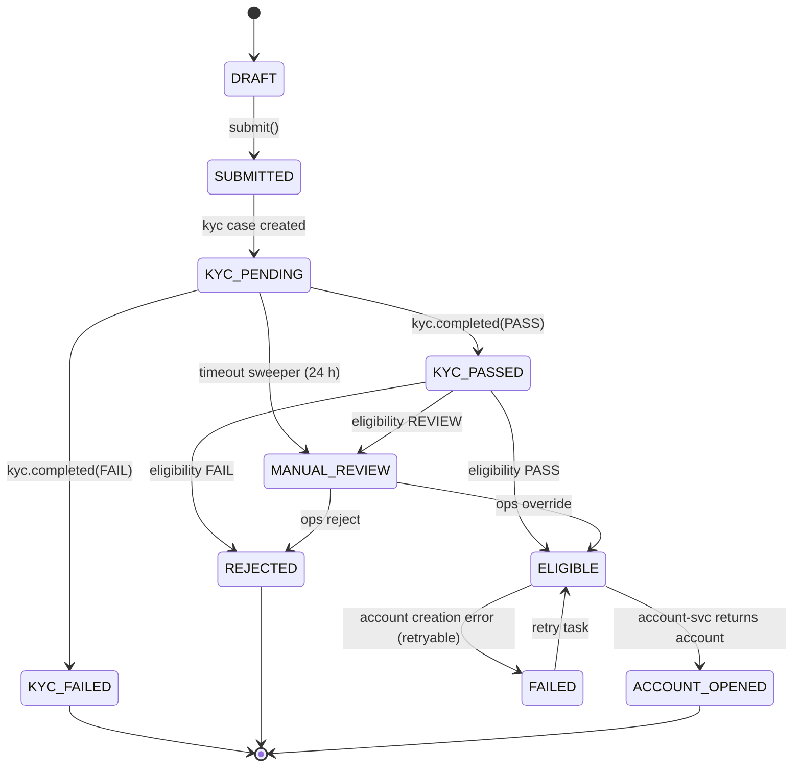
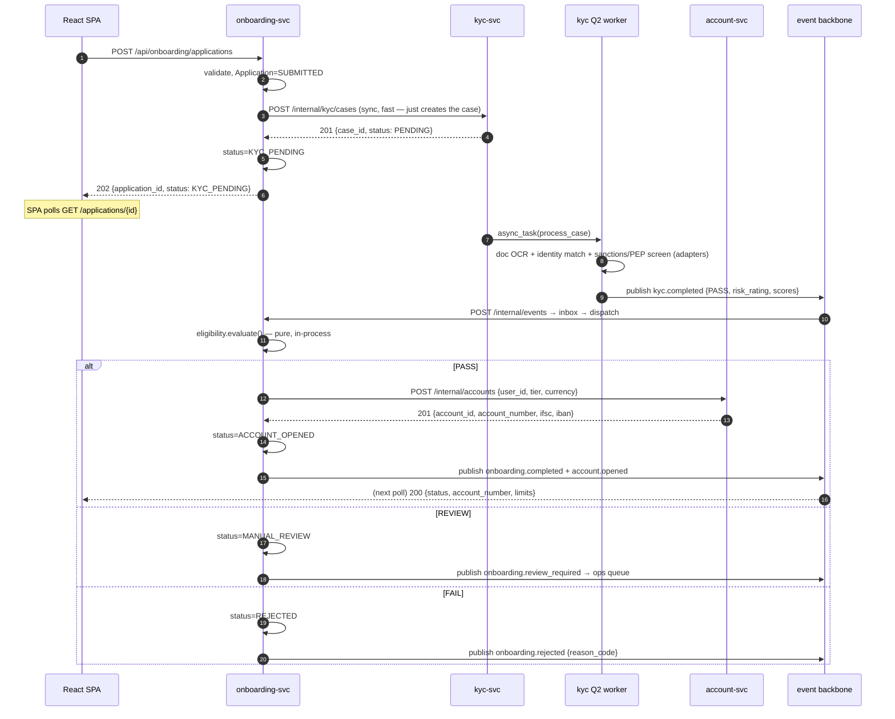
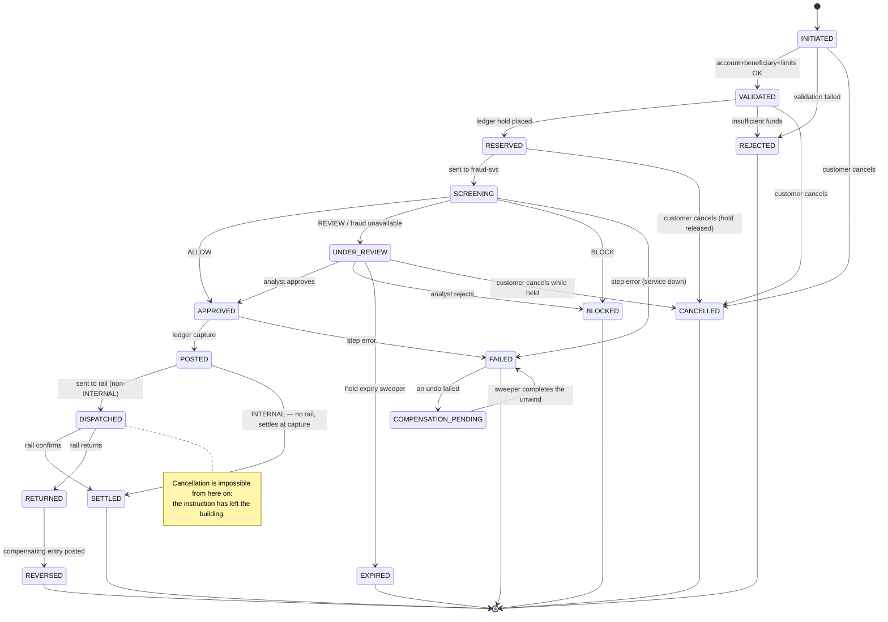
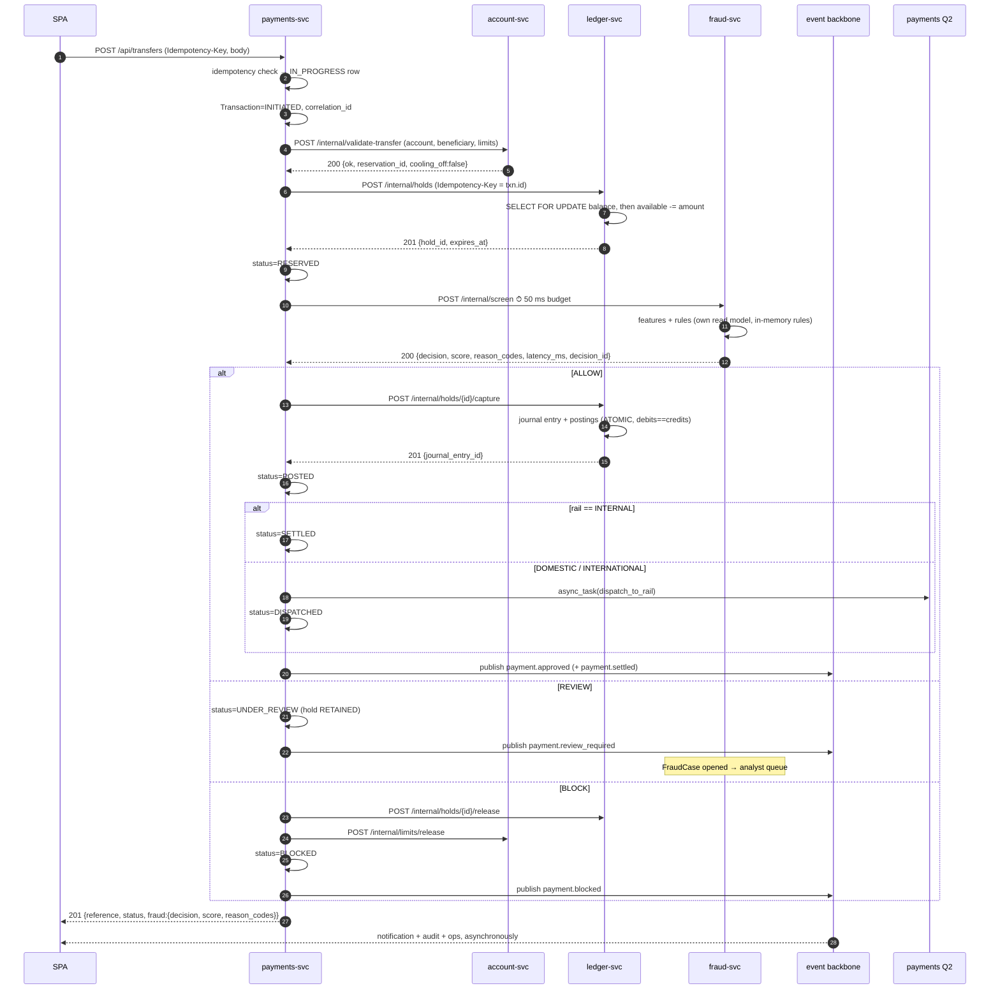

# 02 · Low-Level Design (LLD)

> Implementation-level design: repository layout, the shared library, per-service
> data models and endpoints, sequence diagrams, state machines, and the three
> algorithms that carry the most risk (ledger posting, saga compensation, fraud
> rule evaluation).
>
> Context: [`01-hld.md`](01-hld.md) · Rationale: [`00-first-principles.md`](00-first-principles.md) ·
> Events: [`03-events.md`](03-events.md) · REST: [`04-api-contracts.md`](04-api-contracts.md)

---

## 1. Repository layout

A **monorepo** — ten deployables, one checkout. With four developers and a
shared library that changes weekly, ten repos would mean ten version bumps per
change. Each service still builds and deploys independently.

```
project2/
├── server/
│   ├── libs/
│   │   └── platform_common/        # installed into every service (editable)
│   │       ├── auth/               # JWT verify (JWKS cache), DRF permissions, service tokens
│   │       ├── events/             # envelope, outbox, relay, inbox, dispatch, registry
│   │       ├── http/               # ServiceClient: retries, timeouts, HMAC signing; CORS middleware
│   │       ├── observability/      # correlation-id middleware, JSON logging, /healthz, /readyz, /internal/metrics
│   │       ├── money.py + db/      # Money value object, MoneyField, rounding policy
│   │       └── testing/            # factories, event-capture fixtures, fake ServiceClient
│   ├── services/
│   │   ├── identity/   ├── onboarding/  ├── kyc/          ├── account/  ├── payments/
│   │   ├── ledger/     ├── fraud/       ├── notification/ ├── audit/    └── ops/
│   │   └── <each>: manage.py · pytest.ini · config/settings.py · <app>/{models,serializers,views,services,tasks,handlers,clients,urls}.py · tests/
│   ├── scripts/                    # setup · run_service · manage_all · test_all · verify_* · seed_*
│   └── .data/                      # 10 SQLite files (gitignored)
├── client/                         # Vite + React (JSX) — single SPA, role-based routing
└── docs/                           # HANDBOOK.md + microservices/ (these documents)
```

> ⚠ **As built, three differences from the original layout.** There is no
> `deploy/` (no compose, no nginx, no Postgres init — see HLD §12.1), no
> `Dockerfile` per service, and the SPA is `client/` in JavaScript rather than
> `frontend/` in TypeScript. `libs/` and `services/` moved under `server/` once
> the frontend became a sibling rather than a subdirectory.

### 1.1 Standard service skeleton

Every service has the same shape. Deviating from it is a code-review finding.

| File | Responsibility | Rule |
|---|---|---|
| `models.py` | ORM models | Never imported by another service |
| `serializers.py` | Validation + representation | **All** input validation lives here |
| `views.py` | HTTP: authz, parse, delegate, respond | **No business logic** — if there's an `if` about the domain, it's in the wrong file |
| `services.py` | Domain logic, transactions, saga steps | The only place that opens `transaction.atomic()` |
| `tasks.py` | Django Q2 task entrypoints | Thin: load, delegate to `services.py`, mark done. Must be idempotent |
| `handlers.py` | Inbound event handlers, registered by event type | Idempotent + order-tolerant |
| `clients.py` | Outbound calls to other services via `ServiceClient` | The only place that knows another service's URL |

---

## 2. `platform_common` — the shared library

Everything cross-cutting lives here exactly once. This is what keeps ten Django
projects from drifting into ten different conventions.

### 2.1 Event envelope

```python
# platform_common/events/envelope.py
from dataclasses import dataclass, asdict
from datetime import datetime, timezone
from decimal import Decimal
import json, uuid

@dataclass(frozen=True)
class EventEnvelope:
    event_id: str          # uuid4 — the idempotency key for the whole pipeline
    event_type: str        # "payment.approved"  (noun.verb-past-tense, always)
    event_version: int     # schema version; consumers must tolerate unknown fields
    occurred_at: str       # ISO-8601 UTC — when the fact became true
    producer: str          # "payments-svc"
    aggregate_type: str    # "transfer"
    aggregate_id: str      # UUID of the thing that changed
    sequence: int          # monotonic per aggregate — drives the ordering guard
    correlation_id: str    # follows the user request across all ten services
    causation_id: str|None # the event_id that caused this one
    actor: dict            # {"type": "customer|analyst|system", "id": "..."}
    payload: dict          # event-specific, schema in 03-events.md

    @classmethod
    def new(cls, *, event_type, aggregate_type, aggregate_id, sequence,
            payload, producer, actor, correlation_id, causation_id=None,
            event_version=1):
        return cls(
            event_id=str(uuid.uuid4()),
            occurred_at=datetime.now(timezone.utc).isoformat(),
            **locals_without_cls(),
        )

    def canonical(self) -> str:
        """Deterministic serialisation — used for HMAC signing and audit hashing."""
        return json.dumps(asdict(self), sort_keys=True, separators=(",", ":"), default=_enc)

def _enc(o):
    if isinstance(o, Decimal):  return str(o)     # never float — money must not round-trip through binary
    if isinstance(o, datetime): return o.isoformat()
    raise TypeError(type(o))
```

**Money is always a `Decimal` serialised as a string**, and every amount travels
as `{"amount": "1500.00", "currency": "INR"}`. A float in a payment payload is a
production incident waiting to happen.

### 2.2 Outbox, relay, inbox

```python
# platform_common/events/models.py
class OutboxEvent(models.Model):
    id              = models.UUIDField(primary_key=True, default=uuid.uuid4)
    event_id        = models.UUIDField(db_index=True)   # NOT unique on its own — see below
    event_type      = models.CharField(max_length=100, db_index=True)
    envelope        = models.JSONField()
    subscriber      = models.CharField(max_length=50)   # one row PER subscriber → independent retry
    # class Meta: unique_together = (event_id, subscriber)
    #   Unique on event_id *alone* would allow only one subscriber per event and
    #   silently break the fan-out this table exists for.
    status          = models.CharField(max_length=12, default="PENDING")  # PENDING|SENT|DEAD
    attempts        = models.PositiveIntegerField(default=0)
    next_attempt_at = models.DateTimeField(default=timezone.now, db_index=True)
    last_error      = models.TextField(blank=True)
    created_at      = models.DateTimeField(auto_now_add=True)
    sent_at         = models.DateTimeField(null=True)

    class Meta:
        indexes = [models.Index(fields=["status", "next_attempt_at"])]

class InboxEvent(models.Model):
    event_id     = models.UUIDField(primary_key=True)   # ← the effect-once guarantee
    event_type   = models.CharField(max_length=100, db_index=True)
    envelope     = models.JSONField()
    status       = models.CharField(max_length=12, default="RECEIVED")  # RECEIVED|PROCESSED|FAILED
    attempts     = models.PositiveIntegerField(default=0)
    received_at  = models.DateTimeField(auto_now_add=True)
    processed_at = models.DateTimeField(null=True)
    last_error   = models.TextField(blank=True)
```

> **One outbox row per (event, subscriber).** A notification-svc outage must not
> stall delivery to audit-svc. This is why fan-out happens at publish time, not
> at delivery time.

```python
# platform_common/events/publisher.py
SUBSCRIPTIONS: dict[str, list[str]] = load_from_settings()   # event_type → [subscriber, ...]

def publish(envelope: EventEnvelope) -> None:
    """MUST be called inside the same transaction.atomic() as the state change."""
    assert transaction.get_connection().in_atomic_block, "publish() outside a transaction"
    rows = [OutboxEvent(event_id=envelope.event_id, event_type=envelope.event_type,
                        envelope=asdict(envelope), subscriber=s)
            for s in SUBSCRIPTIONS.get(envelope.event_type, [])]
    OutboxEvent.objects.bulk_create(rows)
    for row in rows:                                   # fast path — fires only after COMMIT
        transaction.on_commit(partial(async_task, "platform_common.events.tasks.relay_one",
                                      str(row.id), q_options={"timeout": 30, "save": False}))
```

```python
# platform_common/events/tasks.py
BACKOFF = [1, 2, 5, 15, 60, 300, 900, 3600]     # seconds; len() == max_attempts

def relay_one(outbox_id: str) -> None:
    row = OutboxEvent.objects.filter(id=outbox_id, status="PENDING").first()
    if not row:
        return                                   # already sent by the sweeper — normal, not an error
    try:
        deliver(row.subscriber, row.envelope)    # POST /internal/events, HMAC-signed, 5 s timeout
    except Exception as exc:
        row.attempts += 1
        if row.attempts >= len(BACKOFF):
            row.status, row.last_error = "DEAD", repr(exc)
            emit_local_alert("outbox.dead", outbox_id)     # surfaces in ops-svc
        else:
            row.next_attempt_at = timezone.now() + timedelta(seconds=BACKOFF[row.attempts])
            row.last_error = repr(exc)
        row.save(update_fields=["attempts", "status", "next_attempt_at", "last_error"])
    else:
        row.status, row.sent_at = "SENT", timezone.now()
        row.save(update_fields=["status", "sent_at"])

def sweep_outbox() -> None:
    """Safety net. Q2 Schedule, every minute. Catches rows whose on_commit task was lost."""
    due = (OutboxEvent.objects
           .filter(status="PENDING", next_attempt_at__lte=timezone.now())
           .order_by("created_at")[:500])
    for row in due:
        async_task("platform_common.events.tasks.relay_one", str(row.id), q_options={"save": False})
```

**Why `save: False`** — Q2 persists a `Task` result row per execution by default.
At ~12 events/s × 3 subscribers that is millions of rows nobody reads. Results
are saved only for tasks whose outcome we actually inspect.

```python
# platform_common/events/views.py  — the /internal/events endpoint, present in every service
@api_view(["POST"])
@authentication_classes([ServiceTokenAuth])
def ingest(request):
    verify_hmac(request)                                   # per-pair signing key
    env = EventEnvelope(**request.data)
    try:
        with transaction.atomic():
            inbox = InboxEvent.objects.create(event_id=env.event_id, event_type=env.event_type,
                                              envelope=request.data)
            transaction.on_commit(partial(async_task,
                "platform_common.events.tasks.dispatch_one", str(inbox.event_id),
                q_options={"save": False}))
    except IntegrityError:
        return Response(status=200)                        # duplicate → already accepted, do nothing
    return Response(status=202)                            # accepted, not yet processed
```

```python
# platform_common/events/dispatcher.py
HANDLERS: dict[str, list[Callable]] = {}    # populated by @subscribe in each service's handlers.py

def subscribe(event_type: str):
    def deco(fn):
        HANDLERS.setdefault(event_type, []).append(fn)
        return fn
    return deco

def dispatch_one(event_id: str) -> None:
    inbox = InboxEvent.objects.get(pk=event_id)
    if inbox.status == "PROCESSED":
        return                                             # re-run of an already-done task: no-op
    env = EventEnvelope(**inbox.envelope)
    try:
        with transaction.atomic():
            for handler in HANDLERS.get(env.event_type, []):
                handler(env)
            inbox.status, inbox.processed_at = "PROCESSED", timezone.now()
            inbox.save(update_fields=["status", "processed_at"])
    except Exception as exc:
        inbox.attempts += 1
        inbox.status = "FAILED" if inbox.attempts >= 8 else "RECEIVED"
        inbox.last_error = repr(exc)
        inbox.save(update_fields=["attempts", "status", "last_error"])
        raise                                              # let Q2 record the failure
```

**The ordering guard**, applied inside every handler that mutates a projection:

```python
def guard_sequence(model, aggregate_id, sequence) -> bool:
    """False → this event is stale; skip it. Handles out-of-order delivery (00 §7)."""
    current = model.objects.filter(aggregate_id=aggregate_id).values_list("last_sequence", flat=True).first()
    return current is None or sequence > current
```

### 2.3 `ServiceClient` — every outbound call

```python
# platform_common/http/client.py
class ServiceClient:
    """Timeouts, bounded retries, circuit breaker, correlation propagation, HMAC. Used for ALL
    service-to-service HTTP. A bare httpx/requests call in a service is a review finding."""

    def __init__(self, name, base_url, *, timeout, retries=2, breaker_threshold=5, breaker_reset=30):
        self._client = httpx.Client(base_url=base_url, timeout=timeout,
                                    limits=httpx.Limits(max_keepalive_connections=20))
        ...

    def post(self, path, json, *, idempotency_key=None):
        if self._breaker.is_open:
            raise ServiceUnavailable(self.name)            # fail fast — do not burn the latency budget
        headers = {
            "X-Correlation-Id": correlation_id(),           # from contextvar, set by middleware
            "Authorization": f"Bearer {self._service_token()}",
            **({"Idempotency-Key": idempotency_key} if idempotency_key else {}),
        }
        # retries ONLY on connect errors / 502 / 503 / 504 — never on 4xx, never on a timeout
        # for a non-idempotent call without an Idempotency-Key
```

> **Retry policy is a correctness question, not a resilience question.** A retry
> after a *timeout* is only safe when the call carries an idempotency key. The
> client enforces this: retry-after-timeout without a key raises rather than
> risking a double debit (I3).

**Connection pooling matters here**: `httpx.Client` is instantiated once per
process. Creating one per request adds TCP+TLS handshake to every call and blows
the 50 ms fraud budget on its own.

### 2.4 Q2 configuration template

```python
# config/settings.py — same shape in every service, tuned per workload
Q_CLUSTER = {
    "name":        SERVICE_NAME,     # queue identity; also the qcluster process name
    "orm":         "default",        # ← ORM broker: the queue lives in THIS service's own database
    "workers":     env.int("Q_WORKERS", 4),
    "recycle":     500,              # restart a worker every 500 tasks — bounds memory leaks
    "timeout":     60,               # a task exceeding this is killed
    "retry":       120,              # lease expiry; MUST be > timeout or tasks re-run while still running
    "max_attempts": 5,               # then the task is abandoned (our own backoff handles delivery)
    "queue_limit": 200,              # backpressure: workers stop pulling when this many are in flight
    "bulk":        10,
    "catch_up":    False,            # after downtime, do NOT fire every missed schedule at once
    "save_limit":  1000,             # cap the successful-task table
    "ack_failures": True,
    "sync":        env.bool("Q_SYNC", False),   # True in tests → tasks run inline, no worker needed
}
```

`retry > timeout` is the single most common Django Q2 misconfiguration: get it
wrong and long tasks are re-delivered while the first copy is still running.
Pin the version (`django-q2>=1.7`) and verify these keys against the installed
release before relying on `max_attempts`.

**Per-service worker tuning:**

| Service | Workers | `timeout` | Why |
|---|---|---|---|
| payments | 6 | 60 s | rail dispatch + schedule sweeps |
| notification | 4 | 30 s | slow third-party I/O, high fan-out |
| kyc | 2 | 300 s | document processing is genuinely long |
| audit | 4 | 30 s | highest event volume |
| ledger, fraud, account | 2 | 30 s | mostly maintenance work |
| identity, onboarding, ops | 2 | 60 s | low volume |

---

## 3. identity-svc

### 3.1 Models

```python
class User(AbstractBaseUser):
    id            = UUIDField(pk); email = EmailField(unique=True); phone = CharField()
    role          = CharField(choices=["CUSTOMER","FRAUD_ANALYST","OPS","ADMIN"], default="CUSTOMER")
    status        = CharField(choices=["PENDING","ACTIVE","LOCKED","CLOSED"])
    mfa_secret    = EncryptedCharField(null=True)          # TOTP, opt-in
    failed_logins = PositiveIntegerField(default=0); locked_until = DateTimeField(null=True)

class RefreshToken(models.Model):
    jti = UUIDField(unique=True); user = FK(User); issued_at, expires_at = DateTimeField(), DateTimeField()
    revoked_at = DateTimeField(null=True)
    replaced_by = FK("self", null=True)                    # rotation chain → enables reuse detection
    device = FK("Device", null=True)

class Device(models.Model):
    """Registered at login. Feeds fraud-svc's device-anomaly rule via device.seen events."""
    user = FK(User); fingerprint_hash = CharField(db_index=True)
    first_seen, last_seen = DateTimeField(), DateTimeField()
    user_agent, last_ip_country = CharField(), CharField(max_length=2)
    trusted = BooleanField(default=False)

class SigningKey(models.Model):
    kid = CharField(unique=True); public_pem = TextField(); private_pem = EncryptedTextField()
    active = BooleanField(); created_at, retires_at = DateTimeField(), DateTimeField()
```

### 3.2 Endpoints

`POST /api/auth/register` · `POST /api/auth/login` · `POST /api/auth/mfa/verify` ·
`POST /api/auth/refresh` · `POST /api/auth/logout` · `GET /api/auth/me` ·
`GET /.well-known/jwks.json` · `POST /internal/token` (client_credentials)

### 3.3 Refresh-token rotation with reuse detection

```python
def refresh(presented_jti: str) -> TokenPair:
    with transaction.atomic():
        tok = RefreshToken.objects.select_for_update().get(jti=presented_jti)
        if tok.revoked_at or tok.replaced_by_id:
            # This token was already used. Either it was stolen, or the legitimate client
            # retried. We cannot tell — so revoke the ENTIRE chain and force re-login.
            revoke_family(tok)
            publish(event("security.refresh_reuse_detected", user_id=tok.user_id))
            raise AuthenticationFailed("token reuse detected")
        new = issue_refresh(tok.user, device=tok.device)
        tok.replaced_by, tok.revoked_at = new, timezone.now()
        tok.save()
    return TokenPair(access=issue_access(tok.user), refresh=new)
```

**Events published:** `user.registered`, `user.logged_in`, `user.login_failed`,
`device.seen`, `security.refresh_reuse_detected`.

### 3.4 Q2 tasks
`purge_expired_tokens` (daily) · `rotate_signing_key` (quarterly, with an overlap
window so old tokens keep verifying) · `unlock_expired_lockouts` (every 5 min).

---

## 4. onboarding-svc (+ eligibility module)

### 4.1 Models

```python
class Application(models.Model):
    id = UUIDField(pk); user_id = UUIDField(db_index=True)     # UUID ref, not FK (cross-DB)
    status = CharField(choices=APPLICATION_STATES, db_index=True)
    customer_info = JSONField()          # name, dob, address, employment, income, nationality
    kyc_case_id = UUIDField(null=True)
    account_id = UUIDField(null=True)
    sequence = PositiveIntegerField(default=0)                 # bumped on every transition
    created_at, updated_at = ...

class EligibilityResult(models.Model):
    application = OneToOne(Application); decision = CharField()  # PASS | REVIEW | FAIL
    risk_score = IntegerField()          # 0–100
    tier = CharField()                   # BASIC | STANDARD | PREMIUM → drives initial limits
    factors = JSONField()                # [{"code":"AGE_OK","points":10}, ...] — explainable
    policy_version = CharField()         # which ruleset produced this — required for audit
```

### 4.2 State machine



Transitions are enforced by an explicit table — no `if status ==` scattered
across the codebase:

```python
ALLOWED = {"DRAFT": {"SUBMITTED"}, "SUBMITTED": {"KYC_PENDING"}, ...}

def transition(app: Application, to: str, *, actor, reason=""):
    if to not in ALLOWED[app.status]:
        raise IllegalTransition(f"{app.status} → {to}")
    app.status, app.sequence = to, app.sequence + 1
    app.save(update_fields=["status", "sequence", "updated_at"])
    publish(event("onboarding.status_changed", aggregate_id=app.id,
                  sequence=app.sequence, payload={"from": ..., "to": to, "reason": reason}))
```

### 4.3 Eligibility module (ADR-004 — a module, with a service-shaped seam)

```python
# onboarding/eligibility/engine.py — pure function; no DB writes, no I/O. Trivially testable.
@dataclass(frozen=True)
class EligibilityRequest:
    age: int; country: str; annual_income: Decimal; employment: str
    kyc_risk_rating: str; sanctions_hit: bool; pep_hit: bool; doc_score: int

def evaluate(req: EligibilityRequest, policy: Policy) -> EligibilityResponse:
    factors = []
    if req.sanctions_hit:  return fail("SANCTIONS_HIT")     # hard stops first
    if req.age < policy.min_age: return fail("UNDERAGE")
    if req.country in policy.prohibited_countries: return fail("PROHIBITED_COUNTRY")
    factors += score_income(req, policy) + score_employment(req, policy) + score_kyc(req, policy)
    risk = clamp(100 - sum(f.points for f in factors), 0, 100)
    if req.pep_hit: return review("PEP_MATCH", risk, factors)
    decision = "PASS" if risk < policy.pass_below else "REVIEW" if risk < policy.review_below else "FAIL"
    return EligibilityResponse(decision, risk, tier_for(risk, policy), factors, policy.version)
```

> **The seam:** `evaluate()` takes a request dataclass and returns a response
> dataclass with no I/O. Extracting it into `eligibility-svc` means wrapping it in
> a DRF view and swapping the caller for a `ServiceClient`. Nothing else changes.

### 4.4 Sequence — onboarding to account



### 4.5 Q2 tasks
`sweep_stuck_kyc` (every 15 min → `MANUAL_REVIEW` after 24 h) ·
`retry_account_creation` (exponential, for `FAILED` applications).

---

## 5. kyc-svc

### 5.1 Models

```python
class KycCase(models.Model):
    id = UUIDField(pk); application_id = UUIDField(db_index=True); user_id = UUIDField()
    status = CharField(choices=["PENDING","IN_PROGRESS","PASSED","FAILED","MANUAL_REVIEW"])
    identity_score = IntegerField(null=True)      # 0–100 name/dob/address match
    document_score = IntegerField(null=True)      # 0–100 authenticity + OCR confidence
    sanctions_hit = BooleanField(default=False); pep_hit = BooleanField(default=False)
    risk_rating = CharField(null=True)            # LOW | MEDIUM | HIGH
    provider_ref = CharField(blank=True); failure_reason = CharField(blank=True)

class KycIdentity(models.Model):
    """PII isolation: encrypted at field level, and only ever in kyc_db."""
    case = OneToOne(KycCase)
    full_name = EncryptedCharField(); dob = EncryptedDateField()
    national_id = EncryptedCharField(); national_id_hash = CharField(db_index=True)  # searchable, not reversible
    address = EncryptedJSONField()

class KycDocument(models.Model):
    case = FK(KycCase); doc_type = CharField()    # PASSPORT | NATIONAL_ID | UTILITY_BILL | SELFIE
    file = FileField(upload_to=hashed_path)       # local volume now, S3 via one settings change
    sha256 = CharField(db_index=True)             # duplicate/tamper detection
    status = CharField(); ocr_result = JSONField(null=True)

class ScreeningHit(models.Model):
    case = FK(KycCase); list_name = CharField()   # OFAC | UN | EU | INTERNAL_PEP
    matched_name = CharField(); match_score = IntegerField(); resolved = BooleanField(default=False)
```

### 5.2 Adapters (all simulated, all swappable)

```python
class IdentityVerificationPort(Protocol):
    def verify(self, identity: KycIdentity) -> IdentityResult: ...
class DocumentPort(Protocol):
    def analyse(self, doc: KycDocument) -> DocumentResult: ...
class SanctionsPort(Protocol):
    def screen(self, full_name: str, dob: date, country: str) -> list[ScreeningHit]: ...
```

Simulated implementations are **deterministic by input hash** — the same test
customer always gets the same result, which makes demos and tests reproducible.
Seeded "known bad" names always produce a sanctions hit so the reject path is
demonstrable on demand.

### 5.3 Q2 task

```python
def process_case(case_id: str) -> None:
    case = KycCase.objects.get(pk=case_id)
    if case.status in ("PASSED", "FAILED"):
        return                                                  # idempotent re-run
    with transaction.atomic():
        case.status = "IN_PROGRESS"; case.save(update_fields=["status"])
    ident = identity_port.verify(case.identity)                 # slow I/O — outside the transaction
    docs  = [document_port.analyse(d) for d in case.documents.all()]
    hits  = sanctions_port.screen(...)
    with transaction.atomic():
        apply_results(case, ident, docs, hits)                  # sets scores, risk_rating, status
        publish(event("kyc.completed", aggregate_id=case.id, payload=summary(case)))
```

**Slow I/O is never held inside a database transaction** — a 30 s external call
holding a Postgres transaction open is how connection pools die.

---

## 6. account-svc

### 6.1 Models

```python
class Account(models.Model):
    id = UUIDField(pk); user_id = UUIDField(db_index=True)
    account_number = CharField(unique=True)        # generated: BBBB-BBBB-NNNNNNN + Luhn check digit
    ifsc = CharField(); iban = CharField(blank=True); swift_bic = CharField(blank=True)
    currency = CharField(max_length=3, default="INR")
    account_type = CharField(choices=["SAVINGS","CURRENT","WALLET"])
    status = CharField(choices=["ACTIVE","FROZEN","DORMANT","CLOSED"], db_index=True)
    tier = CharField(); opened_at = DateTimeField()
    cached_balance = DecimalField(max_digits=20, decimal_places=4, default=0)  # READ MODEL ONLY
    balance_as_of = DateTimeField(null=True)

class Beneficiary(models.Model):
    id = UUIDField(pk); user_id = UUIDField(db_index=True); nickname = CharField()
    beneficiary_type = CharField(choices=["INTERNAL","DOMESTIC","INTERNATIONAL"])
    account_number = CharField(); bank_code = CharField(blank=True)
    swift_bic = CharField(blank=True); country = CharField(max_length=2); currency = CharField(max_length=3)
    status = CharField(choices=["PENDING","ACTIVE","BLOCKED"])
    cooling_off_until = DateTimeField(null=True)   # anti-fraud: no large transfers to a brand-new payee
    fingerprint = CharField(db_index=True)         # sha256(type|acct|bank) — the identity fraud-svc uses
    class Meta: constraints = [UniqueConstraint(fields=["user_id","fingerprint"], name="uniq_benef")]

class LimitPolicy(models.Model):
    """Admin-managed (Administrator use case). Scoped tier-wide or per-account."""
    scope = CharField(choices=["TIER","ACCOUNT"]); scope_ref = CharField(db_index=True)
    rail = CharField(choices=["ANY","INTERNAL","DOMESTIC","INTERNATIONAL"])
    per_txn_max = DecimalField(); daily_max = DecimalField(); monthly_max = DecimalField()
    daily_count_max = PositiveIntegerField(); currency = CharField(max_length=3)
    effective_from = DateTimeField(); version = PositiveIntegerField()

class LimitUsage(models.Model):
    account_id = UUIDField(); window = CharField()   # "DAY:2026-08-07" | "MONTH:2026-08"
    rail = CharField(); amount_used = DecimalField(default=0); count_used = PositiveIntegerField(default=0)
    class Meta: constraints = [UniqueConstraint(fields=["account_id","window","rail"], name="uniq_usage")]
```

### 6.2 The balance question

`cached_balance` is a **read model** fed by `ledger.posted` events, used for
account *lists*. The single-account balance endpoint proxies the ledger, because
that is the number a customer acts on:

```python
def get_balance(account_id) -> BalanceView:
    try:
        b = ledger_client.get(f"/internal/balances/{account_id}")     # 300 ms timeout
        return BalanceView(**b, source="LEDGER", stale=False)
    except ServiceUnavailable:
        acct = Account.objects.get(pk=account_id)
        return BalanceView(available=acct.cached_balance, as_of=acct.balance_as_of,
                           source="CACHE", stale=True)                # UI shows "as of HH:MM"
```

Graceful degradation with **explicit staleness**, rather than silently showing a
possibly-wrong number. The UI renders a badge when `stale` is true.

### 6.3 Limit check — a reservation, not a read

```python
def check_and_reserve(account_id, rail, amount, currency) -> LimitDecision:
    """Called synchronously by payments-svc during validation. Reserves usage so two
    concurrent transfers cannot both pass a limit they'd jointly breach."""
    policy = resolve_policy(account_id, rail)                  # ACCOUNT scope overrides TIER
    if amount > policy.per_txn_max:
        return LimitDecision(False, "PER_TXN_EXCEEDED", policy.per_txn_max)
    with transaction.atomic():
        day = LimitUsage.objects.select_for_update().get_or_create(
            account_id=account_id, window=day_window(), rail=rail)[0]
        mon = LimitUsage.objects.select_for_update().get_or_create(
            account_id=account_id, window=month_window(), rail=rail)[0]
        if day.amount_used + amount > policy.daily_max:  return LimitDecision(False, "DAILY_EXCEEDED", ...)
        if day.count_used + 1 > policy.daily_count_max:  return LimitDecision(False, "DAILY_COUNT_EXCEEDED", ...)
        if mon.amount_used + amount > policy.monthly_max: return LimitDecision(False, "MONTHLY_EXCEEDED", ...)
        day.amount_used += amount; day.count_used += 1; day.save()
        mon.amount_used += amount; mon.count_used += 1; mon.save()
    return LimitDecision(True, reservation_id=...)
```

Reserved usage is **released** if the transfer is later blocked or fails —
payments-svc calls `POST /internal/limits/release` as a compensating step.
A nightly Q2 job reconciles usage against payments-svc's settled totals and
corrects drift.

**Events published:** `account.opened`, `account.frozen`, `beneficiary.added`,
`beneficiary.blocked`, `limit.policy_updated`.
**Events consumed:** `ledger.posted` (→ `cached_balance`), `onboarding.completed`.

---

## 7. payments-svc — the saga owner

### 7.1 Models

```python
class Transaction(models.Model):
    """One model for funding and transfers — they share a lifecycle (ADR-003)."""
    id = UUIDField(pk); reference = CharField(unique=True)      # customer-facing: TXN-20260807-A7F3K2
    user_id = UUIDField(db_index=True); account_id = UUIDField(db_index=True)
    txn_type = CharField(choices=["FUNDING","TRANSFER"])
    rail = CharField(choices=["INTERNAL","DOMESTIC","INTERNATIONAL","CARD","WALLET","BANK_DEBIT"])
    direction = CharField(choices=["CREDIT","DEBIT"])           # funding credits, transfer debits
    amount = DecimalField(max_digits=20, decimal_places=4); currency = CharField(max_length=3)
    fx_rate = DecimalField(null=True); dest_amount = DecimalField(null=True); dest_currency = CharField(blank=True)
    beneficiary_id = UUIDField(null=True); funding_source_id = UUIDField(null=True)
    status = CharField(choices=TXN_STATES, db_index=True); status_reason = CharField(blank=True)
    hold_id = UUIDField(null=True); journal_entry_id = UUIDField(null=True)
    fraud_decision_id = UUIDField(null=True); fraud_score = IntegerField(null=True)
    limit_reservation_id = UUIDField(null=True)
    schedule_id = UUIDField(null=True)                          # set when created by a schedule
    idempotency_key = CharField(db_index=True)
    correlation_id = UUIDField(db_index=True); sequence = PositiveIntegerField(default=0)
    created_at, updated_at, settled_at = ...
    class Meta:
        constraints = [UniqueConstraint(fields=["user_id","idempotency_key"], name="uniq_idem")]
        indexes = [Index(fields=["account_id","-created_at"]), Index(fields=["status","created_at"])]

class SagaStep(models.Model):
    """Explicit saga log. Recovery reads THIS, not the transaction status."""
    transaction = FK(Transaction, related_name="steps")
    name = CharField()          # VALIDATE | RESERVE_LIMIT | PLACE_HOLD | SCREEN | CAPTURE | DISPATCH
    status = CharField(choices=["PENDING","DONE","FAILED","COMPENSATED"])
    attempt = PositiveIntegerField(default=0); request = JSONField(); response = JSONField(null=True)
    compensation_ref = CharField(blank=True); error = TextField(blank=True)
    started_at, finished_at = ...

class IdempotencyRecord(models.Model):
    key = CharField(); user_id = UUIDField(); endpoint = CharField()
    request_hash = CharField()          # reject same key + different body → 409
    status_code = IntegerField(null=True); response_body = JSONField(null=True)
    state = CharField(choices=["IN_PROGRESS","COMPLETE"]); created_at = ...
    class Meta: constraints = [UniqueConstraint(fields=["user_id","key","endpoint"], name="uniq_idem_rec")]

class TransferSchedule(models.Model):
    id = UUIDField(pk); user_id, account_id, beneficiary_id = UUIDField(), UUIDField(), UUIDField()
    amount = DecimalField(); currency = CharField(max_length=3); rail = CharField()
    frequency = CharField(choices=["ONCE","DAILY","WEEKLY","MONTHLY"])
    next_run_at = DateTimeField(db_index=True); end_date = DateField(null=True)
    runs_completed = PositiveIntegerField(default=0); max_runs = PositiveIntegerField(null=True)
    status = CharField(choices=["ACTIVE","PAUSED","COMPLETED","CANCELLED","FAILED"])
    last_run_at = DateTimeField(null=True); consecutive_failures = PositiveIntegerField(default=0)

class FundingSource(models.Model):
    user_id = UUIDField(); source_type = CharField(choices=["EXTERNAL_BANK","DEBIT_CARD","WALLET"])
    display_name = CharField()          # "HDFC ••••4821" — never the full number
    token = EncryptedCharField()        # vault/PSP token, never the PAN
    verified = BooleanField(default=False); verification_method = CharField(blank=True)
```

### 7.2 Transaction state machine



Seventeen states in all. `TERMINAL_STATUSES` — `SETTLED · BLOCKED · REJECTED ·
CANCELLED · EXPIRED · REVERSED` — never transition again;
`CANCELLABLE_STATUSES` — `INITIATED · VALIDATED · RESERVED · UNDER_REVIEW` — is
exactly the set where the instruction has not yet left the building.

> ⚠ `COMPENSATION_PENDING` and `FAILED` were missing from the original diagram.
> They are not edge cases — `COMPENSATION_PENDING` is the state that makes a
> failed *unwind* visible instead of silent, which is the whole reason the saga
> is trustworthy.

### 7.3 The saga

```python
STEPS = [
    Step("VALIDATE",       do=do_validate,   undo=undo_validate),      # releases the limit reservation
    Step("PLACE_HOLD",     do=do_place_hold, undo=undo_place_hold),
    Step("SCREEN",         do=do_screen,     undo=None),
    Step("CAPTURE",        do=do_capture,    undo=undo_capture),
    Step("DISPATCH",       do=do_dispatch,   undo=undo_capture),        # async
]

def run_saga(txn: Transaction) -> Transaction:
    for step in STEPS:
        rec = SagaStep.objects.create(transaction=txn, name=step.name, status="PENDING", ...)
        try:
            result = step.do(txn)
        except HaltSaga as halt:                 # a normal outcome: BLOCK, REVIEW, insufficient funds
            rec.status = "DONE"; rec.save()
            compensate(txn, upto=step, reason=halt.reason)
            return set_status(txn, halt.terminal_status, halt.reason)
        except Exception as exc:                 # an abnormal outcome: a service is down
            rec.status, rec.error = "FAILED", repr(exc); rec.save()
            compensate(txn, upto=step, reason="STEP_ERROR")
            return set_status(txn, "FAILED", str(exc))
        rec.status, rec.response = "DONE", result; rec.save()
    return txn

def compensate(txn, *, upto, reason):
    """Undo completed steps in reverse order. Each undo is idempotent and retried by Q2."""
    for step in reversed(STEPS[:STEPS.index(upto)]):
        if step.undo is None:
            continue
        rec = txn.steps.filter(name=step.name, status="DONE").first()
        if not rec:
            continue
        try:
            step.undo(txn); rec.status = "COMPENSATED"; rec.save()
        except Exception:
            txn.status = "COMPENSATION_PENDING"; txn.save()
            async_task("payments.tasks.retry_compensation", str(txn.id))   # sweeper also catches it
            raise
```

> **`UNDER_REVIEW` is not a compensation.** When fraud returns `REVIEW`, the hold
> and the limit reservation are deliberately *retained* — the money stays
> reserved while an analyst looks at it. Only an analyst rejection or hold expiry
> triggers the undo chain.

> ⚠ **As built: five steps, not six.** `RESERVE_LIMIT` was folded into
> `VALIDATE`. account-svc's `/internal/validate-transfer` checks limits *and*
> reserves budget in one call and returns a `reservation_id`, so splitting it
> into two saga steps would have meant two round trips to the same service to do
> one atomic thing — and a window where the check had passed but the budget was
> not yet held. `undo_validate` releases the reservation.
>
> Two further corrections to the sketch below: compensation runs in **reverse
> order from the failed step's boundary**, and a failed *undo* sets the
> transaction to `COMPENSATION_PENDING` **without re-raising**, so one stuck
> compensation cannot abort the rest of the unwind chain.

### 7.4 Sequence — transfer with fraud screening



### 7.5 Idempotency

```python
def with_idempotency(user_id, key, endpoint, body, fn):
    body_hash = sha256(canonical(body))
    try:
        with transaction.atomic():
            rec = IdempotencyRecord.objects.create(user_id=user_id, key=key, endpoint=endpoint,
                                                   request_hash=body_hash, state="IN_PROGRESS")
    except IntegrityError:
        rec = IdempotencyRecord.objects.get(user_id=user_id, key=key, endpoint=endpoint)
        if rec.request_hash != body_hash:
            raise Conflict("Idempotency-Key reused with a different payload")   # 409
        if rec.state == "IN_PROGRESS":
            raise Conflict("Request already in progress")                       # 409 + Retry-After
        return rec.status_code, rec.response_body                               # replay the original
    status, response = fn()
    rec.state, rec.status_code, rec.response_body = "COMPLETE", status, response
    rec.save()
    return status, response
```

`Idempotency-Key` is **required** on `POST /api/funding`, `POST /api/transfers`
and `POST /api/schedules`. A missing key is a `400`, not a courtesy
default — this is the control that makes a double-click harmless.

### 7.6 Scheduled & recurring transfers

One Q2 `Schedule` for the whole service, not one per customer schedule:

```python
# registered once at deploy: schedule("payments.tasks.run_due_schedules",
#                                     schedule_type=Schedule.MINUTES, minutes=1, repeats=-1)
def run_due_schedules() -> None:
    now = timezone.now()
    with transaction.atomic():
        due = list(TransferSchedule.objects
                   .select_for_update(skip_locked=True)          # ← multiple workers, zero contention
                   .filter(status="ACTIVE", next_run_at__lte=now)[:200])
        for s in due:
            s.next_run_at = compute_next(s)                      # advance FIRST — never double-fire
            s.save(update_fields=["next_run_at"])
    for s in due:
        async_task("payments.tasks.execute_scheduled_transfer", str(s.id), run_at=now)

def execute_scheduled_transfer(schedule_id: str, run_at) -> None:
    s = TransferSchedule.objects.get(pk=schedule_id)
    key = f"sched:{s.id}:{run_at.isoformat()}"                   # deterministic → re-runs are free
    txn = create_transfer(user_id=s.user_id, ..., idempotency_key=key, schedule_id=s.id)
    run_saga(txn)
    if txn.status in ("BLOCKED", "REJECTED", "FAILED"):
        s.consecutive_failures += 1
        if s.consecutive_failures >= 3:
            s.status = "FAILED"                                  # stop retrying a doomed standing order
            publish(event("schedule.failed", ...))               # → notify customer
    else:
        s.consecutive_failures = 0; s.runs_completed += 1
    if s.max_runs and s.runs_completed >= s.max_runs or (s.end_date and s.next_run_at.date() > s.end_date):
        s.status = "COMPLETED"
    s.save()
```

Three details that matter: `skip_locked` makes the sweeper safe with N workers;
advancing `next_run_at` **before** dispatching prevents a double-fire if the
worker crashes; and the deterministic idempotency key makes a re-run a no-op.
`catch_up: False` in `Q_CLUSTER` stops a burst of missed runs after downtime.

### 7.7 Rail dispatch & returns

```python
def dispatch_to_rail(txn_id: str) -> None:
    txn = Transaction.objects.get(pk=txn_id)
    if txn.status not in ("POSTED", "DISPATCHED"):
        return                                                   # idempotent
    adapter = RAIL_ADAPTERS[txn.rail]                            # ACH | NEFT | SWIFT — simulated
    ack = adapter.submit(RailInstruction.from_txn(txn), idempotency_key=str(txn.id))
    txn.status, txn.rail_ref = "DISPATCHED", ack.reference
    txn.save()
    publish(event("payment.dispatched", ...))

@subscribe("rail.callback.received")      # simulated adapter posts back after a delay
def on_rail_callback(env):
    txn = Transaction.objects.select_for_update().get(rail_ref=env.payload["reference"])
    if env.payload["outcome"] == "SETTLED":
        set_status(txn, "SETTLED"); publish(event("payment.settled", ...))
    else:
        ledger_client.post(f"/internal/journal-entries/{txn.journal_entry_id}/reverse",
                           json={"reason": env.payload["reason"]},
                           idempotency_key=f"rev:{txn.id}")
        account_client.post("/internal/limits/release", ...)
        set_status(txn, "REVERSED", env.payload["reason"])
        publish(event("payment.returned", ...))                  # → notify + ops failure case
```

### 7.8 Funding

Same saga, mirrored: the hold is placed on an **internal clearing account**, not
the customer's, because the money is arriving rather than leaving.

| Source | Verification | Ledger movement on capture |
|---|---|---|
| `EXTERNAL_BANK` | micro-deposit or mandate (simulated) | DR `FUNDING_CLEARING` → CR customer |
| `DEBIT_CARD` | 3-DS style step-up (simulated) | DR `CARD_CLEARING` → CR customer |
| `WALLET` | wallet token + OTP (simulated) | DR `WALLET_CLEARING` → CR customer |

Funding is screened by fraud too — a stolen card funding an account before an
immediate outbound transfer is a classic pattern, and screening only the outbound
leg would miss it.

### 7.9 Q2 tasks
`dispatch_to_rail` · `run_due_schedules` (1 min) · `execute_scheduled_transfer` ·
`retry_compensation` (5 min) · `expire_stale_reviews` (10 min) ·
`sweep_stuck_sagas` (10 min — anything `IN_PROGRESS` > 5 min) ·
`reconcile_with_ledger` (nightly).

---

## 8. ledger-svc — the single writer of money

### 8.1 Models

```python
class LedgerAccount(models.Model):
    id = UUIDField(pk); account_ref = UUIDField(null=True, db_index=True)   # → account-svc, null for internal
    code = CharField(unique=True)                # "CUST:<uuid>" or "INTERNAL:FUNDING_CLEARING"
    kind = CharField(choices=["CUSTOMER","CLEARING","SUSPENSE","NOSTRO","FEE","FX_POSITION"])
    normal_side = CharField(choices=["DEBIT","CREDIT"])
    currency = CharField(max_length=3); status = CharField()

class Balance(models.Model):
    ledger_account = OneToOne(LedgerAccount, primary_key=True)
    ledger_balance = DecimalField(max_digits=20, decimal_places=4, default=0)   # settled money
    held           = DecimalField(max_digits=20, decimal_places=4, default=0)   # reserved by holds
    version        = BigIntegerField(default=0)                                 # optimistic-lock counter
    updated_at     = DateTimeField(auto_now=True)
    @property
    def available(self): return self.ledger_balance - self.held

class JournalEntry(models.Model):
    id = UUIDField(pk); reference = CharField(unique=True)
    entry_type = CharField(choices=["TRANSFER","FUNDING","FEE","FX","REVERSAL","ADJUSTMENT"])
    txn_ref = UUIDField(db_index=True)                       # payments-svc Transaction.id
    idempotency_key = CharField(unique=True)                 # ← replay protection at the ledger
    reverses = FK("self", null=True, related_name="reversals")
    correlation_id = UUIDField(); posted_at = DateTimeField(); narrative = CharField()
    class Meta: default_permissions = ()                     # no UPDATE/DELETE, ever

class Posting(models.Model):
    id = UUIDField(pk); journal_entry = FK(JournalEntry, related_name="postings")
    ledger_account = FK(LedgerAccount); direction = CharField(choices=["DEBIT","CREDIT"])
    amount = DecimalField(max_digits=20, decimal_places=4)   # always positive; direction carries the sign
    currency = CharField(max_length=3)
    balance_after = DecimalField(max_digits=20, decimal_places=4)   # point-in-time snapshot for statements

class Hold(models.Model):
    id = UUIDField(pk); ledger_account = FK(LedgerAccount); amount = DecimalField()
    currency = CharField(max_length=3); txn_ref = UUIDField(db_index=True)
    idempotency_key = CharField(unique=True)
    status = CharField(choices=["ACTIVE","CAPTURED","RELEASED","EXPIRED"], db_index=True)
    expires_at = DateTimeField(db_index=True)                # safety net if a saga dies mid-flight
    captured_by = FK(JournalEntry, null=True)
```

### 8.2 Posting — the most safety-critical function in the system

```python
def post_entry(*, entry_type, txn_ref, idempotency_key, legs: list[Leg],
               correlation_id, narrative, reverses=None) -> JournalEntry:
    # 1. Balance check BEFORE touching anything — a journal entry that doesn't balance is a bug,
    #    and it must be impossible to persist one.
    debits  = sum(l.amount for l in legs if l.direction == "DEBIT")
    credits = sum(l.amount for l in legs if l.direction == "CREDIT")
    if debits != credits:
        raise UnbalancedEntry(f"DR {debits} != CR {credits}")
    if any(l.amount <= 0 for l in legs):
        raise InvalidAmount("postings must be strictly positive; direction carries the sign")
    if len({l.currency for l in legs}) > 1:
        raise MixedCurrency("cross-currency requires explicit FX legs through FX_POSITION")

    with transaction.atomic():
        # 2. Idempotency at the ledger itself — payments-svc may legitimately retry
        existing = JournalEntry.objects.filter(idempotency_key=idempotency_key).first()
        if existing:
            return existing

        # 3. Lock every affected balance in ASCENDING PK ORDER. This is what prevents deadlock
        #    when two transfers touch the same pair of accounts in opposite directions.
        account_ids = sorted({l.ledger_account_id for l in legs})
        balances = {b.pk: b for b in Balance.objects
                    .select_for_update()
                    .filter(ledger_account_id__in=account_ids)
                    .order_by("ledger_account_id")}

        entry = JournalEntry.objects.create(entry_type=entry_type, txn_ref=txn_ref,
                                            idempotency_key=idempotency_key, reverses=reverses,
                                            correlation_id=correlation_id, narrative=narrative,
                                            reference=make_ref(), posted_at=timezone.now())
        postings = []
        for leg in legs:
            bal = balances[leg.ledger_account_id]
            delta = leg.amount if leg.direction == effective_sign(bal, leg) else -leg.amount
            bal.ledger_balance += delta
            # 4. Overdraft guard: customer accounts may never go negative (I4).
            if bal.ledger_account.kind == "CUSTOMER" and bal.ledger_balance < 0:
                raise InsufficientFunds(leg.ledger_account_id)     # rolls the whole thing back
            bal.version += 1
            bal.save(update_fields=["ledger_balance", "version", "updated_at"])
            postings.append(Posting(journal_entry=entry, ledger_account_id=leg.ledger_account_id,
                                    direction=leg.direction, amount=leg.amount,
                                    currency=leg.currency, balance_after=bal.ledger_balance))
        Posting.objects.bulk_create(postings)
        publish(event("ledger.posted", aggregate_id=entry.id, payload=entry_summary(entry)))
    return entry
```

**Reversal is a new entry, never an edit:**

```python
def reverse_entry(entry_id, reason, idempotency_key) -> JournalEntry:
    original = JournalEntry.objects.prefetch_related("postings").get(pk=entry_id)
    if original.reversals.exists():
        return original.reversals.first()                        # idempotent
    mirrored = [Leg(p.ledger_account_id, flip(p.direction), p.amount, p.currency)
                for p in original.postings.all()]
    return post_entry(entry_type="REVERSAL", txn_ref=original.txn_ref,
                      idempotency_key=idempotency_key, legs=mirrored, reverses=original,
                      correlation_id=original.correlation_id,
                      narrative=f"Reversal of {original.reference}: {reason}")
```

### 8.3 Hold lifecycle

```python
def place_hold(ledger_account_id, amount, txn_ref, idempotency_key, ttl_minutes=30) -> Hold:
    with transaction.atomic():
        if (h := Hold.objects.filter(idempotency_key=idempotency_key).first()):
            return h
        bal = Balance.objects.select_for_update().get(ledger_account_id=ledger_account_id)
        if bal.available < amount:
            raise InsufficientFunds(available=bal.available, requested=amount)
        bal.held += amount; bal.version += 1; bal.save()
        return Hold.objects.create(..., status="ACTIVE", expires_at=now() + timedelta(minutes=ttl_minutes))

def capture_hold(hold_id, legs, idempotency_key) -> JournalEntry:
    with transaction.atomic():
        hold = Hold.objects.select_for_update().get(pk=hold_id)
        if hold.status == "CAPTURED":
            return hold.captured_by                              # idempotent
        if hold.status != "ACTIVE":
            raise HoldNotActive(hold.status)
        bal = Balance.objects.select_for_update().get(ledger_account=hold.ledger_account)
        bal.held -= hold.amount; bal.save()                      # release the reservation…
        entry = post_entry(legs=legs, idempotency_key=idempotency_key, ...)   # …and move the money
        hold.status, hold.captured_by = "CAPTURED", entry
        hold.save()
    return entry
```

**Hold TTL is a defence in depth**: if payments-svc dies between `PLACE_HOLD` and
`CAPTURE`, the `expire_holds` Q2 task (every minute) releases the reservation
after 30 minutes. The customer's money is never stranded because of a crashed
process. `UNDER_REVIEW` transactions extend the TTL to the case SLA.

### 8.4 Money movements by rail

| Flow | Debit | Credit |
|---|---|---|
| Internal transfer A→B | `CUST:A` | `CUST:B` |
| Domestic outbound (capture) | `CUST:A` | `INTERNAL:CLEARING_DOMESTIC` |
| Domestic settlement confirmed | `INTERNAL:CLEARING_DOMESTIC` | `INTERNAL:NOSTRO_DOMESTIC` |
| International (capture, with FX) | `CUST:A` (src ccy) | `INTERNAL:FX_POSITION_SRC` |
| International (dest leg) | `INTERNAL:FX_POSITION_DST` | `INTERNAL:CLEARING_INTL` (dest ccy) |
| Funding from external bank | `INTERNAL:CLEARING_FUNDING` | `CUST:A` |
| Fee | `CUST:A` | `INTERNAL:FEE_INCOME` |
| Return / reversal | mirror of the original | mirror of the original |

Cross-currency never mixes currencies inside one leg — the FX position accounts
are the hinge, so every entry balances *within* a currency. That is what makes
the daily invariant check (`SUM(debits) == SUM(credits)` per currency) meaningful.

### 8.5 Q2 tasks
`expire_holds` (1 min) · `verify_invariants` (hourly — per currency, debits ==
credits, and `Σ postings == balance` per account; a mismatch raises a critical
ops alert) · `daily_reconciliation` (produces a trial balance artefact).

---

## 9. fraud-svc

### 9.1 Models

```python
class Rule(models.Model):
    """Admin-configurable (Administrator use case). Versioned, validated, never eval'd."""
    id = UUIDField(pk); code = CharField(unique=True)          # R014_INTL_NEW_BENEF_HIGH
    name = CharField(); description = TextField()
    condition = JSONField()                                     # the DSL — see §9.3
    weight = IntegerField()                                     # 0–100 contribution to the score
    hard_block = BooleanField(default=False)                    # fires → BLOCK regardless of score
    mode = CharField(choices=["ACTIVE","SHADOW","DISABLED"], default="SHADOW")
    reason_code = CharField(); category = CharField()           # VELOCITY|AMOUNT|GEO|DEVICE|BENEFICIARY|LIST
    version = PositiveIntegerField(default=1)
    created_by = UUIDField(); updated_at = DateTimeField()

class RuleStat(models.Model):
    """Drives the false-positive reduction loop."""
    rule = OneToOne(Rule); fired_count = BigIntegerField(default=0)
    confirmed_fraud = BigIntegerField(default=0); false_positive = BigIntegerField(default=0)
    @property
    def precision(self):
        d = self.confirmed_fraud + self.false_positive
        return None if d == 0 else self.confirmed_fraud / d

class Threshold(models.Model):
    allow_below = IntegerField(default=40); block_at_or_above = IntegerField(default=75)
    safe_harbour_amount = DecimalField(default=0)   # outage-only auto-allow; 0 = disabled (ADR-005)
    version = PositiveIntegerField(); active = BooleanField()

class FraudDecision(models.Model):
    id = UUIDField(pk); txn_ref = UUIDField(db_index=True); account_ref = UUIDField(db_index=True)
    decision = CharField(choices=["ALLOW","REVIEW","BLOCK"], db_index=True)
    score = IntegerField(); reason_codes = JSONField()          # codes that fired, with weights
    shadow_codes = JSONField()                                  # shadow rules that WOULD have fired
    features = JSONField()                                      # the exact feature vector — replayability
    ruleset_version = CharField(); latency_ms = IntegerField()  # proves the "milliseconds" claim
    created_at = DateTimeField(db_index=True)

class FraudCase(models.Model):
    id = UUIDField(pk); decision = OneToOne(FraudDecision); txn_ref = UUIDField(db_index=True)
    status = CharField(choices=["OPEN","IN_REVIEW","APPROVED","REJECTED"], db_index=True)
    resolution = CharField(blank=True)          # CONFIRMED_FRAUD | FALSE_POSITIVE | INCONCLUSIVE
    priority = CharField(); assigned_to = UUIDField(null=True)
    sla_due_at = DateTimeField(db_index=True); resolution_note = TextField(blank=True)
    resolved_by = UUIDField(null=True); resolved_at = DateTimeField(null=True)

# ── the local read model (no Redis; 00 §5) ───────────────────────────────────
class AccountProfile(models.Model):
    account_ref = UUIDField(primary_key=True)
    txn_count = BigIntegerField(default=0)
    mean_amount = DecimalField(max_digits=20, decimal_places=4, default=0)
    m2 = DecimalField(max_digits=30, decimal_places=6, default=0)     # Welford — running variance
    max_amount = DecimalField(default=0)
    last_country = CharField(max_length=2, blank=True); last_device_hash = CharField(blank=True)
    last_txn_at = DateTimeField(null=True); distinct_benef_24h = IntegerField(default=0)
    @property
    def stddev(self): return Decimal(math.sqrt(self.m2 / self.txn_count)) if self.txn_count > 1 else Decimal(0)

class ScreenedTxn(models.Model):
    """One row per screening — the velocity source. Partitioned/pruned after 90 days."""
    txn_ref = UUIDField(primary_key=True); account_ref = UUIDField()
    amount = DecimalField(); rail = CharField(); benef_fingerprint = CharField()
    country = CharField(max_length=2); device_hash = CharField(); created_at = DateTimeField()
    class Meta: indexes = [Index(fields=["account_ref", "-created_at"])]   # ← the velocity index

class KnownBeneficiary(models.Model):
    account_ref = UUIDField(); fingerprint = CharField(); first_seen = DateTimeField()
    txn_count = IntegerField(default=0)
    class Meta: constraints = [UniqueConstraint(fields=["account_ref","fingerprint"], name="uniq_kb")]

class ListEntry(models.Model):
    list_type = CharField(choices=["BLACKLIST_BENEFICIARY","HIGH_RISK_COUNTRY","BLOCKED_DEVICE"])
    value = CharField(db_index=True); reason = CharField(); added_by = UUIDField(); active = BooleanField()
```

### 9.2 Feature assembly — how the 50 ms budget is met

```python
_RULES  = TTLCache(maxsize=1, ttl=60)     # ruleset held in process memory
_LISTS  = TTLCache(maxsize=1, ttl=60)     # blacklists + high-risk countries, fully in memory
_PROFILE = TTLCache(maxsize=50_000, ttl=5)

@dataclass(frozen=True)
class FeatureVector:
    amount: Decimal; currency: str; rail: str; txn_type: str
    amount_zscore: float; amount_vs_max_ratio: float
    txn_count_5m: int; txn_sum_5m: Decimal; txn_count_1h: int; txn_count_24h: int
    distinct_benef_5m: int; distinct_benef_24h: int
    beneficiary_is_new: bool; beneficiary_age_hours: float; beneficiary_in_cooling_off: bool
    beneficiary_blacklisted: bool; destination_country: str; destination_is_high_risk: bool
    country_changed: bool; device_is_new: bool; device_blocked: bool
    hour_of_day: int; is_first_txn: bool; account_age_days: int

def assemble(req: ScreenRequest) -> FeatureVector:
    profile = _PROFILE.get(req.account_ref) or AccountProfile.objects.filter(...).first()   # 1 PK read
    since_5m, since_1h, since_24h = ...
    agg = (ScreenedTxn.objects.filter(account_ref=req.account_ref, created_at__gte=since_24h)
           .aggregate(                                                    # ONE index range scan
               c5 =Count("pk",  filter=Q(created_at__gte=since_5m)),
               s5 =Sum("amount", filter=Q(created_at__gte=since_5m)),
               c1h=Count("pk",  filter=Q(created_at__gte=since_1h)),
               c24=Count("pk"),
               b5 =Count("benef_fingerprint", distinct=True, filter=Q(created_at__gte=since_5m)),
               b24=Count("benef_fingerprint", distinct=True)))
    known = KnownBeneficiary.objects.filter(account_ref=..., fingerprint=...).first()        # 1 unique probe
    lists = _LISTS["all"]                                                                    # memory
    return FeatureVector(...)
```

Three database round-trips total — one PK read, one index range scan, one unique
probe — plus in-memory lookups. Measured target p99 ≈ 14 ms
([`00-first-principles.md` §5](00-first-principles.md#5-deriving-the-latency-budget)).

### 9.3 The rule DSL

Admin-authored JSON, **interpreted by a whitelisted evaluator — never `eval`,
`exec`, or `pickle`**. This is a security boundary: an admin who can configure
rules must not thereby get remote code execution.

```json
{
  "code": "R014_INTL_NEW_BENEF_HIGH",
  "name": "International transfer to a brand-new beneficiary, large amount",
  "condition": {
    "all": [
      { "fact": "rail",               "op": "eq", "value": "INTERNATIONAL" },
      { "fact": "beneficiary_is_new", "op": "eq", "value": true },
      { "fact": "amount",             "op": "gt", "value": "100000" },
      { "any": [
          { "fact": "destination_is_high_risk", "op": "eq", "value": true },
          { "fact": "amount_zscore",            "op": "gt", "value": 3.0 }
      ]}
    ]
  },
  "weight": 45, "hard_block": false, "reason_code": "R014", "category": "BENEFICIARY", "mode": "ACTIVE"
}
```

```python
OPS = {                                     # the entire allowed vocabulary
    "eq": operator.eq, "ne": operator.ne, "gt": operator.gt, "gte": operator.ge,
    "lt": operator.lt, "lte": operator.le,
    "in": lambda a, b: a in b, "not_in": lambda a, b: a not in b,
    "between": lambda a, b: b[0] <= a <= b[1],
}
FACTS = {f.name: f.type for f in dataclasses.fields(FeatureVector)}

def evaluate_node(node: dict, fv: FeatureVector) -> bool:
    if "all" in node:  return all(evaluate_node(n, fv) for n in node["all"])
    if "any" in node:  return any(evaluate_node(n, fv) for n in node["any"])
    if "not" in node:  return not evaluate_node(node["not"], fv)
    fact, op = node["fact"], node["op"]
    if fact not in FACTS: raise UnknownFact(fact)          # caught at SAVE time, not at screen time
    if op not in OPS:     raise UnknownOperator(op)
    return OPS[op](getattr(fv, fact), coerce(node["value"], FACTS[fact]))
```

`RuleSerializer.validate_condition()` runs the same walk at write time against a
synthetic feature vector, so a malformed rule is rejected by the admin API and
can never reach the hot path. Depth is capped at 5 to bound evaluation cost.

### 9.4 Screening

```python
def screen(req: ScreenRequest) -> ScreenResponse:
    t0 = time.perf_counter()
    fv = assemble(req)
    fired, shadow, score, hard = [], [], 0, False
    for rule in _RULES["active"]:                     # in-memory, refreshed every 60 s
        try:
            if not evaluate_node(rule.condition, fv):
                continue
        except Exception:
            log.exception("rule %s failed — skipping", rule.code)   # one bad rule must not fail the screen
            continue
        if rule.mode == "SHADOW":
            shadow.append(rule.reason_code); continue               # logged, does NOT affect the decision
        fired.append({"code": rule.reason_code, "weight": rule.weight, "rule": rule.code})
        score += rule.weight
        hard = hard or rule.hard_block

    score = min(score, 100)
    th = _thresholds()
    decision = "BLOCK" if hard or score >= th.block_at_or_above else \
               "ALLOW" if score < th.allow_below else "REVIEW"

    latency_ms = int((time.perf_counter() - t0) * 1000)
    with transaction.atomic():
        d = FraudDecision.objects.create(txn_ref=req.txn_ref, decision=decision, score=score,
                                         reason_codes=fired, shadow_codes=shadow,
                                         features=asdict(fv), latency_ms=latency_ms,
                                         ruleset_version=_RULES["version"])
        if decision in ("REVIEW", "BLOCK"):
            FraudCase.objects.create(decision=d, txn_ref=req.txn_ref, status="OPEN",
                                     priority=priority_for(score, req.amount),
                                     sla_due_at=timezone.now() + sla_for(score))
        publish(event("fraud.decision_made", aggregate_id=d.id, payload=...))
    async_task("fraud.tasks.update_profile", req.dict())    # profile update is OFF the hot path
    return ScreenResponse(decision, score, [f["code"] for f in fired], latency_ms, d.id)
```

**`update_profile` is asynchronous on purpose.** Writing the Welford update and
the `ScreenedTxn` row inside the request would add ~5 ms to a 50 ms budget for
data that is only needed by the *next* transaction. Sub-second lag is acceptable
for velocity features; if it ever isn't, the write moves inline.

```python
def update_profile(payload: dict) -> None:               # Welford's online algorithm
    with transaction.atomic():
        p = AccountProfile.objects.select_for_update().get_or_create(account_ref=...)[0]
        x = Decimal(payload["amount"]); p.txn_count += 1
        delta = x - p.mean_amount
        p.mean_amount += delta / p.txn_count
        p.m2 += delta * (x - p.mean_amount)               # numerically stable — never sum-of-squares
        p.max_amount = max(p.max_amount, x)
        p.last_country, p.last_device_hash, p.last_txn_at = ...
        p.save()
        ScreenedTxn.objects.get_or_create(txn_ref=payload["txn_ref"], defaults=...)
        KnownBeneficiary.objects.get_or_create(account_ref=..., fingerprint=...,
                                               defaults={"first_seen": timezone.now()})
```

### 9.5 The starter ruleset

Every rule named in the brief, as configuration rather than code:

| Code | Rule | Weight | Hard |
|---|---|---|---|
| R001 | `amount > per-rail threshold` | 30 | — |
| R002 | `txn_count_5m > 5` (velocity window from the brief) | 40 | — |
| R003 | `txn_sum_5m > daily_limit × 0.8` | 35 | — |
| R004 | `distinct_benef_5m >= 4` (fan-out to many beneficiaries) | 50 | — |
| R005 | `beneficiary_is_new AND amount > 50,000` | 45 | — |
| R006 | `beneficiary_blacklisted` | 100 | ✅ |
| R007 | `destination_is_high_risk AND rail = INTERNATIONAL` | 40 | — |
| R008 | `country_changed AND txn_count_1h > 0` (impossible travel) | 55 | — |
| R009 | `device_is_new AND amount > 25,000` | 35 | — |
| R010 | `device_blocked` | 100 | ✅ |
| R011 | `amount_zscore > 4` (amount anomaly vs the account's own history) | 40 | — |
| R012 | `hour_of_day in 1..4 AND amount > 100,000` | 25 | — |
| R013 | `is_first_txn AND amount > 100,000` | 45 | — |
| R014 | `INTERNATIONAL AND beneficiary_is_new AND amount > 100,000` | 45 | — |
| R015 | `beneficiary_in_cooling_off AND amount > 10,000` | 50 | — |

Thresholds: `< 40 → ALLOW`, `40–74 → REVIEW`, `≥ 75 → BLOCK`.

### 9.6 The false-positive reduction loop

```mermaid
flowchart LR
  D["FraudDecision<br/>reason_codes[]"]:::a --> C["FraudCase OPEN"]:::a
  C --> A["Analyst reviews<br/>full feature vector + audit trail"]:::b
  A -->|"confirmed fraud"| S1["RuleStat.confirmed_fraud++"]:::c
  A -->|"false positive"| S2["RuleStat.false_positive++"]:::d
  S1 & S2 --> P["precision per rule<br/>surfaced in the admin UI"]:::e
  P -->|"precision < 0.3<br/>over 50+ firings"| SUG["Suggest: lower weight<br/>or move to SHADOW"]:::e
  SUG --> ADM["Admin edits the rule<br/>(versioned)"]:::b
  ADM -->|"new rules start in SHADOW"| SH["Measure impact<br/>with zero customer risk"]:::c
  SH --> ADM
  classDef a fill:#e8f5e9,stroke:#43a047;
  classDef b fill:#e3f2fd,stroke:#1976d2;
  classDef c fill:#c8e6c9,stroke:#2e7d32;
  classDef d fill:#ffcdd2,stroke:#c62828;
  classDef e fill:#fff8e1,stroke:#f9a825;
```



**Shadow mode is the key mechanism.** A new or retuned rule runs against live
traffic, records what it *would* have done in `FraudDecision.shadow_codes`, and
affects nothing. After a day, the admin sees its would-be firing rate and
overlap with confirmed fraud before promoting it to `ACTIVE`. This is how you
change a fraud engine without an incident.

### 9.7 Analyst resolution → saga resumption

```python
def approve_case(case_id, analyst_id, note) -> None:
    with transaction.atomic():
        case = FraudCase.objects.select_for_update().get(pk=case_id)
        if case.status in ("APPROVED", "REJECTED"):
            raise Conflict("case already resolved")            # two analysts, one case
        case.status, case.resolved_by, case.resolved_at, case.resolution_note = "APPROVED", analyst_id, now(), note
        case.resolution = "FALSE_POSITIVE"
        case.save()
        for rc in case.decision.reason_codes:                   # feed the tuning loop
            RuleStat.objects.filter(rule__reason_code=rc["code"]).update(false_positive=F("false_positive") + 1)
        publish(event("fraud.case_approved", aggregate_id=case.id,
                      payload={"txn_ref": str(case.txn_ref), "analyst_id": str(analyst_id)}))
```

payments-svc consumes `fraud.case_approved` and resumes the saga from `CAPTURE`
— the hold is still in place, so no re-check of funds is needed:

```python
@subscribe("fraud.case_approved")
def on_case_approved(env):
    txn = Transaction.objects.select_for_update().get(pk=env.payload["txn_ref"])
    if txn.status != "UNDER_REVIEW":
        return                                                 # already resolved — order-tolerant
    resume_saga(txn, from_step="CAPTURE")
```

### 9.8 Q2 tasks
`update_profile` (per screening) · `refresh_rule_cache` (60 s) ·
`rollup_rule_stats` (hourly) · `escalate_sla_breaches` (5 min) ·
`prune_screened_txns` (nightly, 90-day retention).

---

## 10. notification-svc

```python
class Template(models.Model):
    code = CharField(unique=True)      # TRANSFER_APPROVED | FRAUD_REVIEW | ACCOUNT_OPENED
    channel = CharField(choices=["IN_APP","EMAIL","SMS","WEBHOOK"])
    subject = CharField(); body = TextField()      # Django template syntax, autoescaped
    locale = CharField(default="en"); version = PositiveIntegerField()

class Notification(models.Model):
    id = UUIDField(pk); user_id = UUIDField(db_index=True); channel = CharField()
    template_code = CharField(); subject, body = CharField(), TextField()
    status = CharField(choices=["QUEUED","SENT","FAILED","SUPPRESSED"], db_index=True)
    read_at = DateTimeField(null=True); attempts = PositiveIntegerField(default=0)
    source_event_id = UUIDField()
    class Meta:   # one event → one message per channel, no matter how many redeliveries
        constraints = [UniqueConstraint(fields=["source_event_id","channel","user_id"], name="uniq_notif")]

class Preference(models.Model):
    user_id = UUIDField(); category = CharField(); channel = CharField(); enabled = BooleanField(default=True)
    quiet_hours_start, quiet_hours_end = TimeField(null=True), TimeField(null=True)
```

The unique constraint on `(source_event_id, channel, user_id)` is what makes
at-least-once event delivery safe for something as user-visible as email: a
redelivered event cannot produce a second message. Delivery adapters
(`EmailAdapter`, `SmsAdapter`, `WebhookAdapter`) are retried by a Q2 task with
the same backoff ladder as the outbox; the in-app channel is a DB row the SPA
polls with `GET /api/notifications?since=<cursor>`.

**Consumes:** `payment.*`, `fraud.*`, `account.opened`, `onboarding.*`,
`schedule.failed`, `security.*`.

---

## 11. audit-svc

```python
class AuditLog(models.Model):
    id = BigAutoField(primary_key=True)              # sequential — the chain order
    event_id = UUIDField(unique=True); event_type = CharField(db_index=True)
    occurred_at = DateTimeField(db_index=True); recorded_at = DateTimeField(auto_now_add=True)
    producer = CharField(); actor_type, actor_id = CharField(), UUIDField(null=True)
    aggregate_type, aggregate_id = CharField(db_index=True), UUIDField(db_index=True)
    correlation_id = UUIDField(db_index=True)
    payload = JSONField()
    prev_hash = CharField(max_length=64); row_hash = CharField(max_length=64, db_index=True)
    class Meta:
        default_permissions = ()                     # + REVOKE UPDATE, DELETE ON audit_log FROM audit_role
```

```python
def append(env: EventEnvelope) -> AuditLog:
    with transaction.atomic():
        prev = AuditLog.objects.select_for_update().order_by("-id").first()   # serialises the chain
        prev_hash = prev.row_hash if prev else "0" * 64
        row = AuditLog(**fields_from(env), prev_hash=prev_hash)
        row.row_hash = sha256((prev_hash + canonical_row(row)).encode()).hexdigest()
        row.save()
    return row
```

> **The `select_for_update()` serialises all audit writes.** That is deliberate:
> a hash chain has exactly one valid order. It caps audit throughput at a few
> thousand rows/second, which is ~100× our peak. If that ever binds, the answer
> is per-aggregate chains, not dropping the chain.

`verify_chain` runs over the previous day's rows, writes a `ChainVerification`
row either way, and publishes `audit.chain_broken` (a critical ops alert) on a
break. A clean run is recorded but **not** published — an event per successful
daily check is noise that trains people to ignore the channel.

> ⚠ **As built: `audit` has no tests.** `services/audit/tests/` contains only
> `__init__.py`, and `test_all.py` skips any service without test files, so the
> suite still reports "all suites passed". Nothing proves that a tampered row is
> actually detected. Compliance CSV export is also not built.

**Consumes: every event type.** audit-svc is a subscriber to `*` — it is the only
service with that subscription.

---

## 12. ops-svc

```python
class HealthSnapshot(models.Model):
    service = CharField(db_index=True); captured_at = DateTimeField(db_index=True)
    reachable = BooleanField(); queue_depth = IntegerField(null=True)
    failed_tasks_24h = IntegerField(null=True); outbox_pending = IntegerField(null=True)
    outbox_dead = IntegerField(null=True); oldest_pending_age_s = IntegerField(null=True)
    p99_latency_ms = IntegerField(null=True)

class FailureCase(models.Model):
    id = UUIDField(pk); source_service = CharField(); failure_type = CharField()
    # PAYMENT_FAILED | PAYMENT_RETURNED | COMPENSATION_PENDING | OUTBOX_DEAD | CHAIN_BROKEN
    subject_ref = UUIDField(db_index=True); correlation_id = UUIDField(db_index=True)
    status = CharField(choices=["OPEN","INVESTIGATING","RETRIED","RESOLVED","WONT_FIX"])
    detail = JSONField(); assigned_to = UUIDField(null=True); resolution_note = TextField(blank=True)

class Report(models.Model):
    report_type = CharField()   # DAILY_VOLUME | FRAUD_SUMMARY | FALSE_POSITIVE_RATE | LIMIT_BREACHES | TRIAL_BALANCE
    params = JSONField(); status = CharField(choices=["QUEUED","RUNNING","READY","FAILED"])
    file = FileField(null=True); requested_by = UUIDField(); rows = IntegerField(null=True)
```

```python
def poll_health() -> None:            # Q2 Schedule, every 15 s
    for svc, url in SERVICE_REGISTRY.items():
        try:
            m = ServiceClient(svc, url, timeout=2).get("/internal/metrics")
            HealthSnapshot.objects.create(service=svc, reachable=True, **m)
        except Exception:
            HealthSnapshot.objects.create(service=svc, reachable=False, captured_at=now())
            open_failure_case_if_sustained(svc)
```

Each service's `/internal/metrics` (from `platform_common`) reports its own Q2
depth straight from the ORM broker:

```python
def metrics_payload() -> dict:
    return {
        "queue_depth":         OrmQ.objects.count(),                       # Django Q2's queued-task table
        "failed_tasks_24h":    Failure.objects.filter(started__gte=day_ago).count(),
        "outbox_pending":      OutboxEvent.objects.filter(status="PENDING").count(),
        "outbox_dead":         OutboxEvent.objects.filter(status="DEAD").count(),
        "inbox_failed":        InboxEvent.objects.filter(status="FAILED").count(),
        "oldest_pending_age_s": oldest_pending_age(),
    }
```

Because snapshots are stored, **the ops dashboard keeps working while a service
is down** — it shows the last known state plus an unreachable badge, which is
precisely when ops needs it most.

---

## 13. Frontend (Vite + React, JavaScript/JSX)

```
client/src/
├── lib/          api.js (fetch + coalesced refresh) · auth.jsx · money.js · format.js · roles.js
├── components/   AppShell.jsx · kit.jsx (the boxy component kit) · DocumentUpload.jsx
├── routes/
│   ├── Home · Login · Register · Onboarding          (public)
│   ├── customer/  Accounts · SendMoney · AddMoney · Activity · TransactionDetail · Payees · Schedules
│   ├── analyst/   CaseQueue · CaseDetail · RulePerformance
│   ├── ops/       ServiceHealth · Failures · Reports
│   └── admin/     FraudRules · Thresholds · Limits · AuditTrail
└── styles/       tokens.css · base.css · components.css · shell.css · home.css
```

| Concern | Approach |
|---|---|
| Server state | **TanStack Query**. `refetchInterval` for polling views (ADR-007): fraud queue 15 s, fraud stats 30 s, ops health on its own cadence. Polling **stops** at a terminal status. |
| Auth | Access token in a **module variable** (not `localStorage` — XSS); refresh token in `sessionStorage`. Concurrent 401s are **coalesced into one refresh** via a shared promise — five parallel refreshes would present an already-rotated token and the backend would correctly read that as theft. |
| Idempotency | The client generates a `crypto.randomUUID()` `Idempotency-Key` **when the form is opened**, not when submit is clicked — so a double-click reuses the same key. |
| Role routing | JWT role claim → route guard; four distinct shells. **The guard is convenience, not security** — every staff endpoint re-checks the role server-side. |
| Money formatting | Indian digit grouping (`12,34,567.89`) applied **to the string**. Amounts are strings all the way from the ledger — never parsed into a JS `number`. |
| Optimistic UI | Deliberately **not** used for money. A transfer shows a real pending state and reflects only server-confirmed status. |
| Edge routing | No gateway: `vite.config.js` proxies by path prefix to the ten ports, so CORS never occurs in dev. `verify_spa_api.py` exercises the **same table** so proxy/backend drift fails a test rather than blanking a screen. |

> ⚠ **As built, four differences.** TypeScript → **JavaScript/JSX** (matching the
> scaffold). axios → a small `fetch` wrapper. httpOnly refresh cookie →
> `sessionStorage`, a deliberate trade-off: it survives a reload, not a closed
> tab, and it avoids needing a cookie domain shared across ten ports.
> **Zod response validation was dropped** — `drf-spectacular` is wired, but no
> types are generated from it and responses are not validated client-side. That
> is a real loss: a contract drift now surfaces as a render bug rather than a
> caught error.

---

## 14. Concurrency & correctness rules

Non-negotiable, enforced in code review:

1. **Lock ordering.** Any code locking more than one `Balance` sorts by
   `ledger_account_id` ascending first. This is the only deadlock prevention that works.
2. **No I/O inside `transaction.atomic()`.** No HTTP call, no external adapter, no
   `async_task` execution. `transaction.on_commit` is how you schedule work after a commit.
3. **`select_for_update(skip_locked=True)` for sweepers**, so N workers never contend.
4. **Every Q2 task is idempotent.** Assume it will run twice — a worker can die
   after the side effect but before the ack.
5. **Every handler is order-tolerant** via the `(aggregate_id, sequence)` guard.
6. **Money is `Decimal`, 4 dp, `ROUND_HALF_EVEN`**, serialised as a string, and
   *stored* via `platform_common.db.MoneyField` (exact integer minor units).
   `DecimalField` is banned for money: on SQLite it becomes a REAL column and
   silently loses precision (ADR-010). `float` is banned everywhere — `Money`
   and `MoneyField` both raise on it.
7. **Cross-service references are UUIDs, never FKs.** A FK across a service
   boundary is a merged service pretending not to be.
8. **`publish()` only inside the transaction that made the change.** A publish
   outside is a dual write, and dual writes lose events.
9. **Retry only what is safe to retry.** Non-idempotent calls without an
   idempotency key are never retried after a timeout.
10. **Ownership checks are separate from role checks.** A valid `CUSTOMER` token
    is not authorisation to touch account X.

---

## 15. Testing strategy

| Level | What | Tool | Built? |
|---|---|---|---|
| Unit | Rule evaluator, eligibility engine, Welford, saga transitions, `post_entry` balance rules | pytest | ✅ 374 tests |
| Integration | Saga end-to-end with `Q_CLUSTER["sync"]=True` so tasks run inline | pytest-django | ✅ |
| Concurrency | Two simultaneous transfers from one account with a balance sufficient for only one → exactly one succeeds | threaded test | ✅ `ledger/tests/test_concurrency.py` |
| Idempotency | Same `Idempotency-Key` → one transaction, one debit, identical responses | pytest + live HTTP | ✅ unit + `verify_spa_api.py` |
| Event backbone | Publish → signed relay → inbox dedupe → retry → dead-letter, across a real boundary | live HTTP | ✅ `verify_backbone.py` |
| API contract | Every endpoint the SPA calls, over real HTTP, using the SPA's own route table | live HTTP | ✅ `verify_spa_api.py` — 47 checks |
| Browser | 18 screens × 4 roles; fails on any console error, page error, failed request or 4xx | Playwright | ✅ `walkthrough.mjs` |
| **Invariant** | Property test: for any random posting sequence, `Σ debits == Σ credits` per currency | Hypothesis | ❌ **not installed** — invariants are checked by a scheduled job, not a property test |
| Contract (schema) | Consumers assert against each service's committed OpenAPI; CI fails on a breaking change | schemathesis | ❌ **not installed** — `drf-spectacular` is wired, but nothing asserts against the schema |
| Latency | 1,000 screenings → assert `latency_ms` p99 < 50 ms | pytest-benchmark | ❌ **not installed** |
| Chaos | Kill fraud-svc mid-run; kill a publisher between commit and relay | compose-based | ❌ **no compose** — the fraud-outage path is unit-tested instead |
| Security | Rule DSL fuzzing; authz matrix per role × endpoint | pytest | ⚠ DSL validation is tested; no fuzzing, no full authz matrix |
| Audit chain | A tampered row is detected by `verify_chain` | pytest | ❌ **no test at all** — `audit/tests/` is empty |

> The ❌ rows are the gap between the strategy and the suite. The last one is the
> one that matters most: the service whose entire value is "you can trust this
> record" is the only service with no tests.

---

## 16. Spike results & open items

### 16.1 Django Q2 spike — RESOLVED ✅

Run against **django-q2 1.10.0 / Django 5.1.15 / PostgreSQL 17**. Every
assumption the event backbone rests on was verified functionally, not read from
docs.

| # | Assumption | Result |
|---|---|---|
| 1 | ORM broker works on Postgres (`"orm": "default"`) | ✅ |
| 2 | A **string** func path resolves in the worker (producer never imports it) | ✅ |
| 3 | `transaction.on_commit` → `async_task` fires after COMMIT | ✅ |
| 4 | An `on_commit` hook in a **rolled-back** transaction never fires | ✅ — this is what makes the outbox fast path safe |
| 5 | `retry > timeout` required | ✅ django-q2 emits its own warning if violated |
| 6 | `max_attempts` caps a poison task and evicts it | ✅ exactly 3 attempts, then removed from `OrmQ`; one `Failure` row with `attempt_count=3` |
| 7 | `save=False` suppresses per-execution result rows | ✅ |
| 8 | `sync=True` runs tasks inline for tests | ✅ |
| 9 | N concurrent workers never double-execute | ✅ **300 tasks / 12 workers (3 clusters × 4) / 0 duplicates** |

**Four corrections and cautions that came out of it:**

1. **The ORM broker does *not* use `SELECT … FOR UPDATE SKIP LOCKED`.** It claims
   tasks by compare-and-swap on a `lock` timestamp:
   `.filter(id=task.id, lock=task.lock).update(lock=now+RETRY)` — rowcount 0
   means another worker got there first. Safe, but a different mechanism than
   assumed. (Our *own* sweepers do use `skip_locked=True`; that is unrelated and
   still correct.)
2. **`max_attempts` defaults to `0`, which means infinite.** Left at the default,
   a poison event would be retried forever and clog the queue. **Every service
   must set it explicitly.**
3. **`ack_failures` defaults to `False`**, so a failed task stays in `OrmQ` and is
   redelivered once its lock lapses (after `retry` seconds). That is the
   behaviour we want, but it means `retry` — not our backoff ladder — governs
   in-service task retries. Our ladder governs *cross-service delivery*; don't
   conflate them.
4. **`OrmQ.dequeue()` has no `ORDER BY` and `OrmQ` has no index on
   `(key, lock)`.** Two consequences: task execution order is **not FIFO** (fine
   — our handlers are order-tolerant by design), and if a queue ever backs up to
   tens of thousands of rows the dequeue scan degrades. Add an index in a
   migration if queue depth alerts start firing.

### 16.2 Still open

1. **Hold TTL vs analyst SLA.** 30 min default versus a review SLA measured in
   hours. Decide whether `UNDER_REVIEW` extends the hold or converts it to a
   longer-lived reservation record.
2. **FX rate sourcing** for international transfers — a static table is fine for
   the demo; a rate-quote service with expiry is the real answer.
3. **Audit chain throughput** under a burst — validate the serialised-append
   assumption at 3× expected peak before it matters.
4. ~~**Container footprint.**~~ **RESOLVED by dropping containers entirely.**
   `run_service.py --all` runs the estate as 20 local processes against SQLite.
   The compose/nginx/Postgres topology in the original HLD §12.1 was never
   built. Production containerisation is now unproven rather than merely
   unautomated.

### 16.3 Divergences from this design, as built

Recorded rather than quietly corrected, because the gap between a design and its
implementation is itself information.

| Area | Designed | Built | Why |
|---|---|---|---|
| Saga steps | 6, with `RESERVE_LIMIT` separate | **5**, limit reservation inside `VALIDATE` | One atomic call to account-svc; splitting it opened a window where the check passed but budget was unheld |
| Frontend | React 18 + TypeScript + axios + Zod | React 19 + JSX + `fetch` | Matched the existing scaffold; Zod loss is a real cost (§13) |
| Refresh token | httpOnly cookie | `sessionStorage` | No shared cookie domain across ten ports in dev |
| Deployment | docker-compose + nginx + Postgres | local processes + SQLite + Vite proxy | No Docker or DB server available |
| Circuit breaker | In `ServiceClient` | **Not built** | Fail-closed behaviour is correct without it; only latency under outage suffers |
| KYC PII | Fernet field encryption | **Not built** | Plaintext `national_id` in `kyc_identity` |
| Property/contract/benchmark tests | Hypothesis, schemathesis, pytest-benchmark | **Not installed** | Time; replaced by live-HTTP gates (§15) |
| Ops DLQ replay | `POST /api/ops/dlq/{id}/replay` | **Not built** | Dead events surface as failure cases; replay is manual |
