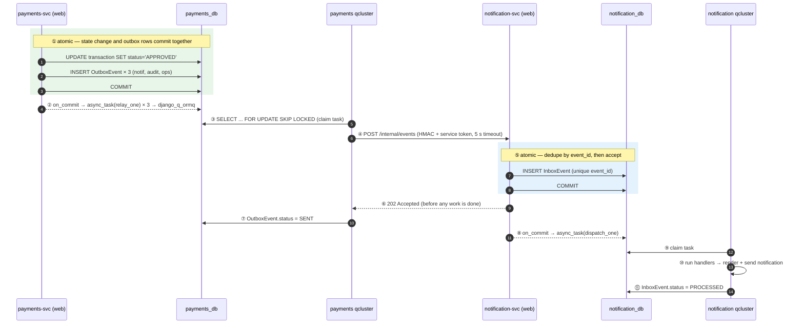

# 03 · Event Catalogue & Django Q2 Mechanics

> The complete asynchronous contract: envelope, event catalogue with payloads,
> subscription matrix, and exactly how Django Q2 — a task queue, not a broker —
> is made to carry events reliably across ten databases with no Redis and no Kafka.
>
> Rationale: [`00-first-principles.md` §6](00-first-principles.md#6-deriving-the-event-backbone-from-django-q2) ·
> Code: [`02-lld.md` §2](02-lld.md#2-platform_common--the-shared-library)

---

## 1. The envelope

Every event, on every hop, has exactly this shape. Consumers must ignore unknown
fields (forward compatibility) and must never depend on field order.

```json
{
  "event_id":       "9f1c2a3e-5b7d-4e91-8c02-6a4d1e0b7f33",
  "event_type":     "payment.approved",
  "event_version":  1,
  "occurred_at":    "2026-08-07T11:42:18.412903+00:00",
  "producer":       "payments-svc",
  "aggregate_type": "transaction",
  "aggregate_id":   "3b8e77a1-0d4c-4a55-9f21-1c7e5a9b2d10",
  "sequence":       4,
  "correlation_id": "c0ffee00-1111-2222-3333-444455556666",
  "causation_id":   "1a2b3c4d-...",
  "actor":          { "type": "customer", "id": "7d2f..." },
  "payload":        { "...": "event-specific, see §4" }
}
```

| Field | Purpose | Consumer rule |
|---|---|---|
| `event_id` | Idempotency key for the whole pipeline | **Must** be the inbox primary key |
| `event_type` | Routing key | `noun.verb-past-tense`, always past tense — events are facts that already happened |
| `event_version` | Schema version | Additive changes bump nothing; breaking changes bump this and publish **both** versions during migration |
| `occurred_at` | When the fact became true | Never "when it was delivered" — used for lag measurement |
| `aggregate_id` + `sequence` | Ordering guard | Skip any event whose `sequence` ≤ the projection's `last_sequence` |
| `correlation_id` | One user request across ten services | Propagate verbatim; never regenerate |
| `causation_id` | Which event caused this one | Enables causal-chain reconstruction in audit |
| `actor` | Who did it | `customer` \| `analyst` \| `ops` \| `admin` \| `system` |

**Money in payloads is always** `{"amount": "1500.0000", "currency": "INR"}` —
a `Decimal` serialised as a string. A JSON number for money is a defect.

---

## 2. Naming and versioning rules

1. `<aggregate>.<past-tense-verb>` — `payment.approved`, not `approve_payment` or `PaymentApprovedEvent`.
2. **Events are facts, not commands.** If a name reads like an instruction, the design is wrong: that should be an HTTP call.
3. **Payloads carry identifiers plus the fields consumers actually need.** Not the whole aggregate — that couples every consumer to the producer's schema. Not just an ID either — that forces a callback and defeats the decoupling.
4. **Additive-only within a version.** Adding an optional field never bumps `event_version`. Removing or retyping a field does, and the producer emits both versions until every consumer has migrated.
5. **Never put PII in a payload.** Names, national IDs and full account numbers stay in their owning service. Payloads carry UUIDs and masked references (`••••4821`).

---

## 3. Subscription matrix

Rows are producers, columns are subscribers. Each ✅ is one `OutboxEvent` row at
publish time (fan-out happens at publish, not at delivery — [`02-lld.md` §2.2](02-lld.md)).

| Event | notif | audit | ops | payments | account | fraud | onboarding | identity |
|---|:--:|:--:|:--:|:--:|:--:|:--:|:--:|:--:|
| `user.registered` | ✅ | ✅ | | | | | ✅ | |
| `user.logged_in` | | ✅ | | | | ✅ | | |
| `user.login_failed` | ✅ | ✅ | ✅ | | | ✅ | | |
| `device.seen` | | ✅ | | | | ✅ | | |
| `security.refresh_reuse_detected` | ✅ | ✅ | ✅ | | | ✅ | | |
| `onboarding.status_changed` | ✅ | ✅ | | | | | | |
| `onboarding.completed` | ✅ | ✅ | | | ✅ | | | |
| `onboarding.rejected` | ✅ | ✅ | ✅ | | | | | |
| `onboarding.review_required` | | ✅ | ✅ | | | | | |
| `kyc.completed` | ✅ | ✅ | | | | ✅ | ✅ | |
| `kyc.screening_hit` | | ✅ | ✅ | | | ✅ | ✅ | |
| `account.opened` | ✅ | ✅ | | | | ✅ | ✅ | ✅ |
| `account.frozen` | ✅ | ✅ | ✅ | ✅ | | ✅ | | |
| `beneficiary.added` | ✅ | ✅ | | | | ✅ | | |
| `beneficiary.blocked` | ✅ | ✅ | | | | ✅ | | |
| `limit.policy_updated` | | ✅ | ✅ | ✅ | | | | |
| `payment.initiated` | | ✅ | ✅ | | | | | |
| `payment.approved` | ✅ | ✅ | ✅ | | ✅ | | | |
| `payment.blocked` | ✅ | ✅ | ✅ | | ✅ | | | |
| `payment.review_required` | ✅ | ✅ | ✅ | | | | | |
| `payment.dispatched` | | ✅ | ✅ | | | | | |
| `payment.settled` | ✅ | ✅ | ✅ | | ✅ | ✅ | | |
| `payment.returned` | ✅ | ✅ | ✅ | | ✅ | ✅ | | |
| `payment.failed` | ✅ | ✅ | ✅ | | ✅ | | | |
| `payment.cancelled` | ✅ | ✅ | ✅ | | ✅ | | | |
| `schedule.created` | ✅ | ✅ | | | | | | |
| `schedule.failed` | ✅ | ✅ | ✅ | | | | | |
| `ledger.posted` | | ✅ | | ✅ | ✅ | | | |
| `ledger.reversed` | ✅ | ✅ | ✅ | ✅ | ✅ | | | |
| `ledger.invariant_breached` | | ✅ | ✅ | | | | | |
| `fraud.decision_made` | | ✅ | ✅ | | | | | |
| `fraud.case_opened` | ✅ | ✅ | ✅ | | | | | |
| `fraud.case_approved` | ✅ | ✅ | ✅ | ✅ | | | | |
| `fraud.case_rejected` | ✅ | ✅ | ✅ | ✅ | | | | |
| `fraud.rule_updated` | | ✅ | ✅ | | | | | |
| `outbox.dead` | | ✅ | ✅ | | | | | |
| `audit.chain_broken` | | — | ✅ | | | | | |

> **audit-svc subscribes to everything.** It is the only wildcard subscriber, and
> the only service with `SELECT`+`INSERT`-only grants on its own table.

**Four events close a loop back into a service that produced work:**
`fraud.case_approved` / `fraud.case_rejected` → payments-svc resumes or
compensates the saga; `kyc.completed` → onboarding-svc continues the workflow;
`ledger.posted` → account-svc updates its cached balance. These are the async
resumption points, and each is guarded by a state check so a duplicate delivery
is a no-op.

---

## 4. Event payloads

Only the fields consumers need. Full schemas live as JSON Schema files in
`libs/platform_common/events/schemas/`, validated in CI.

### 4.1 Money movement

```jsonc
// payment.initiated
{ "transaction_id": "...", "reference": "TXN-20260807-A7F3K2", "user_id": "...",
  "account_id": "...", "txn_type": "TRANSFER", "rail": "INTERNATIONAL",
  "amount": {"amount": "150000.0000", "currency": "INR"},
  "beneficiary_id": "...", "beneficiary_masked": "••••4821", "schedule_id": null }

// payment.approved
{ "transaction_id": "...", "reference": "...", "user_id": "...", "account_id": "...",
  "amount": {...}, "rail": "DOMESTIC", "journal_entry_id": "...",
  "fraud": {"decision": "ALLOW", "score": 22, "reason_codes": [], "latency_ms": 11},
  "approved_at": "2026-08-07T11:42:18Z" }

// payment.blocked
{ "transaction_id": "...", "reference": "...", "user_id": "...", "amount": {...},
  "fraud": {"decision": "BLOCK", "score": 92, "reason_codes": ["R006","R004"], "decision_id": "..."},
  "hold_released": true, "limit_released": true, "customer_message_code": "TXN_BLOCKED_SECURITY" }

// payment.review_required
{ "transaction_id": "...", "reference": "...", "user_id": "...", "amount": {...},
  "case_id": "...", "score": 58, "reason_codes": ["R005","R011"],
  "sla_due_at": "2026-08-07T13:42:18Z", "funds_held": true }

// payment.settled
{ "transaction_id": "...", "reference": "...", "user_id": "...", "account_id": "...",
  "amount": {...}, "rail": "INTERNAL", "rail_ref": null,
  "journal_entry_id": "...", "settled_at": "..." }

// payment.returned
{ "transaction_id": "...", "reference": "...", "user_id": "...", "amount": {...},
  "rail_ref": "SWIFT-99213", "return_reason": "BENEFICIARY_ACCOUNT_CLOSED",
  "reversal_journal_entry_id": "...", "funds_returned": true }

// payment.failed
{ "transaction_id": "...", "reference": "...", "user_id": "...", "amount": {...},
  "failed_step": "CAPTURE", "error_code": "LEDGER_UNAVAILABLE",
  "compensation_status": "COMPLETED", "retryable": true }

// payment.cancelled
{ "transaction_id": "...", "reference": "...", "user_id": "...", "amount": {...},
  "cancelled_from_status": "RESERVED", "cancelled_by": "customer", "hold_released": true }
```

### 4.2 Ledger

```jsonc
// ledger.posted
{ "journal_entry_id": "...", "reference": "JE-000184213", "entry_type": "TRANSFER",
  "txn_ref": "...", "posted_at": "...",
  "postings": [
    {"ledger_account_id": "...", "account_ref": "...", "direction": "DEBIT",
     "amount": {"amount": "150000.0000", "currency": "INR"}, "balance_after": "348200.0000"},
    {"ledger_account_id": "...", "account_ref": null, "direction": "CREDIT",
     "amount": {"amount": "150000.0000", "currency": "INR"}, "balance_after": "8921450.0000"}
  ] }

// ledger.invariant_breached   ← critical: pages ops immediately
{ "check": "DEBITS_EQUAL_CREDITS", "currency": "INR",
  "debits": "18234500.0000", "credits": "18234100.0000", "delta": "400.0000",
  "detected_at": "...", "scope": "2026-08-07" }
```

### 4.3 Fraud

```jsonc
// fraud.decision_made
{ "decision_id": "...", "txn_ref": "...", "account_ref": "...", "decision": "REVIEW",
  "score": 58, "reason_codes": [{"code":"R005","weight":45},{"code":"R011","weight":13}],
  "shadow_codes": ["R017"], "ruleset_version": "2026-08-07.3", "latency_ms": 12 }

// fraud.case_approved   → payments-svc resumes the saga from CAPTURE
{ "case_id": "...", "txn_ref": "...", "decision_id": "...", "analyst_id": "...",
  "resolution": "FALSE_POSITIVE", "note": "Known payee, customer confirmed by callback",
  "resolved_at": "...", "time_to_resolve_s": 842 }

// fraud.case_rejected   → payments-svc compensates
{ "case_id": "...", "txn_ref": "...", "decision_id": "...", "analyst_id": "...",
  "resolution": "CONFIRMED_FRAUD", "note": "...", "resolved_at": "...",
  "actions": ["BLOCK_BENEFICIARY", "FREEZE_ACCOUNT"] }

// fraud.rule_updated    → every fraud-svc replica refreshes its in-memory ruleset
{ "rule_code": "R014_INTL_NEW_BENEF_HIGH", "version": 4, "change": "WEIGHT",
  "from": {"weight": 60, "mode": "ACTIVE"}, "to": {"weight": 45, "mode": "ACTIVE"},
  "changed_by": "...", "reason": "precision 0.21 over 84 firings" }
```

### 4.4 Onboarding, KYC, account

```jsonc
// kyc.completed
{ "case_id": "...", "application_id": "...", "user_id": "...", "status": "PASSED",
  "identity_score": 92, "document_score": 88, "risk_rating": "LOW",
  "sanctions_hit": false, "pep_hit": false, "processing_ms": 4310 }
// NOTE: no name, no DOB, no national ID. PII never leaves kyc-svc.

// account.opened
{ "account_id": "...", "user_id": "...", "account_number_masked": "••••7731",
  "currency": "INR", "account_type": "SAVINGS", "tier": "STANDARD",
  "limits": {"per_txn_max": "200000.0000", "daily_max": "500000.0000"}, "opened_at": "..." }

// beneficiary.added   → fraud-svc seeds KnownBeneficiary + starts the cooling-off clock
{ "beneficiary_id": "...", "user_id": "...", "account_id": "...",
  "beneficiary_type": "INTERNATIONAL", "fingerprint": "sha256:...",
  "country": "AE", "currency": "AED", "cooling_off_until": "2026-08-08T11:00:00Z" }

// limit.policy_updated
{ "policy_id": "...", "scope": "TIER", "scope_ref": "STANDARD", "rail": "INTERNATIONAL",
  "version": 7, "changed_by": "...",
  "from": {"daily_max": "500000.0000"}, "to": {"daily_max": "300000.0000"} }
```

---

## 5. Django Q2 as the transport

### 5.1 What Q2 gives us, and what it doesn't

| Q2 provides | Q2 does **not** provide | We supply |
|---|---|---|
| Durable task queue in the service's own DB | Topics / pub-sub | `SUBSCRIPTIONS` map + one outbox row per subscriber |
| Worker pool with lease-based redelivery | Cross-service delivery | HTTP relay with HMAC signing |
| Cron/interval scheduling | Exponential backoff | `attempts` + `next_attempt_at` on the outbox row |
| Failure recording + admin UI | Dead-letter queue | `status="DEAD"` + ops-svc DLQ view |
| `sync` mode for tests | Ordering guarantees | `(aggregate_id, sequence)` guard in handlers |
| At-least-once execution | Exactly-once | `unique(event_id)` inbox → effect-once |

**Why `orm` and not another broker:** with database-per-service, the ORM broker
puts each queue inside the database that service already owns. There is no shared
transport to secure, no extra container, and queue state is backed up with the
service's data. The cost — polling instead of push — is ~200 ms of latency, which
is invisible next to a 2 s delivery target.

### 5.2 End-to-end delivery path



**Each numbered step has a failure story, and none of them loses the event:**

| Fails at | Consequence | Recovered by |
|---|---|---|
| ① | Nothing published — the business change also rolled back | Correct by construction |
| ② (process dies) | Outbox rows sit `PENDING` | `sweep_outbox` (1 min) |
| ③ (worker dies) | Task lease expires | Q2 redelivers; `relay_one` is idempotent |
| ④ (network/5xx) | `attempts++`, backoff scheduled | `relay_one` retry ladder → `DEAD` → ops |
| ④ (delivered, response lost) | Publisher retries; subscriber sees a duplicate `event_id` | `IntegrityError` → 200, no double-processing |
| ⑤ | 5xx returned; publisher retries | Backoff ladder |
| ⑦ (dies after 202) | Row stays `PENDING`, gets re-sent | Duplicate absorbed by the inbox |
| ⑧ (process dies) | `InboxEvent` sits `RECEIVED` | `sweep_inbox` (1 min) re-dispatches |
| ⑨/⑩ | Q2 records a failure, retries | Handler idempotency |
| ⑩ (handler bug) | `attempts++` → `FAILED` after 8 | ops-svc DLQ → fix → replay |

### 5.3 Retry ladder

```
attempt:   1     2     3     4     5      6      7      8
delay:     1s    2s    5s    15s   60s    5m     15m    1h      → DEAD
cumulative 1s    3s    8s    23s   83s    ~7m    ~22m   ~1h22m
```

Roughly 1.5 hours of transient-failure tolerance before a human is involved.
Long enough to ride out a deploy or a restart; short enough that a real outage
surfaces the same day. `DEAD` rows raise `outbox.dead` → ops-svc `FailureCase`.

### 5.4 Scheduled tasks across the estate

Registered once at deploy time via a `register_schedules` management command
(idempotent — safe to re-run):

| Service | Task | Cadence | Purpose |
|---|---|---|---|
| *all* | `sweep_outbox` | 1 min | Deliver `PENDING` rows whose `on_commit` was lost |
| *all* | `sweep_inbox` | 1 min | Re-dispatch `RECEIVED` rows never processed |
| *all* | `prune_q_tasks` | daily | Trim Q2's own success/failure tables |
| payments | `run_due_schedules` | 1 min | Scheduled + recurring transfers |
| payments | `retry_compensation` | 5 min | Drain `COMPENSATION_PENDING` sagas |
| payments | `sweep_stuck_sagas` | 10 min | Sagas in flight > 5 min |
| payments | `expire_stale_reviews` | 10 min | `UNDER_REVIEW` past SLA → release + notify |
| payments | `reconcile_with_ledger` | nightly | Transaction totals vs journal totals |
| ledger | `expire_holds` | 1 min | Release holds past TTL (crash safety net) |
| ledger | `verify_invariants` | hourly | Debits==credits per currency; postings==balance |
| ledger | `daily_reconciliation` | nightly | Trial balance artefact |
| fraud | `refresh_rule_cache` | 60 s | Pull rule/threshold/list changes into memory |
| fraud | `rollup_rule_stats` | hourly | Precision per rule for the tuning loop |
| fraud | `escalate_sla_breaches` | 5 min | Ageing analyst cases |
| fraud | `prune_screened_txns` | nightly | 90-day retention on the velocity table |
| account | `rollover_limit_windows` | hourly | New day/month usage buckets |
| account | `expire_cooling_off` | 15 min | Activate beneficiaries past their cooling-off |
| account | `reconcile_cached_balances` | nightly | Read model vs ledger truth |
| onboarding | `sweep_stuck_kyc` | 15 min | KYC pending > 24 h → `MANUAL_REVIEW` |
| kyc | `retry_failed_screening` | 10 min | Provider adapter transient failures |
| audit | `verify_chain` | daily | Hash-chain integrity over yesterday's rows |
| identity | `purge_expired_tokens` | daily | Refresh-token hygiene |
| ops | `poll_health` | 15 s | Scrape every `/internal/metrics` |
| ops | `generate_scheduled_reports` | daily | Standing compliance reports |
| notification | `retry_failed_deliveries` | 5 min | Channel-level retries |

```python
# management/commands/register_schedules.py — idempotent by name
from django_q.models import Schedule
Schedule.objects.update_or_create(
    name="sweep_outbox",
    defaults=dict(func="platform_common.events.tasks.sweep_outbox",
                  schedule_type=Schedule.MINUTES, minutes=1, repeats=-1),
)
```

> **`catch_up: False` is essential.** After an hour of downtime, the default would
> fire sixty missed `sweep_outbox` runs the instant the cluster starts. With
> `catch_up` disabled the scheduler resumes from *now*, and the sweeper's own
> query finds everything that piled up anyway.

### 5.5 Testing events

```python
# platform_common/testing/fixtures.py
@pytest.fixture
def captured_events(settings):
    """Q_CLUSTER['sync']=True runs tasks inline; the relay is stubbed so tests
    assert on the envelope rather than on HTTP."""
    settings.Q_CLUSTER = {**settings.Q_CLUSTER, "sync": True}
    sent = []
    with mock.patch("platform_common.events.tasks.deliver", side_effect=lambda s, e: sent.append((s, e))):
        yield sent

def test_approved_transfer_publishes_to_three_subscribers(captured_events, transfer):
    run_saga(transfer)
    types = {e["event_type"] for _, e in captured_events}
    subs  = {s for s, _ in captured_events}
    assert "payment.approved" in types
    assert subs >= {"notification-svc", "audit-svc", "ops-svc"}

def test_duplicate_delivery_is_a_noop(client, envelope):
    assert client.post("/internal/events", envelope, **signed()).status_code == 202
    assert client.post("/internal/events", envelope, **signed()).status_code == 200   # deduped
    assert Notification.objects.count() == 1
```

---

## 6. Replacing the transport later

If Redis or Kafka becomes available, **only `platform_common/events/` changes** —
no service code, no handler, no payload:

| Concern | Today | With a broker |
|---|---|---|
| Fan-out | One outbox row per subscriber | One publish; broker fans out |
| Delivery | HTTP POST from `relay_one` | `producer.send(topic, envelope)` |
| Dedupe | Inbox `unique(event_id)` | **Unchanged** — still needed, brokers are at-least-once too |
| Ordering | `(aggregate_id, sequence)` guard | Partition by `aggregate_id`; keep the guard anyway |
| Replay | Re-drive outbox rows | Reset consumer offset |
| Backoff | `next_attempt_at` column | Broker retry topics |

The outbox stays regardless — it is what makes the database write and the publish
atomic, and no broker solves that. That is why this design isn't a compromise
forced by the absence of Redis: **the outbox is the part you'd keep anyway.**
