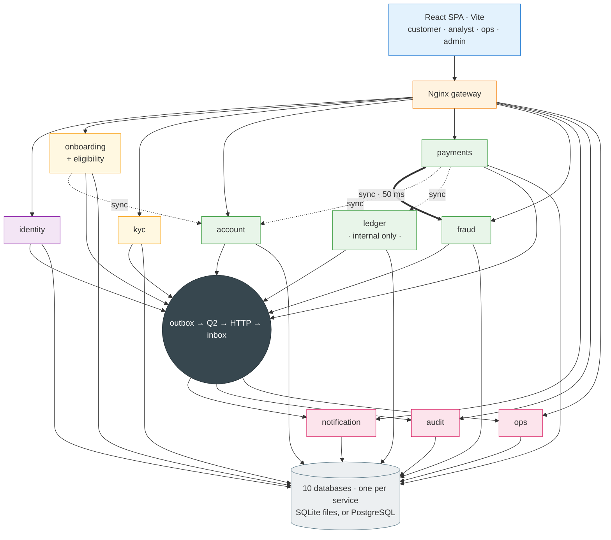

# Microservices Design — Digital Banking Platform

HLD and LLD for a **microservices** build of the platform: onboarding &
KYC-lite account opening (UC1) and funding, transfers & real-time fraud
screening (UC2).

**Stack:** React 18 + Vite + TypeScript · Django 5.2 + DRF (Python 3.12) ·
**SQLite, one file per service** (PostgreSQL is a one-env-var switch) ·
**Django Q2** as the message queue.
**No Redis. No Kafka. No database server. No non-Python runtime dependency** at
all, beyond an Nginx config file (which has a documented Django fallback).

> This supersedes the modular-monolith plan in [`../plan.md`](../plan.md) and the
> archived Kafka/Redis design (`Xfull-vision/`, in git history only —
> `git show 1c37b59:Xfull-vision/docs/01-hld.md`). Neither meets the current
> constraints: the first isn't microservices, the second needs infrastructure we
> don't have.

---

## Read in this order

| # | Document | What it answers | Read if you are… |
|---|---|---|---|
| **00** | [First Principles](00-first-principles.md) | *Why* is the architecture shaped this way? Invariants, boundary derivation, capacity math, 9 ADRs | anyone — start here |
| **01** | [High-Level Design](01-hld.md) | C4 views, 10-service topology, event backbone, security, failure modes, NFR budgets, deployment | reviewers, architects |
| **02** | [Low-Level Design](02-lld.md) | Models, endpoints, sequences, state machines, ledger posting, saga, fraud rule engine | everyone building it |
| **03** | [Events & Django Q2](03-events.md) | Envelope, 38-event catalogue, subscription matrix, outbox→relay→inbox mechanics, retry ladder, schedules | whoever touches async |
| **04** | [API Contracts](04-api-contracts.md) | REST surface, error envelope, idempotency, authz matrix, contract testing | frontend + integrators |
| **05** | [Delivery Plan](05-delivery-plan.md) | Build order, phase gates, team split, compose, seed data, demo script, traceability, risks | the whole team |

---

## The architecture in one diagram

---

## The five decisions worth knowing before you read anything else

1. **"Millions of transactions a day" is ~12 TPS average, ~120 peak.** That is
   small. We spend the complexity budget on *correctness*, not throughput —
   which is why no broker, no feature store and no sharding appear anywhere.

2. **Django Q2 is a task queue, not a broker — so events ride a transactional
   outbox.** Each service's queue lives in its own database (`orm` broker); a Q2
   worker relays each event over HTTP to each subscriber's inbox, which dedupes
   on `event_id` and processes on its own queue. At-least-once delivery,
   effect-once processing, no shared infrastructure.
   ([`03-events.md`](03-events.md))

3. **`ledger-svc` is the only writer of money, and it's a separate service so
   that's enforced by the database rather than by code review.** It has no public
   route. Double-entry, hold/capture, reversals-never-edits. Money is stored as
   exact integer minor units — `DecimalField` becomes a float column on SQLite
   and silently loses precision (ADR-010). ([`02-lld.md` §8](02-lld.md))

4. **Fraud is a synchronous gate that fails to REVIEW, never to ALLOW.** It hits
   its 50 ms budget without Redis by owning a denormalised read model (three
   indexed queries + in-memory rules ≈ 14 ms p99). Rules are admin-configurable
   JSON evaluated by a whitelisted interpreter — never `eval`.
   ([`02-lld.md` §9](02-lld.md))

5. **The audit log is hash-chained**, so altering or deleting any historic row
   breaks every hash after it — demonstrated, not claimed. On PostgreSQL
   `REVOKE UPDATE, DELETE` on the table makes it enforced as well.

---

## Services

| Service | Owns | Public API |
|---|---|---|
| identity | users, roles, tokens, signing keys, devices | `/api/auth/*` |
| onboarding | applications, eligibility results | `/api/onboarding/*` |
| kyc | KYC cases, documents, screening hits (all PII) | `/api/kyc/*` |
| account | accounts, beneficiaries, limit policies & usage | `/api/accounts/*`, `/api/beneficiaries/*` |
| payments | funding, transfers, schedules, saga, idempotency | `/api/funding/*`, `/api/transfers/*` |
| **ledger** | journal, postings, balances, holds | **none — internal only** |
| fraud | rules, decisions, cases, feature read model | `/api/fraud/*` |
| notification | messages, templates, preferences | `/api/notifications/*` |
| audit | append-only hash-chained log | `/api/audit/*` (read) |
| ops | health snapshots, failure cases, reports | `/api/ops/*` |
