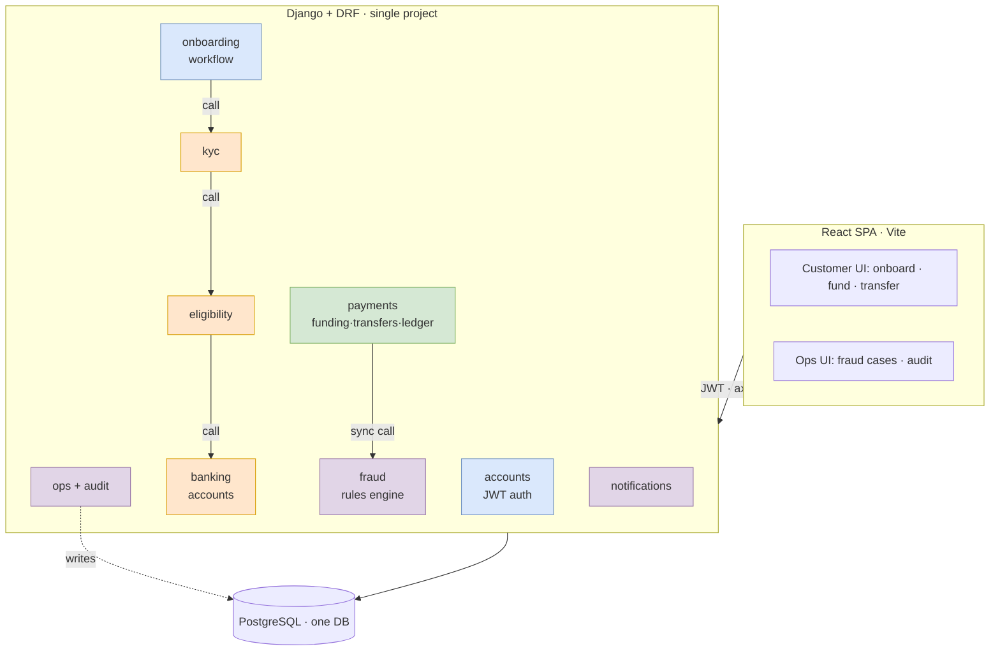
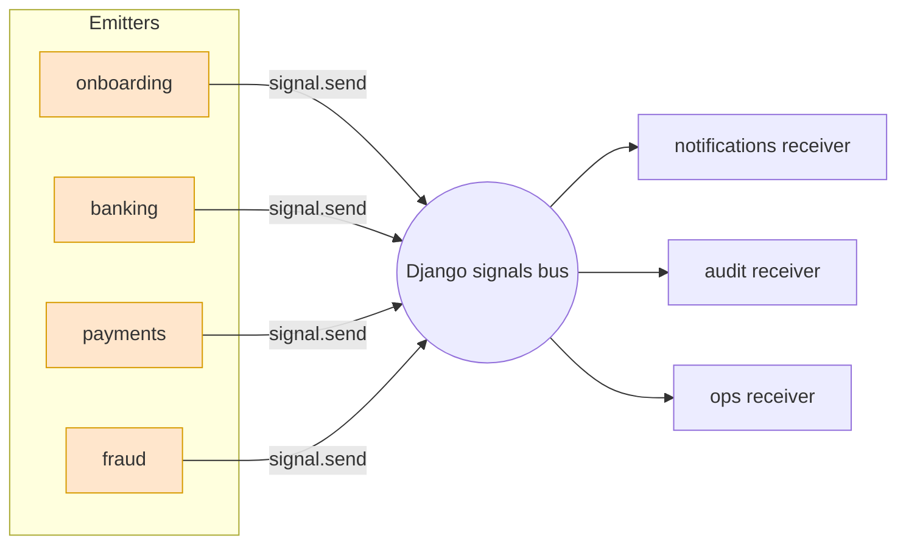
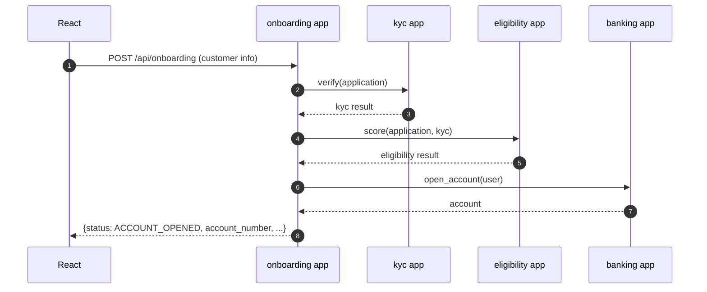
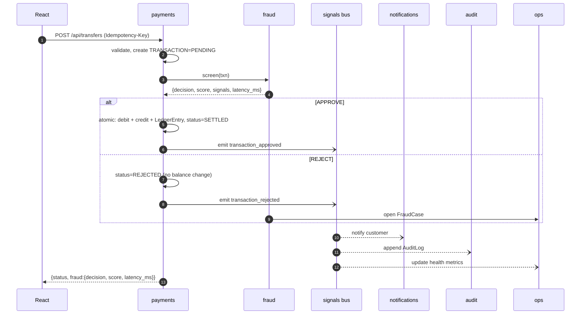
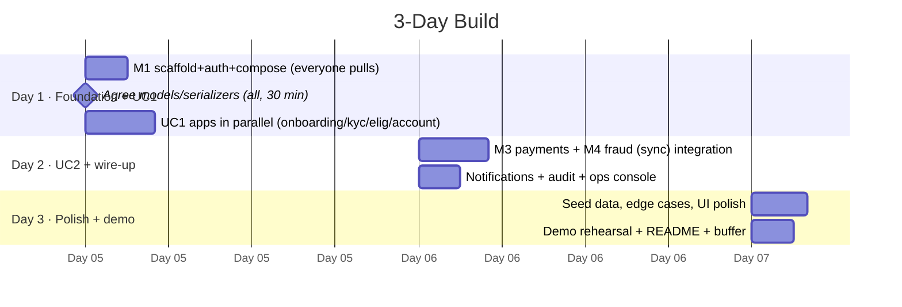

# Project Plan — 3-Day Hackathon Build

> **This is the plan we are building.** Two use cases (onboarding + funding/transfers
> with fraud), 4 members, built as **one Django project** with a small number of apps.
> Architecture diagram: [`../diagrams/architecture.drawio`](../diagrams/architecture.drawio).
>
> An earlier, heavier microservices design is archived under
> [`../full-vision/`](../full-vision/) for reference only — we are **not** building that.

---

## 1. The approach (and the moving parts we deliberately avoid)

| Heavier alternative (NOT building) | What we build |
|-----------------------------------|---------------|
| 12 microservices + API gateway | **1 Django project, 1 app per domain** (modular monolith) — calls are Python imports, no gateway, no service-to-service auth |
| Kafka event bus | **Django signals = in-process event bus** — apps emit domain events; audit/notifications/ops subscribe as receivers (this is our **event-driven** layer, swappable for Kafka later) |
| RS256 + JWKS | **SimpleJWT HS256** (access + refresh) — one app, one shared secret |
| DB-per-service | **One PostgreSQL database**, one table-set per Django app |
| Redis feature store + Celery | **None** — compute fraud velocity with a DB query |
| MinIO object storage | **Django `FileField`** to local media (or store metadata; KYC is mocked) |
| Double-entry ledger + Kafka outbox | **`Account.balance` + a `LedgerEntry` row per txn**, updated in one DB transaction; **Idempotency-Key** unique column |
| Prometheus/Grafana/OTel/Loki/Sentry | **Django logging + a `/health` endpoint** |
| K8s + Helm + Terraform | **`docker-compose` (web + postgres)** or `runserver` + local Postgres |
| Email/SMS providers | **In-app notifications** (DB rows shown in UI) + console email backend |

**Net effect: ~9 Django apps in one process, one database, ~10 tables — instead of 12 services + 6 infra components.** All four people work in the same repo but in **different app folders**, so merge conflicts stay rare.

---

## 2. Architecture



Colours = which member owns the app (see §4). Everything is **in-process**; the arrows are Python function calls, not network hops.

---

## 2a. Event-driven design (Django signals)

This is how we satisfy the **event-driven** requirement without a broker. Domain apps
**emit Django Signals** (a publish/subscribe bus inside the one process); cross-cutting
apps **subscribe as receivers** and react without the emitter knowing they exist — the
same decoupling Kafka gives. When we later split into services (`../full-vision/`),
each signal becomes a Kafka topic **1:1**, so nothing is thrown away.

**Event catalogue** (signals defined in `core/events.py`, part of M1's scaffold):

| Domain event (signal) | Emitted by | Receivers react by |
|-----------------------|-----------|--------------------|
| `customer_captured` | onboarding | audit |
| `kyc_completed` | kyc | audit |
| `account_opened` | banking | notifications (welcome + details), audit |
| `funding_completed` | payments | notifications, audit |
| `transaction_approved` | payments | notifications, audit, ops (metrics) |
| `transaction_rejected` | payments | notifications, audit, ops (open case) |
| `fraud_flagged` | fraud | ops (case), audit |



Implementation: `event_signal.send(sender, event="transaction_approved", payload={...})`;
receivers use `@receiver(event_signal)` and are registered in each app's
`apps.py::ready()`. Receivers are **fire-and-forget** — a slow notification never
blocks the payment. (If a receiver must not be lost, wrap it in a try/except and log;
for true durability you'd move to Kafka — that's the `full-vision` upgrade.)

---

## 3. Tech stack

| Layer | Choice |
|-------|--------|
| Frontend | React 18 + Vite + TypeScript, React Router, axios (JWT interceptor), plain Context (skip Redux) |
| Backend | Python 3.12, **one** Django 5 + DRF project, apps per domain |
| Auth | `djangorestframework-simplejwt`, **HS256**, access (30 min) + refresh (1 day) |
| DB | **One** PostgreSQL (SQLite is fine for pure local dev) |
| Eventing | **Django signals** (in-process pub/sub) for domain events → audit · notifications · ops. No external broker. |
| API docs | `drf-spectacular` → `/api/docs` Swagger (free contract + testing UI) |
| Run | `docker-compose` (web + db) **or** `python manage.py runserver` + local Postgres |

---

## 4. The 4-member split (equal ownership)

Each member owns **1–3 Django apps + a React area**.

| Member | Django apps (in the one project) | React area | Owns for the team |
|--------|----------------------------------|-----------|-------------------|
| **M1 — Platform + Auth + Onboarding** | `accounts` (JWT), `onboarding` | Login/register, onboarding wizard, app shell/layout | **Project scaffold**: repo, `settings.py`, root `urls.py`, `docker-compose`, seed script, shared serializers/permissions |
| **M2 — Verify + Account** | `kyc`, `eligibility`, `banking` | KYC form, eligibility result, account dashboard | The UC1 decision logic (rules) |
| **M3 — Payments** | `payments` (funding + transfers + ledger) | Fund form, transfer form (domestic/intl), history | **Transaction integrity**: idempotency, balance-in-a-DB-transaction |
| **M4 — Fraud + Ops + Audit + Notifications** | `fraud`, `ops`, `audit`, `notifications` | Ops/fraud console, notifications bell | The fraud rules + the audit helper everyone calls |

> Still equal: M1 owns the shared scaffold (so only 2 apps), M4 owns 4 small apps that are mostly one model + one view each, M2/M3 own the domain-heavy logic.

**Coordination rule that avoids conflicts:** each app lives in its own folder; each member registers their app's routes via `include()` in the root `urls.py`. Only M1 edits `settings.py`/root `urls.py` — others send M1 a one-line "add my app" request or a tiny PR.

---

## 5. Data model (~10 tables, one database)

```mermaid
erDiagram
  USER ||--o{ ONBOARDING_APPLICATION : starts
  ONBOARDING_APPLICATION ||--|| KYC_CASE : triggers
  ONBOARDING_APPLICATION ||--|| ELIGIBILITY_RESULT : scored
  USER ||--o{ ACCOUNT : owns
  ACCOUNT ||--o{ TRANSACTION : has
  TRANSACTION ||--o{ LEDGER_ENTRY : posts
  TRANSACTION ||--|| FRAUD_DECISION : screened
  FRAUD_DECISION ||--o{ FRAUD_CASE : mayopen
  USER ||--o{ NOTIFICATION : receives

  USER { uuid id PK; string email; string role }
  ONBOARDING_APPLICATION { uuid id PK; uuid user_id FK; string status; json customer_info }
  KYC_CASE { uuid id PK; uuid application_id FK; string status; int score; json checks }
  ELIGIBILITY_RESULT { uuid id PK; uuid application_id FK; string decision; int risk_score; json factors }
  ACCOUNT { uuid id PK; uuid user_id FK; string account_number; string currency; decimal balance; string status }
  TRANSACTION { uuid id PK; uuid account_id FK; string type; decimal amount; string rail; string status; string idempotency_key }
  LEDGER_ENTRY { uuid id PK; uuid txn_id FK; string direction; decimal amount; decimal balance_after }
  FRAUD_DECISION { uuid id PK; uuid txn_id FK; int score; string decision; int latency_ms; json signals }
  FRAUD_CASE { uuid id PK; uuid decision_id FK; string status; string resolution }
  NOTIFICATION { uuid id PK; uuid user_id FK; string message; bool read }
  AUDIT_LOG { uuid id PK; string event_type; uuid actor_id; json payload; datetime created_at }
```
`funding` and `transfer` are **one `TRANSACTION` model** with a `type` field.
`FRAUD_DECISION.latency_ms` records how long screening took (proves the "milliseconds" goal).
`AUDIT_LOG` is written by the `audit(event_type, actor, payload)` helper (or the audit
signal receiver); it is **append-only — rows are never updated or deleted** → the
regulatory trail.

---

## 6. Flows

### UC1 — onboarding (all synchronous, one request cycle)


### UC2 — transfer with fraud (sync fraud call + event-driven side-effects)

The **fraud call is synchronous** (the transaction waits for the decision), but the
**side-effects are event-driven** (notify/audit/ops react to signals, off the critical
path). Fraud itself is a Python function returning `APPROVE / REJECT / REVIEW` with reason
codes — no network hop, so it completes in **single-digit milliseconds** (recorded as
`latency_ms`).

---

## 7. Three-day timeline



**Milestones**
- **End Day 1:** a user can register → onboard → **get an account number** (UC1 works, at least via Swagger).
- **End Day 2:** a user can **fund → transfer**, a suspicious transfer is **rejected by fraud**, notification + audit + ops case appear (UC2 works).
- **End Day 3:** polished happy-path demo of both use cases in the React UI.

---

## 8. Scope guardrails (say "not now" to these)
- ❌ Real KYC/bank APIs, real email/SMS, real payment rails → all mocked/in-app.
- ❌ Kafka, Celery, Redis, MinIO, K8s, Prometheus → none needed for the demo.
- ❌ RS256/JWKS, service mesh, gateway → single-app HS256 JWT.
- ✅ **If you finish early**, promote toward the archived [`../full-vision/`](../full-vision/) design in this order: (1) Redis for fraud velocity, (2) Celery for KYC processing, (3) split `payments` into its own service, (4) Kafka for notifications/audit.

---

## 9. Definition of done (per app)
- Models + migrations run · DRF endpoints in Swagger (`/api/docs`) · happy path tested manually · writes an `AUDIT_LOG` row for key actions · its React screen renders real data. That's enough for a hackathon.

---

## 10. Cross-cutting solution requirements (how each is met)

| Requirement | How we meet it in this build |
|-------------|------------------------------|
| **API-first** | Every capability is a DRF endpoint; OpenAPI 3 auto-published at `/api/docs` (drf-spectacular). Frontend + reviewers consume the same contract. |
| **Event-driven** (UC2) | Django **signals** in-process event bus — see §2a. Emitters don't know their receivers; maps 1:1 to Kafka topics later. |
| **Secure** | JWT (SimpleJWT) on all non-public endpoints; Django password hashing (PBKDF2/argon2); **serializer validation on every input**; role-based permissions (`customer` / `ops_analyst` / `compliance`); secrets from env (`django-environ`); CORS locked to the SPA origin; HTTPS at the proxy in prod; no PII/secrets in logs. |
| **Cloud-ready** | 12-factor: `Dockerfile` + `docker-compose`, **all config via env vars**, **stateless web** (JWT, no server sessions) so it scales horizontally; Postgres is the only stateful dependency. Deploys as-is to Render / Railway / Cloud Run / ECS / K8s; `gunicorn` + `whitenoise` for prod. |
| **Microservices-friendly** | Bounded contexts = Django apps with **no cross-app model imports** — apps interact only through `services.py` functions + signals. Each app can be lifted into its own service (models → own DB, calls → HTTP, signals → Kafka) with no rewrite. Target split lives in `../full-vision/`. |
| **Scalable** | Stateless web behind a load balancer; DB connection pooling; monitoring/ops can read from replicas; fraud is O(1) + one indexed query. |
| **Banking-grade** | Money moves only inside `transaction.atomic()` + `select_for_update()`; **idempotency keys** stop double-debit; **`LedgerEntry` per posting** makes balances reconstructable; **append-only `AuditLog`** is the regulatory trail. |
| **Fraud in milliseconds** | In-process function call (no network) + one indexed velocity query → single-digit ms; recorded as `FraudDecision.latency_ms` and asserted in a test. |

---

## 11. Requirements traceability (are we fulfilling all of it?)

### Use Case 1 — objectives
| Objective | Fulfilled by |
|-----------|--------------|
| Capture customer information | `onboarding` app · `POST /api/onboarding` |
| Perform KYC-lite verification | `kyc` app · `verify()` (mock identity + doc + sanctions/PEP) |
| Evaluate eligibility and risk | `eligibility` app · `score()` → decision + risk_score + tier |
| Open an account digitally | `banking` app · `open_account()` |
| Generate account details instantly | account number returned **synchronously in the same onboarding response** |
| Audit, compliance & workflow tracking | append-only `AuditLog` (compliance) + `onboarding` **state machine** (workflow) + `ops` viewer |

### Use Case 2 — objectives
| Objective | Fulfilled by |
|-----------|--------------|
| Accept funding / fund accounts | `payments` · `POST /api/funding` |
| Domestic & international transfers | `payments` · `POST /api/transfers` (`rail = DOMESTIC / INTERNATIONAL`) |
| Real-time payment processing | processed synchronously within the request cycle |
| Fraud checks in milliseconds | `fraud.screen()` in-process + `latency_ms` |
| Approve or reject transactions | fraud decision → `Transaction.status` (SETTLED / REJECTED) |
| Notify customers | `notifications` app via `transaction_*` / `account_opened` signals |
| Monitor health & reduce false positives | `ops` `/metrics` + false-positive feedback → fraud rule-weight tuning |
| Operational visibility | `ops` console + audit trail viewer |
| Complete audit trail (regulatory) | append-only `AuditLog`, written on every domain event |

### Solution requirements (both use cases)
| Requirement | Met? | Notes |
|-------------|------|-------|
| Python backend-centric | ✅ | Django 5 + DRF |
| API-first | ✅ | OpenAPI at `/api/docs` |
| Microservices-friendly | ✅ | app bounded contexts + service/signal seams → `full-vision` split |
| Cloud-ready | ✅ | Docker + env config + stateless |
| Secure & scalable | ✅ | JWT + RBAC + validation; stateless horizontal scale |
| Backend-heavy / Python-centric (UC2) | ✅ | Django-heavy, thin React |
| Event-driven (UC2) | ✅ | Django signals bus (§2a) |
| Banking-grade (UC2) | ✅ | atomic ledger + idempotency + append-only audit |
