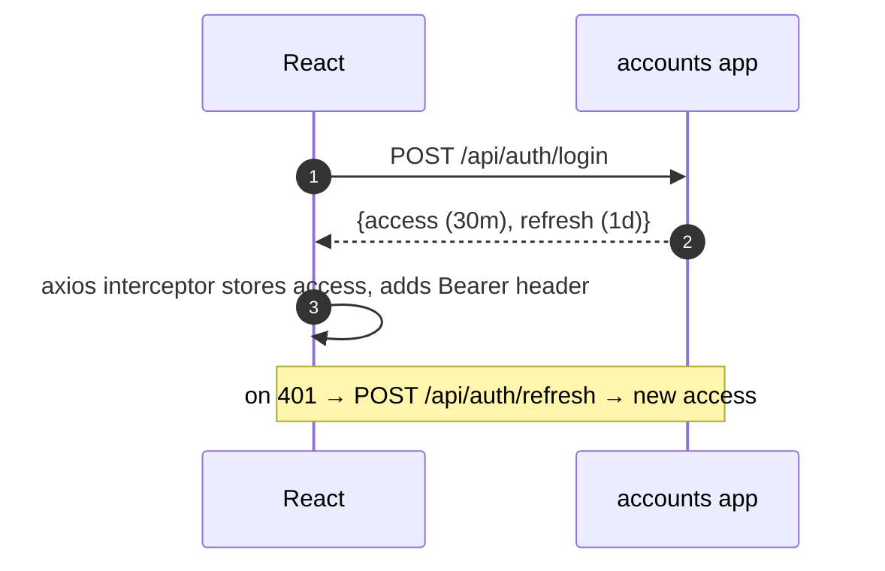
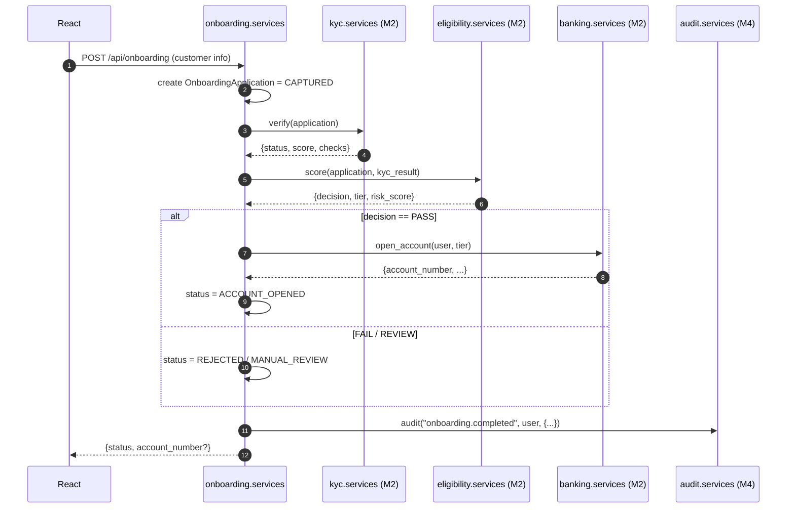
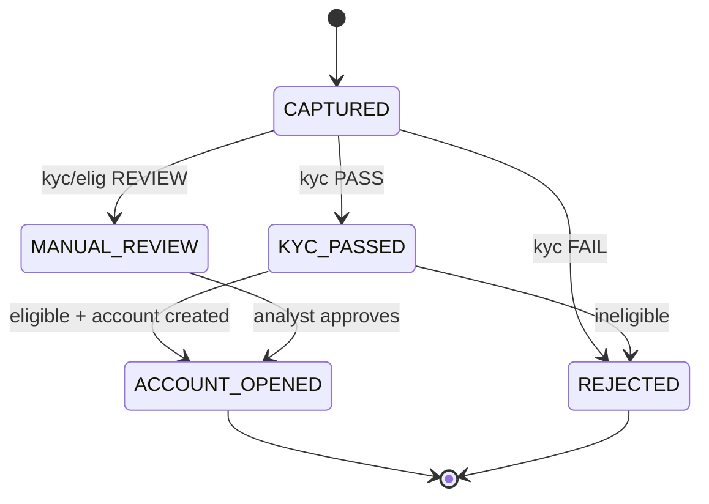

# Member 1 — Platform + Auth + Onboarding

> You build the **project skeleton everyone else plugs into**, plus the **auth** and
> the **UC1 onboarding workflow**. Deliver the scaffold first — it unblocks the team.
> Plan: [`../docs/plan.md`](../docs/plan.md).

## Ownership

| Type | You own |
|------|---------|
| **Django apps** | `accounts` (custom user + JWT), `onboarding` |
| **Platform** | The **project scaffold**: `config/settings.py`, root `config/urls.py`, `docker-compose.yml` + `Dockerfile`, env-based settings (`django-environ`), `requirements.txt`, seed script, shared `permissions.py` / base serializers, and **`core/events.py`** (the Django **signal registry** everyone emits to) |
| **React** | App shell/layout + router, `login`/`register`, onboarding wizard |
| **DB tables** | `User`, `OnboardingApplication` (+ optional `ApplicationEvent`) |

## Endpoints you expose (DRF)
```
POST /api/auth/register     {email,password,full_name}     -> 201 {user_id}
POST /api/auth/login        {email,password}               -> 200 {access,refresh}
POST /api/auth/refresh      {refresh}                      -> 200 {access}
GET  /api/auth/me                                          -> 200 {user_id,email,role}
POST /api/onboarding        {full_name,dob,address,phone,national_id} -> 201 {application_id,status}
GET  /api/onboarding/{id}                                  -> 200 {status, kyc, eligibility, account}
```

## The scaffold contract (what teammates rely on)
- `config/settings.py` with `INSTALLED_APPS` ready to append; DRF + SimpleJWT (HS256) + drf-spectacular configured; one Postgres `DATABASES`.
- Root `config/urls.py` includes each app: `path("api/", include("<app>.urls"))`. **Only you edit this file** — teammates send a one-line "add my app".
- `accounts.permissions.IsAuthenticated` / `HasRole("ops_analyst")` for everyone to import.
- `core/events.py` defines the shared `event_signal` + event-name constants (see plan §2a). Everyone emits with `event_signal.send(...)`; M4's apps connect receivers.
- `docker-compose up` brings up `web` + `db`; `manage.py seed` creates demo users.
- Env-based config (`django-environ`) + `Dockerfile` so the app is **cloud-ready** (deploys to any container host).

## Flow 1 — Auth


## Flow 2 — Onboarding orchestration (you call M2's apps in-process)


## Onboarding state machine


## You depend on (import these; stub them Day 1 if not ready)
- `kyc.services.verify(application)` · `eligibility.services.score(application, kyc)` · `banking.services.open_account(user, tier)` — **M2**
- `audit.services.audit(event_type, actor, payload)` — **M4**

## Build checklist
- [ ] Scaffold: settings (env-based), urls, `Dockerfile` + docker-compose, requirements, seed, **`core/events.py` signal registry** — **push first thing Day 1**.
- [ ] `accounts`: custom `User`, register/login/refresh/me, SimpleJWT HS256, roles, permission classes.
- [ ] `onboarding`: `OnboardingApplication` model, state-machine `services.py`, the two endpoints, calls into M2 + audit.
- [ ] React: layout + protected routes, auth forms + axios interceptor, onboarding wizard + status screen.
- [ ] Stub `kyc/eligibility/banking` services so onboarding is testable before M2 finishes.

## Definition of done
Migrations run · endpoints in `/api/docs` · login works and guards routes · onboarding produces an account number end-to-end (with real or stubbed M2) · writes an audit row.
