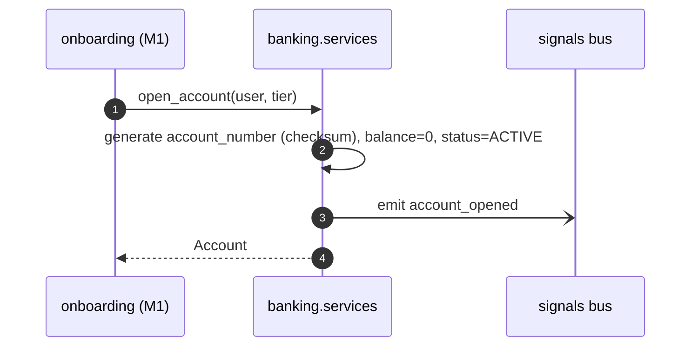

# Member 2 — KYC, Eligibility & Account (Banking)

> You own the **UC1 decision logic**: verify the customer (KYC-lite), score their
> eligibility, and open the account. M1's onboarding app calls your three functions
> in order. Plan: [`../docs/plan.md`](../docs/plan.md).

## Ownership

| Type | You own |
|------|---------|
| **Django apps** | `kyc`, `eligibility`, `banking` |
| **React** | KYC form, eligibility result card, **account dashboard** (number, balance, status) |
| **DB tables** | `KycCase`, `EligibilityResult`, `Account` |

## Functions you expose (in-process, called by M1's onboarding)
```python
# kyc/services.py
def verify(application) -> KycResult:
    # mock rules: identity match + doc check + sanctions/PEP (deterministic for demo)
    # returns {status: PASS|FAIL|REVIEW, score, checks:{...}}

# eligibility/services.py
def score(application, kyc_result) -> EligibilityResult:
    # rules + risk_score -> {decision: PASS|FAIL|REVIEW, risk_score, tier, factors[]}

# banking/services.py
def open_account(user, tier="STANDARD") -> Account:   # generate number, balance 0, ACTIVE
def get_account(account_id) -> Account
def credit(account, amount)                            # += amount  (called by M3)
def debit(account, amount)                             # -= amount, raises InsufficientFunds (called by M3)
```
> `credit`/`debit` are the **only** way balance changes — M3's payments calls them inside a DB transaction. This keeps the `Account` model's invariants in your app.

## Endpoints you expose
```
POST /api/kyc/{application_id}/documents   (multipart or metadata) -> 202 {kyc_case_id,status}
GET  /api/kyc/{application_id}                                     -> {status,score,checks}
GET  /api/eligibility/{application_id}                             -> {decision,risk_score,tier,factors}
GET  /api/accounts/me                                             -> [{account_number,balance,status,...}]
GET  /api/accounts/{id}                                           -> {account_number,balance,...}
```

## Flow — KYC + eligibility (synchronous rules)
```mermaid
flowchart TB
  V[verify(application)] --> R1{sanctions/PEP hit?}
  R1 -->|yes| KF[KYC status=FAIL]
  R1 -->|no| KP[score docs+identity → PASS/REVIEW]
  KP --> S[score(application, kyc)]
  KF --> S
  S --> D{risk thresholds}
  D -->|low & kyc PASS| PASS[decision=PASS, tier=STANDARD/PREMIUM]
  D -->|mid| REVIEW[decision=REVIEW]
  D -->|high or kyc FAIL| FAIL[decision=FAIL]
```

## Flow — account opening


## You depend on
- `core.events.event_signal` — emit `account_opened` (and optionally `kyc_completed`) from `core/events.py` (**M1** scaffold); M4's audit + notifications receivers react. No direct call to M4 needed.

## Build checklist
- [ ] `kyc`: `KycCase` model, `verify()` mock rules, endpoints; optional `FileField` doc upload (or store metadata).
- [ ] `eligibility`: `EligibilityResult` model, `score()` rules + `factors`, endpoint.
- [ ] `banking`: `Account` model, `open_account/get_account/credit/debit`, `/api/accounts/*` endpoints; `InsufficientFunds` exception for M3; **emit `account_opened` signal**.
- [ ] React: KYC form (inside M1's wizard), eligibility result card, account dashboard.
- [ ] Give M3 the `credit/debit` signatures early so payments can integrate.

## Definition of done
Migrations run · endpoints in `/api/docs` · `verify`/`score`/`open_account` callable and unit-tested · account dashboard shows a real account · `credit`/`debit` enforce balance rules.
