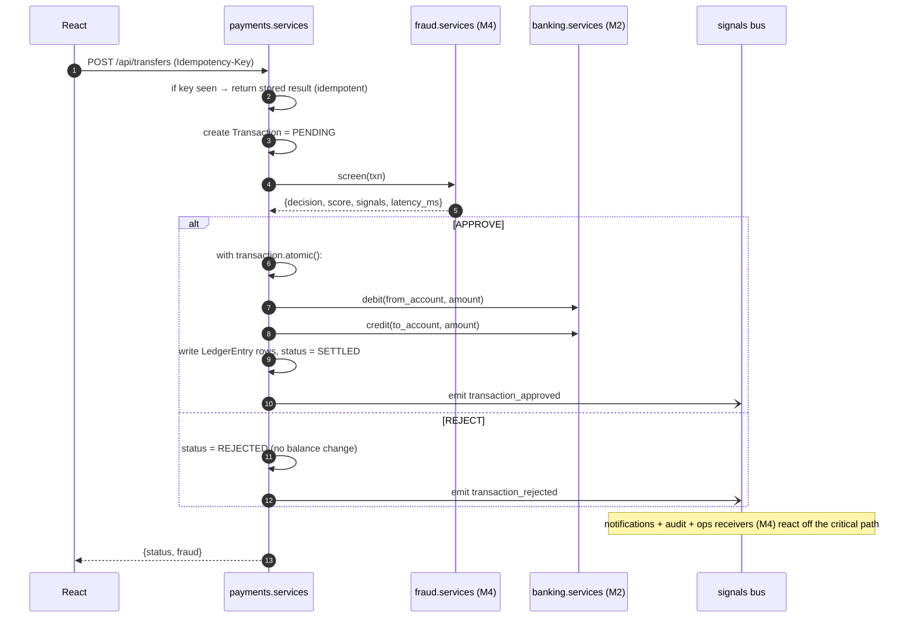
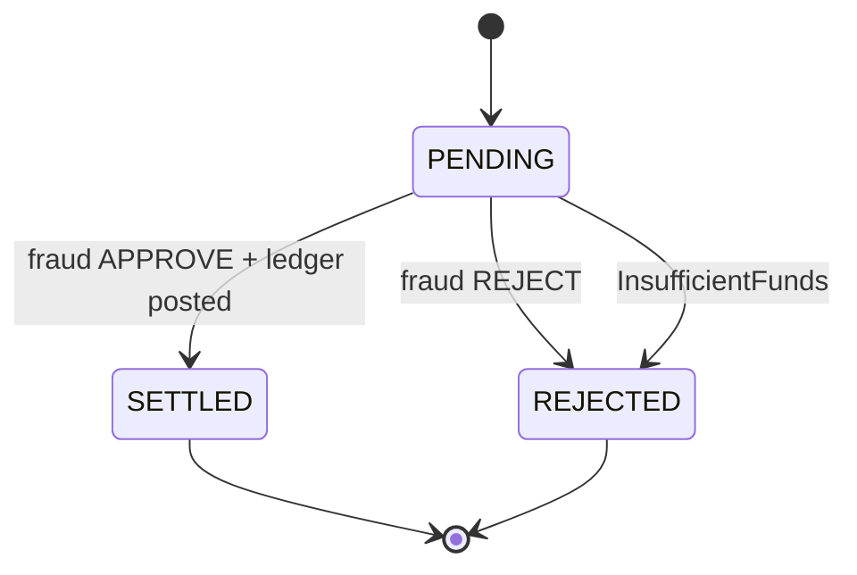

# Member 3 — Payments (Funding + Transfers + Ledger)

> You own **the money**. Funding and transfers are one `Transaction` model. Correctness
> first: idempotency + balance changes inside a single DB transaction, and every
> transfer is screened by M4's fraud function before any balance moves.
> Plan: [`../docs/plan.md`](../docs/plan.md).

## Ownership

| Type | You own |
|------|---------|
| **Django app** | `payments` (funding, transfers, ledger) |
| **React** | Fund form, transfer form (domestic/international), transaction history + detail |
| **DB tables** | `Transaction`, `LedgerEntry` |

## Endpoints you expose
```
POST /api/funding    {account_id, amount, source}            Header: Idempotency-Key
     -> 201 {transaction_id, status}
POST /api/transfers  {from_account_id, to_account_ref, amount, rail}  Header: Idempotency-Key
     -> 201 {transaction_id, status, fraud:{decision,score}}
GET  /api/transactions?account_id=   -> [{id,type,amount,status,...}]
GET  /api/transactions/{id}          -> {..., fraud:{decision,score,signals}}
```

## Flow — transfer with fraud + ledger (the core path)


## Transaction state machine


## Correctness rules (don't skip)
- **Idempotency:** `idempotency_key` is a unique column. Same key → return the original result; never create a second transaction.
- **Atomicity:** debit + credit + `LedgerEntry` writes + status update happen inside one `transaction.atomic()` with `select_for_update()` on the account row — no double-spend.
- **No balance change on reject** and **no balance change before fraud approves.**
- Funding is the same flow with `type=FUNDING` (credit only, usually auto-approved unless fraud flags the source).

## You depend on (stub Day 1)
- `fraud.services.screen(txn) -> {decision, score, signals, latency_ms}` — **M4**
- `banking.services.debit/credit/get_account` + `InsufficientFunds` — **M2**
- `core.events.event_signal` — emit `transaction_approved` / `transaction_rejected` / `funding_completed`; M4's notifications + audit + ops receivers react (no direct call needed).

## Build checklist
- [ ] `Transaction` + `LedgerEntry` models; `type` = FUNDING/TRANSFER; `rail` = DOMESTIC/INTERNATIONAL.
- [ ] Idempotency-Key handling (unique column + lookup).
- [ ] `services.py` orchestration: create → screen → atomic ledger post → **emit `transaction_*` signal**.
- [ ] Endpoints for funding, transfers, history, detail.
- [ ] React: fund form, transfer form (domestic/intl toggle), history list + detail (show fraud reason when blocked).
- [ ] Concurrency test: two transfers racing the same balance don't overdraw.

## Definition of done
Migrations run · endpoints in `/api/docs` · idempotent retries return the same result · a rejected transfer leaves balances unchanged · a suspicious transfer is blocked by fraud · history renders in React.
