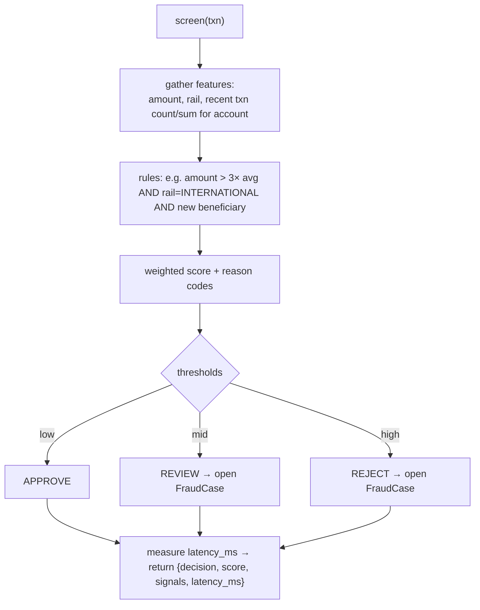
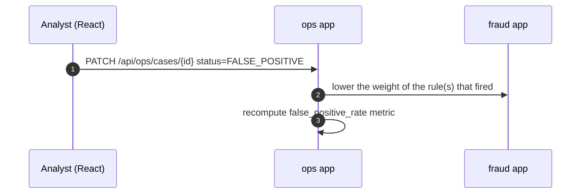

# Member 4 — Fraud, Ops, Audit & Notifications

> You own **trust + the shared helpers everyone calls**: the fraud rules that gate
> every transfer, the `audit()` helper every app logs to, in-app notifications, and
> the ops console that shows fraud cases + the audit trail.
> Plan: [`../docs/plan.md`](../docs/plan.md).

## Ownership

| Type | You own |
|------|---------|
| **Django apps** | `fraud`, `ops`, `audit`, `notifications` |
| **React** | Ops/fraud console (cases + review), audit trail viewer, notifications bell |
| **DB tables** | `FraudDecision`, `FraudCase`, `AuditLog`, `Notification` |

## Functions you expose (everyone imports these)
```python
# fraud/services.py
def screen(txn) -> FraudResult:
    # in-process rules; reads recent Transactions for the account (velocity) — a DB query, no Redis
    # measure wall-clock around scoring and persist FraudDecision.latency_ms (proves "milliseconds")
    # returns {decision: APPROVE|REJECT|REVIEW, score, signals:[{code,contribution,detail}], latency_ms}
    # on REJECT/REVIEW also emits fraud_flagged (ops receiver opens a FraudCase)

# notifications/services.py
def notify(user, message, channel="IN_APP") -> Notification   # stored + shown in UI

# audit/services.py
def audit(event_type, actor, payload) -> None                 # append-only AuditLog row
```

## Endpoints you expose
```
GET   /api/ops/cases?status=            -> [{case_id, txn_id, score, status}]     (ops_analyst)
PATCH /api/ops/cases/{id}   {status: CONFIRMED|FALSE_POSITIVE, resolution}
GET   /api/ops/metrics                  -> {approved, rejected, false_positive_rate}
GET   /api/audit?actor_id=&event_type=  -> [{event_type, actor_id, payload, created_at}]  (compliance)
GET   /api/notifications/me             -> [{message, read, created_at}]
```

## Event receivers (your apps are the event-driven consumers)

Instead of everyone calling your helpers directly, your apps **subscribe** to the shared
`event_signal` (from `core/events.py`, plan §2a). Register receivers in each app's
`apps.py::ready()` — this is what makes the system **event-driven**:

- **`audit` receiver** → writes an **append-only** `AuditLog` row for **every** event (never updates/deletes).
- **`notifications` receiver** → sends the right message on `account_opened`, `transaction_approved`, `transaction_rejected`, `funding_completed`.
- **`ops` receiver** → on `transaction_rejected` / `fraud_flagged` opens/updates a `FraudCase` and bumps health metrics.

The direct `audit()` / `notify()` helpers still exist for convenience, but the **receivers are the primary path**.

## Flow — fraud screening (called synchronously by M3)


## Flow — false-positive feedback (reduce false positives)


## Flow — audit trail (every app calls this)
```mermaid
flowchart LR
  APPS[any app: onboarding, payments, banking...] -->|audit(event, actor, payload)| AUD[AuditLog row]
  AUD --> VIEW[GET /api/audit → ops/compliance viewer]
```

## You depend on
- Read-only access to `Transaction` history (M3) for velocity features — import the model.
- The shared `event_signal` from `core/events.py` (**M1** scaffold) — your receivers subscribe to it.
- Everyone **emits signals**; your receivers consume them. Publish the receiver behaviour (which event → which reaction) **Day 1** so teammates can emit immediately (a no-op receiver is fine at first).

## Build checklist
- [ ] `fraud`: `FraudDecision` model (**with `latency_ms`**), `screen()` rules engine with reason codes + thresholds; velocity via a `Transaction` query; emit `fraud_flagged`.
- [ ] `ops`: `FraudCase` model, list/patch endpoints, `/metrics`, false-positive → rule-weight tuning; **ops receiver** for `transaction_rejected`/`fraud_flagged`.
- [ ] `audit`: **append-only** `AuditLog` model + `audit()` helper (publish signature Day 1) + **audit receiver subscribed to all signals**.
- [ ] `notifications`: `Notification` model + `notify()` helper, `/api/notifications/me` + **notifications receiver** for `account_opened`/`transaction_*`.
- [ ] Register all receivers in each app's `apps.py::ready()`.
- [ ] Add a test asserting `FraudDecision.latency_ms` is in the low-milliseconds range.
- [ ] React: ops/fraud console (case queue + review + confirm/false-positive), audit viewer, notifications bell.
- [ ] (Optional platform assist) help M1 with `docker-compose` + `/health` endpoint.

## Definition of done
Migrations run · endpoints in `/api/docs` · `screen()` blocks a suspicious transfer and approves a normal one · `audit()`/`notify()` used by other apps · ops console lists cases and a false-positive updates the metric.
